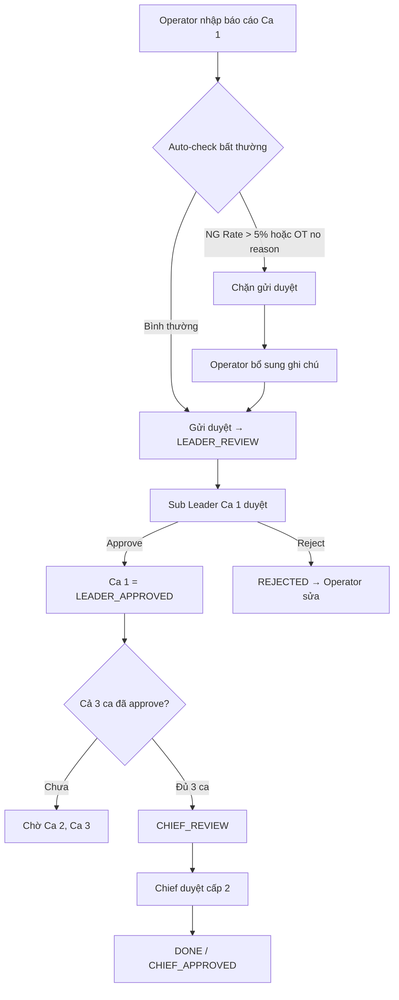

# Factory Business Analysis Skill (v2 — post FCC Vietnam lessons)

Skill chuyên phân tích nghiệp vụ (BA) cho nhà máy sản xuất, đặc biệt nhà máy Nhật / nhà máy Nhật đặt tại Việt Nam, phục vụ triển khai ERP (Odoo) và tích hợp IoT/Automation.

Phiên bản này đã được cập nhật dựa trên kinh nghiệm thực chiến từ dự án **FCC Vietnam Smart Factory Production Report System** (hợp tác DanaExperts × Y-nettech, phase proposal/demo 2026).

## Khi nào sử dụng skill này

- Phân tích quy trình nghiệp vụ nhà máy (as-is / to-be)
- Tạo tài liệu yêu cầu: BRD, FRD, user stories, use case
- Vẽ flowchart / process map cho quy trình sản xuất
- Gap analysis giữa hiện trạng và hệ thống ERP mới
- Thiết kế cấu trúc team, role, ma trận phân quyền (RBAC)
- Thiết kế luồng phê duyệt (approval workflow) — đặc biệt phê duyệt theo ca
- Tạo proposal, demo plan, kịch bản demo cho khách hàng Nhật
- Phân tích các module Odoo cần triển khai cho nhà máy
- Viết User Manual (tiếng Việt/Nhật) cho hệ thống đã xây

## Ngữ cảnh dự án mẫu (FCC Vietnam)

Dự án hợp tác giữa **DanaExperts** (ERP/Odoo) và **Y-nettech** (IoT/Automation) triển khai hệ thống Smart Factory cho nhà máy FCC tại Việt Nam, chủ đầu tư Nhật. Hệ thống số hóa hoàn toàn quy trình báo cáo sản xuất hằng ngày theo cấu trúc **1 máy × 1 ngày × 3 ca**, phê duyệt riêng theo từng ca, tự động phát hiện bất thường (NG > 5%, Downtime > 60 phút, OT không lý do).

Khi phân tích các dự án tương tự, luôn cân nhắc tích hợp giữa ERP, IoT/Automation và đặc thù vận hành shift-based của nhà máy Nhật.

---

## 1. Các nghiệp vụ chính trong nhà máy Nhật Bản

Khi phân tích, hãy bao quát đầy đủ các phạm vi nghiệp vụ sau.

### 1.1 Sản xuất (製造 - Manufacturing)
- Lập kế hoạch sản xuất (生産計画): MPS, MRP, Monthly Plan theo máy × ngày × product × target
- Quản lý Work Order / Manufacturing Order
- Bill of Materials (BOM) - 部品表: multi-level BOM, routing
- Shop floor control: tracking tiến độ từng công đoạn
- OEE (Overall Equipment Effectiveness) - 設備総合効率
- Kanban (看板): pull system, visual management
- Just-In-Time (JIT)
- **Báo cáo sản xuất hằng ngày (生産日報)**: cấu trúc 1 máy × 1 ngày × 3 ca, có sản lượng OK/NG, downtime, OT

### 1.2 Quản lý chất lượng (品質管理 - Quality Control)
- Incoming / In-Process / Outgoing Quality Control (IQC / IPQC / OQC)
- 5S (整理・整頓・清掃・清潔・躾)
- Kaizen (改善): continuous improvement
- Poka-yoke (ポカヨケ): mistake-proofing
- SPC (Statistical Process Control)
- FMEA, 8D Report, Fish-bone diagram
- **Auto-flag ngưỡng NG**: tự động đánh dấu abnormal khi NG Rate > ngưỡng (thường 5%)

### 1.3 Kho vận & Logistics (倉庫・物流)
- Inventory management: lot/serial tracking, FIFO, location management
- Warehouse operations: receiving, putaway, picking, packing, shipping
- Barcode/RFID integration
- Supply chain: procurement, vendor management
- Delivery scheduling & route planning

### 1.4 Bảo trì thiết bị (設備保全 - Maintenance)
- TPM (Total Productive Maintenance) - 全員参加の生産保全
- Preventive maintenance (予防保全): lịch bảo trì định kỳ
- Predictive maintenance (予知保全): dựa trên dữ liệu IoT sensor
- Corrective maintenance (事後保全)
- Spare parts management, MTBF/MTTR tracking
- **Downtime tracking**: ghi nhận mọi khoảng máy dừng, phân loại theo lý do (Breakdown, Maintenance, Material shortage, Setup/Changeover)

### 1.5 Nhân sự (人事 - HR)
- Attendance management (勤怠管理): ca kíp, overtime, OT phải có lý do bắt buộc
- **Shift management (シフト管理)**: thường 3 ca — Ca 1 (06:00–14:00), Ca 2 (14:00–22:00), Ca 3 (22:00–06:00 hôm sau, vượt nửa đêm)
- **Team structure**: mỗi ca × mỗi bộ phận = 1 đội riêng, có Sub Leader + 4 operator (tổng 5 người/đội)
- Skill matrix (スキルマトリックス)
- Safety management (安全管理), Training management (教育訓練)

### 1.6 Kế toán & Tài chính (経理・財務)
- Cost accounting (原価計算): product costing, variance analysis
- Budget management (予算管理)
- AP/AR management
- Japanese GAAP (J-GAAP), 消費税 (consumption tax)
- Multi-currency (JPY ¥ / VND)

### 1.7 IoT & Automation (IoT・自動化)
- Machine data collection: PLC, SCADA integration
- Real-time monitoring dashboard
- Alarm & alert management
- Energy monitoring (エネルギー管理)
- Traceability (トレーサビリティ): full product genealogy
- **IFS bridge**: nhiều nhà máy Nhật vẫn dùng IFS, hệ mới cần đồng bộ Product Code, Lot, Plan thông qua mock API trong demo

---

## 2. Bài học kinh nghiệm từ FCC Vietnam (áp dụng cho dự án tương tự)

Phần này chứa những insight cụ thể rút ra từ dự án FCC mà hầu hết nhà máy Nhật có cấu trúc tương tự. Hãy áp dụng mặc định, trừ khi khách hàng có yêu cầu khác.

### 2.1 Cấu trúc tổ chức theo Đội (Team-based), không phải theo danh sách phẳng
Thay vì liệt kê 40 operator + 10 supervisor, tổ chức theo đội:
- **1 đội = 1 bộ phận × 1 ca**
- Mỗi đội: 1 Sub Leader + 4 Operator = 5 người
- N đội = N_bộ_phận × 3 ca (với nhà máy 3 ca)
- Ví dụ FCC: 3 bộ phận (Press, CNC, Mill) × 3 ca = 9 đội × 5 người = 45 user sản xuất

### 2.2 Sub Leader kiêm Operator (Dual role)
Quy luật phổ biến ở nhà máy Nhật: tổ trưởng không chỉ ngồi văn phòng, họ vẫn đứng máy. Hệ thống phải cho phép:
- Sub Leader có `machineId` như công nhân khác
- Sub Leader tự nhập báo cáo ca của mình
- Khi người tạo trùng người duyệt cấp 1 → **auto-approve** cho ca đó, không yêu cầu bấm duyệt lại

### 2.3 Phê duyệt ĐỘC LẬP theo từng ca, không theo toàn báo cáo
Một báo cáo (1 máy × 1 ngày) có 3 ca → do 3 Sub Leader khác nhau phê duyệt riêng:
- Ca 1 → Sub Leader Ca 1 của bộ phận đó
- Ca 2 → Sub Leader Ca 2 của bộ phận đó
- Ca 3 → Sub Leader Ca 3 của bộ phận đó
- Khi cả 3 ca đều LEADER_APPROVED → báo cáo tổng thể chuyển sang CHIEF_REVIEW
- Chief / Ast Chief phê duyệt cấp 2 cho toàn báo cáo (không chia ca nữa)

### 2.4 Ràng buộc thời gian trong ca
- Downtime start/end phải nằm TRONG cửa sổ ca
- Ca đêm (Ca 3) vượt nửa đêm → logic validate phải xử lý "23:30 là trước 02:00 hôm sau"
- OT chỉ tính sau giờ chính thức của ca
- Ngày báo cáo bị giới hạn: chỉ hôm nay hoặc N ngày trước (thường N=3) để ngăn nhập lùi quá xa

### 2.5 Tự động phát hiện bất thường (Auto-abnormality detection)
Hệ thống tự động phân loại từng ca là NORMAL / ABNORMAL dựa trên 3 quy tắc phổ biến:

| Quy tắc | Ngưỡng mặc định | Hành động |
|---|---|---|
| NG cao | NG Rate > 5% | ABNORMAL — chặn gửi duyệt nếu không có ghi chú giải thích |
| Downtime dài | Tổng downtime > 60 phút/ca | ABNORMAL — cảnh báo nhưng không chặn |
| OT không lý do | OT bật mà lý do rỗng | ABNORMAL — chặn gửi duyệt |

Khi BA tài liệu luồng, phải ghi rõ ngưỡng mặc định và khả năng tùy chỉnh.

### 2.6 Bulk Approval có phân nhóm Normal / Abnormal
Sub Leader / Chief thường xử lý hàng loạt cuối ca. Cơ chế Bulk:
- Liệt kê ca chờ duyệt, tự động nhóm thành "Normal" và "Abnormal"
- "Chọn tất cả" chỉ chọn nhóm Normal
- Abnormal phải tích thủ công → tránh lướt nhanh bỏ sót

### 2.7 seedFromPlan — Tự động điền từ Monthly Plan + IFS
Giảm gõ tay cho operator: khi chọn Máy + Ngày, hệ thống tự động:
- Đọc Monthly Plan → điền Product Code, Target
- Đọc lịch phân ca → điền Operator, Sub Leader cho từng ca
- Đồng bộ Product từ IFS mock

### 2.8 Tablet-first UI
- Input số: Number Wheel Picker (bánh xe cuộn theo từng chữ số)
- Input giờ: Time Picker với ràng buộc cửa sổ ca
- Touch target ≥ 44px
- Không phụ thuộc bàn phím ảo
- Portrait hoặc landscape đều dùng được

### 2.9 Đa ngôn ngữ VI/JA (không phải JA/EN)
Khách Nhật tại Việt Nam cần giao diện song ngữ Việt-Nhật, vì:
- Operator, Sub Leader người Việt → cần tiếng Việt
- Section Manager, Chief, Director người Nhật → cần tiếng Nhật
- Toggle VI/JA luôn ở navbar, không reload trang

---

## 3. Quy trình phân tích nghiệp vụ

Khi nhận yêu cầu phân tích, thực hiện theo các bước:

**Step 1 — Xác định scope**
- Phạm vi nghiệp vụ cần phân tích (từ danh sách §1)
- Stakeholders liên quan
- Làm rõ mục tiêu: proposal, demo, phase nào của dự án

**Step 2 — Phân tích As-Is (現状分析)**
- Mô tả quy trình hiện tại (thường là báo cáo giấy hoặc Excel)
- Vẽ process flow (Mermaid)
- Xác định pain points: thời gian nhập liệu, lỗi sao chép, khó truy vết bất thường
- Đánh giá mức độ automation hiện tại

**Step 3 — Thiết kế To-Be (あるべき姿)**
- Đề xuất quy trình mới với Odoo + IoT
- Map nghiệp vụ vào Odoo modules tương ứng (§4)
- Thiết kế cấu trúc team, role, ma trận phân quyền
- Thiết kế luồng phê duyệt theo ca (nếu áp dụng)
- Xác định điểm tích hợp IoT/Automation (phạm vi đối tác automation)
- Vẽ to-be process flow

**Step 4 — Gap Analysis**
- So sánh as-is vs to-be
- Xác định Odoo standard vs customization cần thiết
- Đánh giá effort và priority

**Step 5 — Tạo deliverables**
- Tùy theo yêu cầu: BRD, FRD, user stories, process maps, proposal slides, user manual

---

## 4. Mapping nghiệp vụ → Odoo Modules

Luôn map nghiệp vụ với Odoo module tương ứng.

| Nghiệp vụ | Odoo Module | Ghi chú |
|---|---|---|
| Sản xuất | Manufacturing (mrp) | MO, BOM, Work Centers, Routing |
| Báo cáo nhật báo (custom) | Custom module | 1 máy × 1 ngày × 3 ca, per-shift approval |
| Chất lượng | Quality (quality_control) | Quality Points, Quality Checks, Quality Alerts |
| Kho vận | Inventory (stock) + Barcode | Locations, Operations, Lot/Serial |
| Mua hàng | Purchase (purchase) | RFQ, PO, Vendor management |
| Bán hàng | Sales (sale) | SO, Quotation, Delivery |
| Bảo trì | Maintenance (maintenance) | Preventive, Corrective, Calendar |
| Nhân sự | HR + Attendance + Planning | Employees, Shifts, Leaves, Team structure |
| Kế toán | Accounting (account) | J-GAAP, Multi-currency (JPY/VND) |
| Dashboard | Studio / Custom | OEE, KPI, per-role dashboards |
| IoT | IoT Box + Custom | Y-nettech / đối tác automation |
| IFS bridge | Custom | Mock đồng bộ Product / Plan |

---

## 5. Đặc thù nhà máy Nhật Bản

### Văn hóa & tiêu chuẩn
- **Monozukuri (ものづくり)**: triết lý sản xuất, coi trọng craft & chất lượng
- **Genba (現場)**: đi thực tế nhà máy, không ngồi bàn giấy
- **Horenso (報連相)**: Báo cáo - Liên lạc - Tham vấn → hệ thống phải hỗ trợ luồng thông tin chặt chẽ
- **PDCA cycle**: Plan-Do-Check-Act
- **ISO compliance**: ISO 9001, ISO 14001 phổ biến

### Đặc thù kỹ thuật
- Tài liệu kỹ thuật thường song ngữ (日本語/Tiếng Việt cho nhà máy Nhật tại VN)
- Múi giờ: JST (UTC+9) hoặc ICT (UTC+7) tùy nơi triển khai
- Tiền tệ: JPY (¥) không decimal, VND không decimal
- Fiscal year: thường bắt đầu tháng 4 (4月始まり)
- Tuân thủ: J-GAAP, 消費税

### Format tài liệu
- Keigo (敬語 - kính ngữ) khi viết cho khách Nhật
- Cấu trúc rõ ràng, đánh số 1., 1.1, 1.1.1
- Thuật ngữ tiếng Nhật kèm romaji khi cần
- Tài liệu cuối dạng .docx, .pptx, hoặc PDF — dùng skill docx/pptx khi tạo

---

## 6. Template deliverables

### 6.1 Business Requirements Document (BRD)

```
1. プロジェクト概要 (Project Overview)
2. 業務範囲 (Business Scope)
3. 現状分析 (As-Is Analysis)
   3.1 業務フロー (Business Flow)
   3.2 課題・問題点 (Issues & Pain Points)
4. あるべき姿 (To-Be Design)
   4.1 新業務フロー (New Business Flow)
   4.2 組織・役割 (Organization & Roles) — team structure
   4.3 承認フロー (Approval Flow) — per-shift routing nếu áp dụng
   4.4 システム構成 (System Architecture)
5. 機能要件 (Functional Requirements)
6. 非機能要件 (Non-Functional Requirements)
7. 統合ポイント (Integration Points - IoT/ERP/IFS)
8. 実施計画 (Implementation Plan)
9. リスク・課題 (Risks & Issues)
```

### 6.2 User Manual (cho hệ thống đã hoàn thành)

Cấu trúc đã được kiểm chứng từ FCC Vietnam — có thể dùng làm template:

```
Trang bìa (Version, Partners, Month/Year)
Thông tin tài liệu (lịch sử phiên bản, mục đích, đối tượng)
Chương 1 — Tổng quan hệ thống
Chương 2 — Vai trò & phân quyền (bảng role, ma trận chức năng)
Chương 3 — Cấu trúc đội (team structure, phân bổ máy)
Chương 4 — Đăng nhập & chọn user
Chương 5 — Dashboard theo vai trò
Chương 6 — Tạo báo cáo sản xuất
Chương 7 — Luồng phê duyệt (3 cấp, per-shift, bulk, abnormality)
Chương 8 — Tính năng khác (OT, IFS, Monthly Plan, Analytics, i18n)
Chương 9 — Dữ liệu demo & tài khoản mẫu + kịch bản demo
```

### 6.3 Process Flow (Mermaid)



### 6.4 Role Matrix template

| Chức năng | Operator | Sub Leader | Ast Chief / Chief | QA / Maintenance | Director |
|---|---|---|---|---|---|
| Tạo báo cáo | ✓ | ✓ | — | — | — |
| Sửa báo cáo của mình | ✓ | ✓ | — | — | — |
| Gửi duyệt | ✓ | ✓ | — | — | — |
| Duyệt cấp 1 (theo ca) | — | ✓ | — | — | — |
| Duyệt cấp 2 (toàn ngày) | — | — | ✓ | — | — |
| Bulk approval | — | ✓ | ✓ | — | — |
| Xem tất cả báo cáo | — | — | ✓ | ✓ | ✓ |
| Analytics / KPI | — | — | ✓ | ✓ | ✓ |
| Monthly Plan | — | — | ✓ | — | ✓ |

### 6.5 User Story format

```
As a [role],
I want to [goal],
So that [reason].

Acceptance Criteria:
- [ ] Criterion 1
- [ ] Criterion 2

Abnormality rules:
- [ ] NG Rate threshold
- [ ] Downtime threshold
- [ ] OT reason required
```

---

## 7. Hướng dẫn output

- **Docx**: gọi skill `docx` TRƯỚC khi tạo file Word
- **Pptx**: gọi skill `pptx` TRƯỚC khi tạo slides
- **Markdown + Mermaid**: phù hợp cho nội bộ team
- **Song ngữ**: format `日本語 (Tiếng Việt)` hoặc `日本語 / Tiếng Việt`
- **Linh hoạt**: chọn format phù hợp với giai đoạn dự án (proposal → demo → phase 1)

Khi cần tạo demo app tương tác, chuyển sang skill `odoo-demo` hoặc `erp-workflow-demo`. Cả ba skill này được thiết kế để dùng chung.

## 8. Tham khảo

- `references/odoo-modules-mapping.md` — mapping chi tiết Odoo modules
- Skill `odoo-demo` — tạo prototype UI Odoo
- Skill `erp-workflow-demo` — tạo full ERP web app với role, workflow
- Skill `docx` / `pptx` — xuất tài liệu cuối cùng
