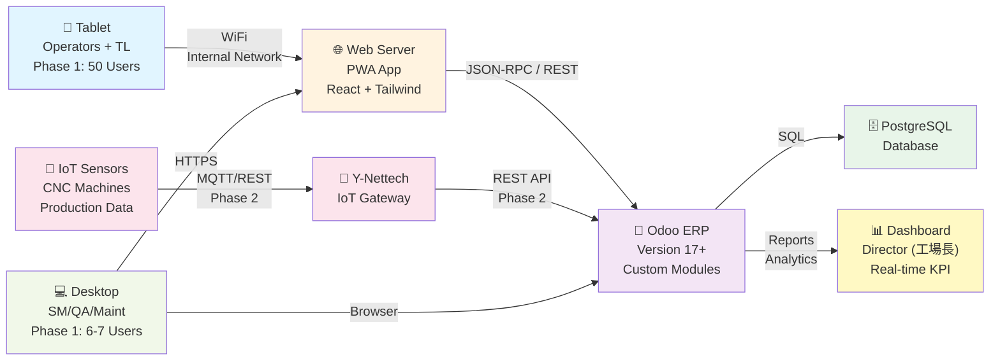
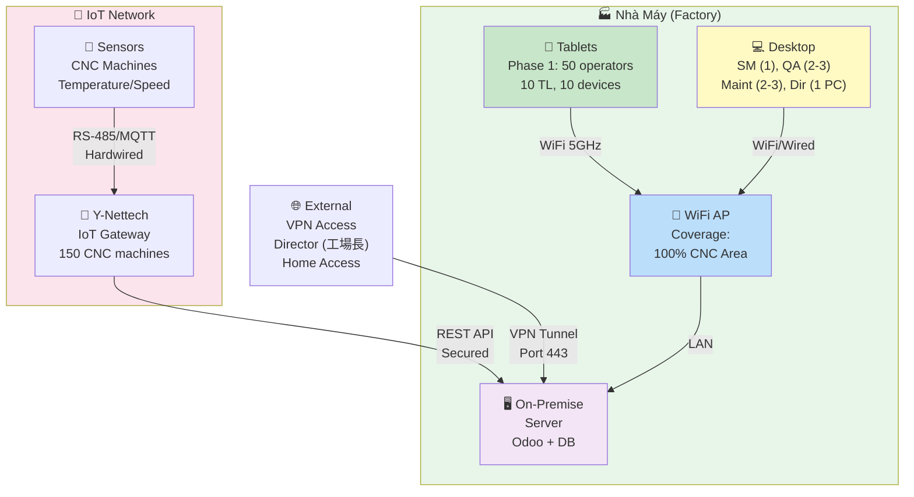
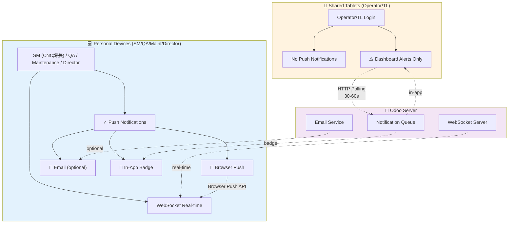
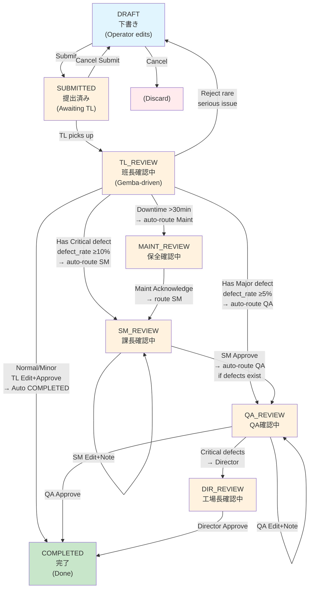
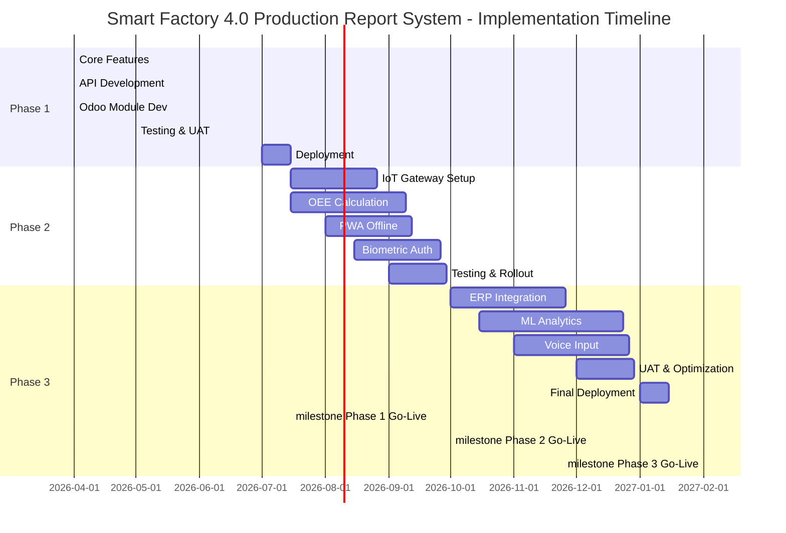

# Tài Liệu Thiết Kế Cơ Bản (Basic Design)
## Hệ Thống Báo Cáo Sản Xuất Hàng Ngày - Smart Factory 4.0

**Phiên bản (Version):** 1.0
**Ngày (Date):** 2026-04-05
**Tổ chức (Organization):** DanaExperts & Y-Nettech Collaboration
**Dự án (Project):** Smart Factory 4.0 Production Daily Report System

---

## 📋 Mục Lục (Table of Contents)

1. [Tổng Quan Kiến Trúc Hệ Thống](#1-tổng-quan-kiến-trúc-hệ-thống)
2. [Thiết Kế Dữ Liệu](#2-thiết-kế-dữ-liệu)
3. [Thiết Kế Màn Hình](#3-thiết-kế-màn-hình)
4. [Thiết Kế Quy Trình Công Việc](#4-thiết-kế-quy-trình-công-việc)
5. [Thiết Kế API](#5-thiết-kế-api)
6. [Thiết Kế Bảo Mật](#6-thiết-kế-bảo-mật)
7. [Thiết Kế Phi Chức Năng](#7-thiết-kế-phi-chức-năng)
8. [Kế Hoạch Giai Đoạn](#8-kế-hoạch-giai-đoạn)

---

## 1. Tổng Quan Kiến Trúc Hệ Thống

### 1.1 Sơ Đồ Tổng Quan Hệ Thống (System Overview Diagram)



**Mô tả (Description):**
- **Tablet Layer**: Phase 1 = 50 operators + 10 TL (班長) trên 10 shared tablets (1 tablet/5 workers)
- **Web App Layer**: PWA (Progressive Web App) chạy trên React, hỗ trợ cả tablet (1024×768) và desktop
- **Backend Layer**: Odoo 17+ với các module tùy chỉnh cho Smart Factory
- **Database Layer**: PostgreSQL (Odoo standard)
- **IoT Integration (Phase 2)**: Y-Nettech gateway kết nối sensors từ máy móc CNC
- **Manager Layer**: Desktop/laptop cho SM (CNC課長), QA, Maintenance, Director - Phase 1 Pilot CNC Department ONLY (150 machines)

---

### 1.2 Công Nghệ Sử Dụng (Technology Stack)

#### Frontend (フロントエンド)
- **Framework**: React 18+ (JSX)
- **Styling**: Tailwind CSS v3 + responsive design
- **Charts**: Recharts (line, bar, pie charts)
- **Icons**: Lucide React (48px+ for touch targets)
- **State Management**: React Context API / Zustand
- **HTTP Client**: Axios
- **Validation**: React Hook Form + Zod
- **UI Components**: Custom components + Headless UI
- **Real-time Communication**: WebSocket (personal devices), Polling (shared tablets)
- **Notifications**: In-app (dashboard alerts), Push (browser/app, managers only), Email (optional)
- **Offline Support (Phase 2)**: Service Worker, IndexedDB

#### Backend (バックエンド)
- **Framework**: Odoo 17+ (Python)
- **Custom Modules**: `sf_production_report`
- **ORM**: Odoo ORM
- **API**: JSON-RPC (native Odoo) + REST API (custom)
- **Authentication**: Session-based (Odoo session middleware)
- **Workflow**: Odoo workflow engine

#### Database (データベース)
- **DBMS**: PostgreSQL 12+
- **Encoding**: UTF-8 (hỗ trợ Japanese, Vietnamese)
- **Backup**: Daily snapshots (on-premise requirement)

#### Deployment (デプロイメント)
- **Environment**: On-premise server hoặc Private Cloud (bảo mật theo yêu cầu)
- **Server**: Linux (Ubuntu 20.04+) hoặc CentOS 8+
- **Web Server**: Nginx (reverse proxy) + Odoo application server
- **Port**: 8069 (Odoo internal), 443 (HTTPS public)
- **WiFi**: Corporate WiFi (SSID: Factory-Internal, WPA2-Enterprise)

---

### 1.3 Kiến Trúc Mạng (Network Architecture)



**Đặc điểm (Features):**
- **Internal WiFi Only**: Không kết nối Internet công cộng (bảo vật lý)
- **WiFi Coverage**: 100% diện tích shop floor, độ mạnh tín hiệu ≥ -70 dBm
- **Server DMZ**: Server nằm trong mạng nội bộ, có firewall
- **VPN Access**: Manager/Director có thể truy cập qua VPN từ bên ngoài
- **IoT Hardwired**: Sensors kết nối trực tiếp tới gateway (đầu tháng Phase 2)

---

### 1.4 Kiến Trúc Thiết Bị & Thông Báo (Device & Notification Architecture)

#### Tổ Chức (Organizational Structure - Phase 1 CNC Department)
```
Director (工場長) ──────────────── 1 person
  └── SM/CNC Dept Head (CNC課長) ─ 1 person [PERSONAL tablet]
        ├── TL 1 (班長) → 4-5 operators [SHARED tablet group of 5]
        ├── TL 2 (班長) → 4-5 operators [SHARED tablet group of 5]
        ├── ...
        └── TL 10 (班長) → 4-5 operators [SHARED tablet group of 5]

Phase 1 User Count:
- Operators (作業員): 50
- Team Leaders (班長): 10 (each TL manages 4-5 operators)
- Section Manager (CNC課長): 1 (manages all 10 TL)
- QA (品質管理): 2-3
- Maintenance (保全): 2-3
- Director (工場長): 1
TOTAL: ~58-60 users

Equipment:
- CNC Machines: 150 (pilot CNC department only)
- Shared Tablets: 10 (1 per 5 operators + TL)
- Personal Devices: 6-7 (SM + QA + Maintenance + Director)
```

#### Device Model (モデル)
```
SHARED TABLETS (Operator/TL - 1 tablet per 5 workers)
├─ Users: Operator (作業員), Team Leader (班長)
├─ Reality: TL cũng làm sản xuất trực tiếp, ít thời gian thao tác tool
├─ Login at: Đầu ngày (7:30-8:00) | Sau chorei (8:30-9:00) |
│            Trước/sau trưa (11:30-13:30) | Cuối ngày (16:30-17:00)
├─ Usage: KHSX check → Chorei review → Approve/Edit → Create reports
├─ Session: Short-lived (~30min-1h per login, 3-4 lần/ngày)
├─ Devices: 10 tablets (Phase 1 CNC: 50 operators + 10 TL)
├─ Network: WiFi polling (30-60 sec intervals)
└─ Notifications: Dashboard Alerts On Login ONLY (no push)

PERSONAL DEVICES (SM/QA/Maintenance/Director - Tablet/PC riêng)
├─ Users: Section Manager (CNC課長), QA (品質管理担当), Maintenance Lead (保全リーダー), Director (工場長)
├─ Reality: SM manages all 10 TL, cần nhận thông tin SỚM để ra quyết định cho vấn đề phát sinh
├─ Login at: Start of day, stay logged in all day
├─ Usage: Continuous monitoring, approvals, real-time decisions
├─ Devices: 6-7 devices (1 SM tablet + 2-3 QA tablets + 2-3 Maint devices + 1 Director PC)
├─ Session: Long-lived (8+ hours per shift)
├─ Network: WebSocket (real-time, <1 sec latency)
└─ Notifications: ENABLED (push, email, in-app)
```

**Device Detection (useDeviceType Hook):**
```javascript
// Device type is determined by USER ROLE, not by device detection
// SM MOVED to PERSONAL DEVICES: manages all 10 TL, needs real-time notifications
const useDeviceType = (userRole) => {
  // Roles that use shared tablets (no push notifications)
  // TL uses shared tablet despite being team leader because they also do production work
  const SHARED_TABLET_ROLES = ['operator', 'team_leader'];

  // Roles with personal devices (push notifications enabled)
  // SM now in personal: needs to respond quickly to Major/Critical issues from all 10 TL
  const PERSONAL_DEVICE_ROLES = ['section_manager', 'qa', 'maintenance_lead', 'director'];

  const deviceType = PERSONAL_DEVICE_ROLES.includes(userRole)
    ? 'personal_device'
    : 'shared_tablet';

  return deviceType;
};
```

#### Notification Architecture


**Notification Rules:**
| Role | Device Type | Push | Email | Dashboard Alert |
|------|-------------|------|-------|-----------------|
| Operator | Shared Tablet | ✗ | ✗ | ✓ (on login) |
| TL (班長) | Shared Tablet | ✗ | ✗ | ✓ (on login) |
| SM (CNC課長) | Personal | ✓ | ✓ | ✓ |
| QA (品質) | Personal | ✓ | ✓ | ✓ |
| Maintenance | Personal | ✓ | ✓ | ✓ |
| Director (工場長) | Personal | ✓ | ✓ | ✓ |

---

### 1.6 Kiến Trúc Tích Hợp (Integration Architecture)

```mermaid
graph LR
    PWA["🌐 Web App<br/>React PWA"]
    WS["WebSocket<br/>Server"]

    PWA -->|1. JSON-RPC<br/>Odoo Session| Odoo["🏢 Odoo ERP<br/>Custom Module<br/>sf_production_report"]
    PWA -->|2. WebSocket<br/>(personal device)| WS
    PWA -->|2b. HTTP Polling<br/>(shared tablet)| Odoo
    PWA -->|3. File Upload<br/>Image Storage| FileServer["📁 File Server<br/>Defect Photos<br/>Max 5MB/file"]

    Odoo -->|4. REST API<br/>Webhook| YNettech["🌉 Y-Nettech<br/>IoT Platform"]
    Odoo -->|5. SQL| DB["🗄️ PostgreSQL<br/>sf_production_report<br/>sf_defect_record<br/>sf_cause_category"]

    Dashboard["📊 Director<br/>Dashboard<br/>Real-time View"]

    Odoo -->|6. ORM Report<br/>Aggregation| Dashboard

    Audit["📝 Audit Trail<br/>Change Log<br/>Timestamps"]
    Odoo -->|7. Chatter<br/>Comments<br/>History| Audit

    WS -->|Real-time<br/>Updates| Odoo

    style PWA fill:#fff3e0
    style WS fill:#f1f8e9
    style Odoo fill:#f3e5f5
    style YNettech fill:#fce4ec
    style DB fill:#e8f5e9
```

**Chi Tiết Kết Nối (Connection Details):**

| Kết Nối | Giao Thức | Mục Đích | Bảo Mật |
|---------|-----------|---------|--------|
| Web App ↔ Odoo | JSON-RPC + Session | CRUD reports, authentication | Session-based + HTTPS |
| Web App ↔ File Server | HTTP POST multipart | Upload defect photos | HTTPS + CORS validation |
| Odoo ↔ Y-Nettech | REST API + JWT (Phase 2) | Sensor data sync | API token + HTTPS |
| Odoo ↔ PostgreSQL | ORM (native) | Persistent storage | Local socket |

---

## 2. Thiết Kế Dữ Liệu

### 2.1 Sơ Đồ Entity-Relationship (ER Diagram)

```mermaid
erDiagram
    USER ||--o{ PRODUCTIONREPORT : creates
    USER ||--o{ COMMENT : writes
    USER ||--o{ WORKFLOWHISTORY : performs
    USER ||--o{ SUPERVISOREVALUATION : evaluates

    PRODUCTIONPLAN ||--o{ REPORTLINEITEM : has
    PRODUCTIONREPORT ||--o{ REPORTLINEITEM : contains
    REPORTLINEITEM ||--o{ DEFECTRECORD : has

    DEFECTTYPE ||--o{ DEFECTRECORD : categorizes
    CAUSECATEGORY ||--o{ DEFECTRECORD : "has cause"
    SOLUTION ||--o{ DEFECTRECORD : proposes

    PRODUCTIONREPORT ||--o{ COMMENT : "receives"
    PRODUCTIONREPORT ||--o{ WORKFLOWHISTORY : "has history"
    PRODUCTIONREPORT ||--o{ REPORTNARRATIVE : contains
    PRODUCTIONREPORT ||--o{ WORKHOURSBYACTIVITY : contains
    PRODUCTIONREPORT ||--o{ SUPERVISOREVALUATION : "has evaluation"
    JOBORDER ||--o{ PRODUCTIONREPORT : "links to"

    MACHINE ||--o{ PRODUCTIONPLAN : operates
    MACHINE ||--o{ PRODUCTIONREPORT : reports

    USER {
        int id PK
        string name
        string email
        string role "operator|leader|qa|manager|director"
        string department
        string line
        string avatar_url
        datetime last_login
    }

    JOBORDER {
        int id PK
        string job_number "工番"
        string customer_name "得意先名"
        string work_title "作業件名"
        text description
        date start_date
        date due_date
        string status "active|closed|cancelled"
        datetime created_at
    }

    PRODUCTIONPLAN {
        int id PK
        string lot_number
        string product_code
        string product_name
        int planned_qty
        int machine_id FK
        int job_order_id FK
        string line_code
        date plan_date
        datetime created_at
    }

    PRODUCTIONREPORT {
        int id PK
        date report_date
        string shift "A|B|C"
        int operator_id FK
        int machine_id FK
        int job_order_id FK
        string status "draft|submitted|approved|rejected|closed"
        text operator_notes
        datetime submitted_at
        int rejected_by_id FK
        text reject_reason
        datetime approved_at
        int approved_by_id FK
        datetime created_at
        datetime updated_at
    }

    REPORTNARRATIVE {
        int id PK
        int report_id FK
        text work_target "作業目標"
        text results "結果"
        text variance_improvement "差異原因/改善すべき点"
        text tomorrow_plan "明日の予定"
        datetime created_at
        datetime updated_at
    }

    REPORTLINEITEM {
        int id PK
        int report_id FK
        int plan_id FK
        int actual_qty
        decimal labor_hours
        decimal machine_hours
        int defect_count "auto calculated"
        boolean is_modified
        datetime created_at
    }

    WORKHOURSBYACTIVITY {
        int id PK
        int report_id FK
        string activity_type "作業種別 code"
        decimal planned_hours "計画時間"
        decimal actual_hours "実績時間"
        decimal achievement_percent "達成率 %"
        int progress_percent "進捗 %"
        datetime created_at
    }

    DEFECTRECORD {
        int id PK
        int line_item_id FK
        int defect_type_id FK
        string severity "minor|major|critical"
        int count
        text description
        int cause_id FK
        int solution_id FK
        string photo_url
        datetime created_at
    }

    DEFECTTYPE {
        int id PK
        string code "D01-D99"
        string label_ja
        string label_en
        boolean active
    }

    CAUSECATEGORY {
        int id PK
        string group "Man|Machine|Material|Method"
        string code "M1-01 to M4-06"
        string label_ja
        string label_en
        boolean active
    }

    SOLUTION {
        int id PK
        string code "A01-A99"
        string label_ja
        string label_en
        string type "immediate|corrective|preventive"
        boolean active
    }

    MACHINE {
        int id PK
        string code
        string name_ja
        string name_en
        string line_code
        string machine_type
        datetime created_at
    }

    SUPERVISOREVALUATION {
        int id PK
        int report_id FK
        int evaluator_id FK
        int rating "1-5 stars"
        text evaluation_comments
        text improvement_instructions
        datetime evaluated_at
    }

    COMMENT {
        int id PK
        int report_id FK
        int user_id FK
        string role "operator|leader|qa|manager|director"
        text text
        datetime created_at
        datetime updated_at
    }

    WORKFLOWHISTORY {
        int id PK
        int report_id FK
        string action "create|submit|approve|reject|cancel_submit|close|tl_direct_edit|chorei_discussed"
        int user_id FK
        datetime timestamp
        text note
        text edit_summary "For TL_DIRECT_EDIT: what was changed"
    }

    USERSESSION {
        int id PK
        int user_id FK
        string device_type "shared_tablet|personal_device"
        datetime login_at
        datetime logout_at
        string ip_address
        text user_agent
    }

    NOTIFICATIONPREFERENCE {
        int id PK
        int user_id FK
        string role "operator|leader|qa|manager|director"
        boolean push_enabled
        boolean email_enabled
        boolean in_app_dashboard_enabled
        datetime created_at
        datetime updated_at
    }
```



**Quan Hệ Chính (Primary Relationships):**
- 1 Operator tạo nhiều Reports (1:N)
- 1 ProductionPlan có nhiều LineItems (1:N)
- 1 Report chứa nhiều LineItems (1:N)
- 1 LineItem có nhiều DefectRecords (1:N)
- 1 DefectType, CauseCategory, Solution được tham chiếu bởi DefectRecords
- 1 User có nhiều UserSessions (1:N) - Track device type per session
- 1 User có 1 NotificationPreference (1:1) - Role-based notification settings

---

### 2.2 Các Bảng Dữ Liệu Chủ (Master Data Tables)

#### DefectType (Loại Lỗi)
```
Code    | Label (JP)        | Label (EN)           | Active
--------|-------------------|----------------------|--------
D01     | 寸法不良          | Dimensional Error    | true
D02     | 色違い            | Color Mismatch       | true
D03     | 傷/汚れ           | Scratch/Dirt         | true
D04     | 欠陥              | Defect               | true
D05     | 組立不良          | Assembly Error       | true
...     | ...               | ...                  | true
D99     | その他            | Others               | true
```

#### CauseCategory (Phân Loại Nguyên Nhân - 4M Model)

**Man (Nhân sự):**
```
Code    | Group | Label (JP)        | Label (EN)
--------|-------|-------------------|------------------
M1-01   | Man   | 疲労              | Fatigue
M1-02   | Man   | 無集中            | Lack of Focus
M1-03   | Man   | スキル不足        | Insufficient Skill
M1-04   | Man   | 手順違反          | Procedure Violation
M1-05   | Man   | 確認忘れ          | Forgot Verification
M1-06   | Man   | その他            | Others
```

**Machine (Máy móc):**
```
Code    | Group   | Label (JP)        | Label (EN)
--------|---------|-------------------|------------------
M2-01   | Machine | メンテ不足        | Maintenance Lack
M2-02   | Machine | 摩耗              | Wear
M2-03   | Machine | 調整不良          | Poor Adjustment
M2-04   | Machine | 故障              | Failure
M2-05   | Machine | センサ不良        | Sensor Error
M2-06   | Machine | その他            | Others
```

**Material (Vật liệu):**
```
Code    | Group    | Label (JP)        | Label (EN)
--------|----------|-------------------|------------------
M3-01   | Material | 品質不良          | Poor Quality
M3-02   | Material | 受け取り不良      | Receiving Error
M3-03   | Material | 保管不良          | Storage Error
M3-04   | Material | 仕様違い          | Specification Error
M3-05   | Material | ロット混同        | Lot Confusion
M3-06   | Material | その他            | Others
```

**Method (Phương pháp):**
```
Code    | Group  | Label (JP)        | Label (EN)
--------|--------|-------------------|------------------
M4-01   | Method | 手順書不備        | Procedure Defect
M4-02   | Method | 判定基準不明      | Unclear Criteria
M4-03   | Method | 環境不良          | Poor Environment
M4-04   | Method | 測定器不良        | Measurement Error
M4-05   | Method | 工程順序違反      | Process Sequence Error
M4-06   | Method | その他            | Others
```

#### ActivityType (Loại Hoạt Động - 作業種別)

**Activity Types for Work Hours Tracking:**
```
Code   | Label (JP)         | Label (EN)              | Category
-------|-------------------|------------------------|------------------
A01    | 打合・段取         | Meeting/Setup           | Planning
A02    | 設計・展開         | Design/Development      | Planning
A03    | 製缶               | Fabrication             | Production
A04    | 組立               | Assembly                | Production
A05    | 試運転             | Test Run                | Quality
A06    | 現地作業           | On-site Work            | Field Work
A07    | 機械加工           | Machining               | Production
A08    | メンテナンス       | Maintenance             | Maintenance
A09    | バリ取・酸洗       | Deburring/Pickling      | Finishing
A10    | ドキュメント作成   | Documentation           | Administrative
```

#### Solution (Giải Pháp)
```
Code    | Label (JP)           | Label (EN)              | Type
--------|----------------------|------------------------|-------------
A01     | 作業者に指導         | Instruct Operator      | Immediate
A02     | 再確認作業           | Re-check Work          | Immediate
A03     | 不良品の交換         | Replace Defect Part    | Immediate
A04     | 機械メンテ実施       | Perform Machine Maint. | Corrective
A05     | 機械調整             | Machine Adjustment     | Corrective
A06     | 部品交換             | Replace Component      | Corrective
A07     | 作業員研修計画       | Training Program       | Preventive
A08     | 新しい工具導入       | New Tool Introduction  | Preventive
...     | ...                  | ...                    | ...
A99     | その他               | Others                 | Others
```

---

### 2.3 Thiết Kế Module Odoo (Odoo Module Design)

#### Module: `sf_production_report`

**File Structure:**
```
sf_production_report/
├── __manifest__.py
├── __init__.py
├── models/
│   ├── __init__.py
│   ├── sf_production_report.py
│   ├── sf_report_line_item.py
│   ├── sf_defect_record.py
│   ├── sf_defect_type.py
│   ├── sf_cause_category.py
│   ├── sf_solution.py
│   ├── sf_activity_type.py
│   ├── sf_report_narrative.py
│   ├── sf_work_hours_by_activity.py
│   ├── sf_supervisor_evaluation.py
│   ├── sf_job_order.py
│   └── sf_machine.py
├── views/
│   ├── sf_production_report_views.xml
│   ├── sf_report_narrative_views.xml
│   ├── sf_work_hours_views.xml
│   ├── sf_supervisor_evaluation_views.xml
│   ├── sf_defect_record_views.xml
│   └── menus.xml
├── controllers/
│   ├── __init__.py
│   └── api.py
├── security/
│   ├── ir.model.access.csv
│   └── record_rules.xml
└── static/
    └── description/
        └── icon.png
```

#### Models (Odoo ORM)

**sf.production.report** (inherit mail.thread)
```python
class SFProductionReport(models.Model):
    _name = 'sf.production.report'
    _description = 'Production Daily Report'
    _inherit = ['mail.thread', 'mail.activity.mixin']

    # Fields
    report_date = fields.Date(required=True, default=fields.Date.today)
    shift = fields.Selection([('A','Shift A'), ('B','Shift B'), ('C','Shift C')])
    operator_id = fields.Many2one('res.users', required=True)
    machine_id = fields.Many2one('sf.machine', required=True)

    status = fields.Selection([
        ('draft', 'Draft'),
        ('submitted', 'Submitted'),
        ('approved', 'Approved'),
        ('rejected', 'Rejected'),
        ('closed', 'Closed')
    ], default='draft', track_visibility='onchange')

    operator_notes = fields.Text(tracking=True)
    job_order_id = fields.Many2one('sf.job.order', string='Job Order (工番)')

    # Relations
    line_item_ids = fields.One2many('sf.report.line.item', 'report_id')
    comment_ids = fields.One2many('sf.defect.record', 'report_id')
    history_ids = fields.One2many('sf.workflow.history', 'report_id')
    narrative_id = fields.One2one('sf.report.narrative', 'report_id',
                                  string='Narrative (作業実績)')
    work_hours_ids = fields.One2many('sf.work.hours.by.activity', 'report_id',
                                     string='Work Hours by Activity')
    evaluation_id = fields.One2one('sf.supervisor.evaluation', 'report_id',
                                   string='Supervisor Evaluation (評価)')

    # Computed fields
    total_defects = fields.Integer(compute='_compute_defects')
    total_labor_hours = fields.Float(compute='_compute_hours')
    total_machine_hours = fields.Float(compute='_compute_hours')
    achievement_rate = fields.Float(compute='_compute_achievement')

    # Workflow
    submitted_at = fields.Datetime(readonly=True)
    approved_at = fields.Datetime(readonly=True)
    approved_by_id = fields.Many2one('res.users', readonly=True)
    rejected_at = fields.Datetime(readonly=True)
    rejected_by_id = fields.Many2one('res.users', readonly=True)
    reject_reason = fields.Text(tracking=True)

    # Methods
    def action_submit(self):
        # Validation + workflow transition
        pass

    def action_approve(self):
        # Permission check + status change
        pass

    def action_reject(self, reason):
        # Store reason + revert to draft
        pass

    def action_cancel_submit(self):
        # Revert SUBMITTED → DRAFT
        pass
```

**sf.report.line.item**
```python
class SFReportLineItem(models.Model):
    _name = 'sf.report.line.item'
    _description = 'Report Line Item'

    report_id = fields.Many2one('sf.production.report', required=True, ondelete='cascade')
    plan_id = fields.Many2one('sf.production.plan', readonly=True)

    # Plan data (read-only)
    product_code = fields.Char(related='plan_id.product_code', readonly=True)
    product_name = fields.Char(related='plan_id.product_name', readonly=True)
    planned_qty = fields.Integer(related='plan_id.planned_qty', readonly=True)

    # Actual data
    actual_qty = fields.Integer(default=0, tracking=True)
    labor_hours = fields.Float(default=0.0, tracking=True)
    machine_hours = fields.Float(default=0.0, tracking=True)

    # Computed
    defect_count = fields.Integer(compute='_compute_defect_count')
    is_modified = fields.Boolean(compute='_compute_modified')
    achievement_pct = fields.Float(compute='_compute_achievement')

    # Relations
    defect_ids = fields.One2many('sf.defect.record', 'line_item_id')
```

**sf.defect.record**
```python
class SFDefectRecord(models.Model):
    _name = 'sf.defect.record'
    _description = 'Defect Record'

    line_item_id = fields.Many2one('sf.report.line.item', required=True, ondelete='cascade')
    defect_type_id = fields.Many2one('sf.defect.type', required=True)

    severity = fields.Selection([
        ('minor', 'Minor'),
        ('major', 'Major'),
        ('critical', 'Critical')
    ], default='minor', tracking=True)

    count = fields.Integer(default=1, tracking=True)
    description = fields.Text(tracking=True)

    cause_id = fields.Many2one('sf.cause.category')
    solution_id = fields.Many2one('sf.solution')
    photo_url = fields.Char()

    created_at = fields.Datetime(default=fields.Datetime.now, readonly=True)
```

**sf.defect.type, sf.cause.category, sf.solution** (Master Data)
```python
class SFDefectType(models.Model):
    _name = 'sf.defect.type'
    code = fields.Char(required=True, unique=True)  # D01-D99
    label_ja = fields.Char(required=True)
    label_en = fields.Char(required=True)
    active = fields.Boolean(default=True)

class SFCauseCategory(models.Model):
    _name = 'sf.cause.category'
    group = fields.Selection([('Man','Man'), ('Machine','Machine'),
                             ('Material','Material'), ('Method','Method')])
    code = fields.Char(required=True, unique=True)  # M1-01 to M4-06
    label_ja = fields.Char(required=True)
    label_en = fields.Char(required=True)
    active = fields.Boolean(default=True)

class SFSolution(models.Model):
    _name = 'sf.solution'
    code = fields.Char(required=True, unique=True)  # A01-A99
    label_ja = fields.Char(required=True)
    label_en = fields.Char(required=True)
    type = fields.Selection([('immediate','Immediate'),
                            ('corrective','Corrective'),
                            ('preventive','Preventive')])
    active = fields.Boolean(default=True)

class SFActivityType(models.Model):
    _name = 'sf.activity.type'
    _description = 'Work Activity Type (作業種別)'

    code = fields.Char(required=True, unique=True)  # A01-A10
    label_ja = fields.Char(required=True)
    label_en = fields.Char(required=True)
    category = fields.Selection([
        ('planning', 'Planning'),
        ('production', 'Production'),
        ('quality', 'Quality'),
        ('field_work', 'Field Work'),
        ('maintenance', 'Maintenance'),
        ('finishing', 'Finishing'),
        ('administrative', 'Administrative')
    ])
    active = fields.Boolean(default=True)
```

**sf.report.narrative** (New - Daily Narrative)
```python
class SFReportNarrative(models.Model):
    _name = 'sf.report.narrative'
    _description = 'Production Report Narrative (作業実績フォーム)'

    report_id = fields.Many2one('sf.production.report', required=True,
                               ondelete='cascade', unique=True)

    # Narrative fields
    work_target = fields.Text(string='Work Target (作業目標)',
                             help='What operator plans to do today')
    results = fields.Text(string='Results (結果)',
                         help='What was actually done')
    variance_improvement = fields.Text(string='Variance/Improvement (差異原因/改善すべき点)',
                                      help='Why there\'s a gap, what to improve')
    tomorrow_plan = fields.Text(string='Tomorrow\'s Plan (明日の予定)',
                               help='Next day planning')

    created_at = fields.Datetime(default=fields.Datetime.now, readonly=True)
    updated_at = fields.Datetime(default=fields.Datetime.now, readonly=True)
```

**sf.work.hours.by.activity** (New - Activity-based Hours)
```python
class SFWorkHoursByActivity(models.Model):
    _name = 'sf.work.hours.by.activity'
    _description = 'Work Hours by Activity Type (作業時間by種別)'

    report_id = fields.Many2one('sf.production.report', required=True,
                               ondelete='cascade')
    activity_type_id = fields.Many2one('sf.activity.type', required=True)

    # Hours tracking
    planned_hours = fields.Float(string='Planned Hours (計画時間)', default=0.0)
    actual_hours = fields.Float(string='Actual Hours (実績時間)', default=0.0)
    achievement_percent = fields.Float(string='Achievement % (達成率)',
                                      compute='_compute_achievement_pct')
    progress_percent = fields.Integer(string='Progress % (進捗)', default=0)

    created_at = fields.Datetime(default=fields.Datetime.now, readonly=True)

    @api.depends('planned_hours', 'actual_hours')
    def _compute_achievement_pct(self):
        for record in self:
            if record.planned_hours > 0:
                record.achievement_percent = (record.actual_hours / record.planned_hours) * 100
            else:
                record.achievement_percent = 0.0
```

**sf.supervisor.evaluation** (New - Supervisor Evaluation)
```python
class SFSupervisorEvaluation(models.Model):
    _name = 'sf.supervisor.evaluation'
    _description = 'Supervisor Evaluation (評価)'

    report_id = fields.Many2one('sf.production.report', required=True,
                               ondelete='cascade', unique=True)
    evaluator_id = fields.Many2one('res.users', string='Evaluator (評価者)',
                                  required=True)

    # Rating system
    rating = fields.Selection([
        ('1', '★'),
        ('2', '★★'),
        ('3', '★★★'),
        ('4', '★★★★'),
        ('5', '★★★★★')
    ], string='Rating (評点)', required=True)

    evaluation_comments = fields.Text(string='Evaluation Comments (評価コメント)',
                                     help='Free text evaluation comments')
    improvement_instructions = fields.Text(string='Improvement Instructions (改善指示)',
                                          help='Supervisor instructions for improvement')

    evaluated_at = fields.Datetime(default=fields.Datetime.now, readonly=True)

class SFJobOrder(models.Model):
    _name = 'sf.job.order'
    _description = 'Job Order (工番)'

    job_number = fields.Char(string='Job Number (工番)', required=True,
                            unique=True, index=True)
    customer_name = fields.Char(string='Customer Name (得意先名)', required=True)
    work_title = fields.Char(string='Work Title (作業件名)', required=True)
    description = fields.Text(string='Description')

    start_date = fields.Date(string='Start Date', required=True)
    due_date = fields.Date(string='Due Date', required=True)

    status = fields.Selection([
        ('active', 'Active'),
        ('closed', 'Closed'),
        ('cancelled', 'Cancelled')
    ], default='active')

    created_at = fields.Datetime(default=fields.Datetime.now, readonly=True)
```

---

## 3. Thiết Kế Màn Hình

### 3.1 Màn Hình Đăng Nhập (Login Screen)

**Thông Tin Cơ Bản (Basic Info):**
- **Tên (Name):** ログイン画面 / Login Screen
- **Đường dẫn (URL):** `/login`
- **Truy cập được từ:** Tất cả (không cần đăng nhập)
- **Responsive:** Tablet (1024×768), Desktop (1920×1080)

**Mô tả Giao Diện (Wireframe Description):**

```
┌─────────────────────────────────────────────────────┐
│                                    🌐 JP | EN (tập)  │
│                                                     │
│                  [ Logo Công Ty ]                   │
│          Smart Factory 4.0 - 製造実績報告システム    │
│                                                     │
│  ┌──────────────────────────────────────────────┐  │
│  │  👤 User 1            👤 User 2    👤 User 3 │  │
│  │  [Avatar]            [Avatar]     [Avatar]   │  │
│  │  Nguyen Van A        Tanaka Yuki  Pham Thi B│  │
│  │  Operator (A Line)   TL (B Line)  QA        │  │
│  │  Line A              Line B       Quality   │  │
│  │  [Press to Select]   [Press]      [Press]   │  │
│  └──────────────────────────────────────────────┘  │
│                                                     │
│  ┌──────────────────────────────────────────────┐  │
│  │  👤 User 4            👤 User 5    + More   │  │
│  │  [Avatar]            [Avatar]     [+]      │  │
│  │  Suzuki Taro         Le Minh T   [Add]     │  │
│  │  Manager             Manager              │  │
│  │  [Press to Select]   [Press]      [More]  │  │
│  └──────────────────────────────────────────────┘  │
│                                                     │
│                  [Show Password]  [Remember Me]     │
│                                                     │
│  ┌──────────────────────────────────────────────┐  │
│  │         Nền Gradient: Xanh → Tím             │  │
│  │      Copyright 2026 DanaExperts & Y-Nettech  │  │
│  └──────────────────────────────────────────────┘  │
└─────────────────────────────────────────────────────┘
```

**Các Thành Phần (Components):**
- **Language Selector**: JP | EN (top-right)
- **Company Logo**: Centered, 120×120px
- **Title**: "Smart Factory 4.0 - 製造実績報告システム"
- **User Cards**: Grid 3 columns (tablet), responsive
  - Avatar: 64×64px circular
  - Name: 16px font, bold
  - Role: 14px font, gray
  - Department/Line: 12px font, lighter gray
  - Touch target: 96×96px (h-24, w-24)
- **Action Button**: [Press to Select] or auto-redirect on tap
- **More Users**: [+] icon để xem thêm users
- **Background**: Gradient (blue #1976D2 → purple #7B1FA2)

**Dữ Liệu Hiển Thị (Data Displayed):**
- User account list (from Odoo res.users)
- Avatar URLs (cached)
- Role, Department, Line information
- Recent login users (first 6)

**Hành Động Theo Vai Trò (Actions per Role):**
- **All roles:** Chọn user → Đăng nhập
- **Admin:** Có nút "Manage Users" (nếu cần)

**Hành Vi Responsive (Responsive Behavior):**
- **Tablet (1024×768):** 3 cột card, card h-24 w-24
- **Desktop (1920×1080):** 4-5 cột card
- **Mobile (landscape):** 2 cột
- Portrait mode: full-screen, 2 cột, scrollable

---

### 3.2 Bố Cục Chính (Main Layout)

**Cấu Trúc Chung (Common Structure):**

```
┌──────────────────────────────────────────────────────┐
│  [≡] Sidebar     [ 🏠 Home | 📊 Dashboard ]  🔔 👤  │  ← Navbar (h-16)
├──────┬───────────────────────────────────────────────┤
│      │                                               │
│ Side │          Main Content Area                   │
│ bar  │          (changes per screen)                │
│ w-72 │                                               │
│ (or  │                                               │
│ w-20 │                                               │
│ when │                                               │
│close)│                                               │
│      │                                               │
├──────┴───────────────────────────────────────────────┤
│  Language: JP | EN    © 2026                         │
│  [Logout Button]                                    │
└──────────────────────────────────────────────────────┘
```

**Sidebar (w-72 mở, w-20 đóng):**

```
┌─────────────────────────┐
│  [≡] ▼                  │ ← Collapse button
│                         │
│  [🏠 Dashboard]         │
│  [📋 Report Management] │
│  [📊 Quality Analysis]  │
│  [👥 Team Status]       │
│  [⚙️  Settings]          │
│                         │
│  ─────────────────────  │
│  Language: JP | EN      │ ← Language toggle
│  [🔐 Logout]            │
└─────────────────────────┘
```

**Menu Items (Varies by Role):**

| Menu Item | Operator | TL | QA | Manager | Director |
|-----------|----------|----|----|---------|----------|
| Dashboard | ✓ | ✓ | ✓ | ✓ | ✓ |
| Create Report | ✓ | - | - | - | - |
| My Reports | ✓ | - | - | - | - |
| Team Reports | - | ✓ | - | - | - |
| Pending Approvals | - | ✓ | ✓ | ✓ | - |
| Quality Analysis | - | - | ✓ | ✓ | ✓ |
| Department View | - | - | - | ✓ | - |
| Factory View | - | - | - | - | ✓ |

**Navbar (h-16):**
- Left: Collapse/expand sidebar toggle + Breadcrumb
- Center: Page title
- Right: Notification bell (with badge), Language toggle, User avatar + dropdown (Logout)

---

### 3.3 Dashboard Nhân Viên Vận Hành (Operator Dashboard)

**Thông Tin Cơ Bản:**
- **Tên:** オペレータダッシュボード / Operator Dashboard
- **Đường dẫn:** `/dashboard/operator`
- **Người truy cập:** Operator (role = 'operator')
- **Dữ liệu:** Theo user hiện tại (filter by operator_id = current_user.id)

**Mô tả Giao Diện (Wireframe):**

```
┌───────────────────────────────────────────────────────┐
│ Dashboard > Operator                                  │
├───────────────────────────────────────────────────────┤
│                                                       │
│  ┌──────────────┬──────────────┬──────────────┐     │
│  │ Today Output │ Achievement  │ Pending      │     │
│  │              │ Rate         │ Approvals    │     │
│  │    250 pcs   │   94.2 %     │    2 items   │     │ ← KPI Cards
│  │    (+15)     │   (+2.5%)    │   ↳ Review   │     │   (h-24)
│  └──────────────┴──────────────┴──────────────┘     │
│                                                       │
│  ┌──────────────────────────────────────────────┐   │
│  │ Rejected Reports (if any)                    │   │
│  │ ⚠️  Report #2024-001 - Rejected on 14:30     │   │ ← Alert
│  │    Reason: Missing defect info               │   │ Banner
│  │    [Edit] [Resubmit]                         │   │
│  └──────────────────────────────────────────────┘   │
│                                                       │
│  Recent Reports (Last 7 days)                        │
│  ┌──────────────────────────────────────────────┐   │
│  │ ID  | Date     | Machine | Output | Status  │   │
│  ├──────────────────────────────────────────────┤   │
│  │2024 │2026-04-05│  M-101 │ 250    │ Approved│   │ ← Table
│  │     │          │        │        │ ✓       │   │   (scrollable)
│  │2023 │2026-04-04│  M-101 │ 245    │ Approved│   │
│  │2022 │2026-04-03│  M-102 │ 260    │ Approved│   │
│  │2021 │2026-04-02│  M-102 │ 240    │ Submitted   │
│  │2020 │2026-04-01│  M-101 │ 255    │ Submitted   │
│  │2019 │2026-03-31│  M-101 │ 250    │ Draft   │   │
│  └──────────────────────────────────────────────┘   │
│  [Load More]  [+ Create New Report]                  │
│                                                       │
│  Quick Actions                                        │
│  ┌──────────────┬──────────────┬──────────────┐     │
│  │ [+ New       │ [📋 My       │ [✏️  Edit     │     │
│  │   Report]    │   Reports]   │   Last]      │     │
│  └──────────────┴──────────────┴──────────────┘     │
│                                                       │
└───────────────────────────────────────────────────────┘
```

**KPI Cards (4 cards, h-24):**
1. **Today Output**: Số sản phẩm tạo ra hôm nay
   - Value: 250 pcs
   - Change: +15 (vs yesterday)
   - Icon: 📦 (green)

2. **Achievement Rate**: % so với kế hoạch
   - Value: 94.2%
   - Change: +2.5%
   - Icon: 📈 (blue)

3. **Pending Approvals**: Số báo cáo chờ duyệt
   - Value: 2 items
   - Icon: ⏳ (yellow)

4. **Defect Rate**: % lỗi so với sản phẩm
   - Value: 2.1%
   - Change: -0.3%
   - Icon: ⚠️ (orange)

**Rejected Banner:**
- Hiển thị nếu có rejected reports
- Nội dung: Report ID + Reason + Edit button

**Recent Reports Table:**
- Columns: ID, Date, Machine, Output, Status
- Rows: Last 7 days (scrollable, max 6 rows visible)
- Status badges: Draft (gray), Submitted (blue), Approved (green), Rejected (red)
- Action: Click row → Navigate to Detail

---

### 3.4 Màn Hình Tổng Quan Buổi Sáng (Morning Review Dashboard - 朝礼ダッシュボード)

**Thông Tin Cơ Bản:**
- **Tên:** 朝礼ダッシュボード / Morning Review Dashboard
- **Đường dẫn:** `/dashboard/morning-review`
- **Người truy cập:** Operator (when first logging in at start of day)
- **Dữ liệu:** Pending items + yesterday's summary + today's KHSX + chorei notes
- **Hiển thị:** Tự động khi operator đăng nhập lần đầu tiên (6:00-7:00)

**Mô tả Giao Diện (Wireframe):**

```
┌───────────────────────────────────────────────────────┐
│ 朝礼ダッシュボード / Morning Review                    │
├───────────────────────────────────────────────────────┤
│                                                       │
│  PENDING ACTIONS (Điều cần làm)                       │
│  ┌──────────────────────────────────────────────┐   │
│  │ ⚠️  Pending Items: 2                          │   │
│  │                                               │   │
│  │ • Report #2023 - Rejected (Tanaka Yuki)      │   │
│  │   Reason: Missing cause & solution            │   │
│  │   Submitted: 2026-04-04                       │   │
│  │   [✏️  Fix] [📄 View]                          │   │
│  │                                               │   │
│  │ • TL Feedback on Report #2022                │   │
│  │   "Consider adding more detail in narrative"  │   │
│  │   [👁️  Review]                                │   │
│  └──────────────────────────────────────────────┘   │
│                                                       │
│  YESTERDAY'S SUMMARY (昨日の実績)                     │
│  ┌──────────────────────────────────────────────┐   │
│  │ 📊 Report #2023                              │   │
│  │ Status: ✓ Approved                           │   │
│  │ Output: 245 pcs (Plan: 240) → +2%           │   │
│  │ Defects: 3 (Rate: 1.2%)                      │   │
│  │ Shift: A  | Machine: M-101                   │   │
│  └──────────────────────────────────────────────┘   │
│                                                       │
│  TODAY'S KHSX (今日の生産計画)                        │
│  ┌──────────────────────────────────────────────┐   │
│  │ 📋 Production Plan for 2026-04-05            │   │
│  │                                               │   │
│  │ Product A (P001)                             │   │
│  │ Machine: M-101  | Planned: 250 pcs           │   │
│  │ Lot: LOT-2026-001 | Customer: ABC Corp      │   │
│  │                                               │   │
│  │ [Start Today's Report]                       │   │
│  └──────────────────────────────────────────────┘   │
│                                                       │
│  CHOREI NOTES (朝礼ノート) - if available            │
│  ┌──────────────────────────────────────────────┐   │
│  │ 📌 Morning Meeting Notes (April 5)            │   │
│  │ • Focus on quality today - customer complaint│   │
│  │ • New tool setup for B-line                  │   │
│  │ • Training session at 12:00 (Lunch room)     │   │
│  │ • Yesterday defect: D03 (color) - discussed  │   │
│  │   in chorei, solution planned                │   │
│  └──────────────────────────────────────────────┘   │
│                                                       │
│  QUICK ACTION BUTTONS (h-14, full-width)             │
│  ┌──────────────────────────────────────────────┐   │
│  │ [✏️  Fix Rejected Report]                    │   │
│  │ [📄 View Yesterday's Report]                 │   │
│  │ [▶️  Start Today's Report]                   │   │
│  │ [≡ More Options]                             │   │
│  └──────────────────────────────────────────────┘   │
│                                                       │
│  [Dismiss] or auto-hide after user action           │
│                                                       │
└───────────────────────────────────────────────────────┘
```

**Các Thành Phần (Components):**

1. **Pending Actions Card:**
   - Hiển thị rejected reports hoặc TL feedback
   - Mỗi item: Report ID + Reason + Date + Action buttons
   - Color: Red/orange banner for attention

2. **Yesterday's Summary:**
   - Report ID + Status + Output + Defect count
   - Quick performance metrics
   - Link to full report if needed

3. **Today's KHSX:**
   - Danh sách production plan cho hôm nay
   - Product code, Machine, Planned qty
   - Button: [Start Report]

4. **Chorei Notes:**
   - Hiển thị nếu có ghi chú từ buổi họp buổi sáng
   - Danh sách items được thảo luận
   - Context về quality issues được giải quyết

5. **Quick Actions:**
   - Buttons đưa operator đến tasks cần làm ngay

**Behavior:**
- Hiển thị tự động khi operator login lần đầu
- Có thể dismiss hoặc tự ẩn sau khi operator click action
- Dữ liệu real-time: gọi API `GET /api/v1/morning-review/{operator_id}`

---

### 3.5 Giao Diện Chỉnh Sửa Trực Tiếp Của TL (TL Direct Edit Interface)

**Thông Tin Cơ Bản:**
- **Tên:** 班長直接編集画面 / TL Direct Edit
- **Đường dẫn:** `/report/:id/tl-edit` hoặc modal trên detail view
- **Người truy cập:** TL/QA/Manager (when reviewing submitted reports)
- **Mục Đích:** Cho phép TL trực tiếp chỉnh sửa (add root cause, countermeasure, etc) thay vì luôn reject

**Mô tả Giao Diện:**

```
┌───────────────────────────────────────────────────────┐
│ Report Detail #2024                                   │
├───────────────────────────────────────────────────────┤
│                                                       │
│  STATUS HEADER                                        │
│  Status: ⏳ Submitted | Submitted by: Taro K. (08:15) │
│                                                       │
│  [...existing report content...]                      │
│                                                       │
│  DEFECT DETAILS (Editable by TL)                      │
│  ┌──────────────────────────────────────────────┐   │
│  │ Defect 1: Dimensional Error                  │   │
│  │ ──────────────────────────────────────────── │   │
│  │ Type: D01  |  Severity: ⚠️  Major            │   │
│  │ Count: 3  |  Photo: [link]                   │   │
│  │                                               │   │
│  │ Description (Operator's):                    │   │
│  │ "Size exceeds tolerance ±0.5mm"             │   │
│  │                                               │   │
│  │ [TL EDIT MODE]  ← Toggle this section        │   │
│  │                                               │   │
│  │ ✏️  Cause (根本原因):                         │   │
│  │     [Select: M1-03 Insufficient Skill]      │   │
│  │                                               │   │
│  │ ✏️  Solution (対策):                         │   │
│  │     [Select: A07 Training Program]          │   │
│  │                                               │   │
│  │ ✏️  TL Notes (班長メモ):                     │   │
│  │     [Textarea: "Discussed in chorei. Taro   │   │
│  │      has training scheduled for next week.  │   │
│  │      Recommend pairing with experienced     │   │
│  │      operator for 3 days."]                 │   │
│  │                                               │   │
│  │ 📌 Mark as: ⊙ "Discussed in Chorei"         │   │
│  │              (checkbox or tag)               │   │
│  │                                               │   │
│  │ [Save Changes] [Cancel]                      │   │
│  └──────────────────────────────────────────────┘   │
│                                                       │
│  AUDIT TRAIL (Changes logged)                         │
│  ┌──────────────────────────────────────────────┐   │
│  │ [TL Direct Edit Log]                         │   │
│  │ Tanaka Yuki (TL) - 2026-04-05 14:30         │   │
│  │ ✏️  Modified Defect 1:                       │   │
│  │   • Cause: (empty) → M1-03 (Insufficient)  │   │
│  │   • Solution: (empty) → A07 (Training)     │   │
│  │   • Note: "Discussed in chorei..."         │   │
│  │ ℹ️  Report status: Still SUBMITTED          │   │
│  │   (no reject-resubmit cycle needed)         │   │
│  └──────────────────────────────────────────────┘   │
│                                                       │
│  ACTION BUTTONS                                       │
│  ┌──────────────────────────────────────────────┐   │
│  │ [← Back]  | [✓ Approve]  [✗ Reject]         │   │
│  │           | [🔧 Edit] (already in edit mode)│   │
│  └──────────────────────────────────────────────┘   │
│                                                       │
└───────────────────────────────────────────────────────┘
```

**Edit Mode Behavior:**
- **When TL clicks "[✏️  Edit Directly]"** button (new, alongside Approve/Reject):
  - Defect fields (cause, solution) become editable
  - Add textarea for TL notes (explanation)
  - Add checkbox: "Discussed in Chorei" (tracks if this was discussed in morning meeting)

- **What TL can edit:**
  - `cause_id`: Root cause category (4M)
  - `solution_id`: Countermeasure/Solution
  - `description`: Can add more detail if needed
  - `severity`: Can adjust if operator mis-categorized
  - Add TL commentary (audit trail)

- **After editing:**
  - Report stays in `SUBMITTED` status (NOT reverted to DRAFT)
  - No "reject-resubmit" cycle
  - New action in workflow_history: `TL_DIRECT_EDIT` with comment
  - Operator sees the updates in their next login (morning review dashboard shows TL feedback)

- **Benefit:**
  - Reduces back-and-forth rejections
  - Chorei discussion context is captured (issues resolved face-to-face)
  - Audit trail clear: who edited what, why (comment explains the change)

---

### 3.6 Dashboard Trưởng Nhóm (Team Leader Dashboard)

**Thông Tin Cơ Bản:**
- **Tên:** 班長ダッシュボード / Team Leader Dashboard
- **Đường dẫn:** `/dashboard/leader`
- **Người truy cập:** Team Leader (role = 'leader')
- **Dữ liệu:** Theo team (filter by line = current_user.line & team = current_user.team)

**Mô tả Giao Diện:**

```
┌───────────────────────────────────────────────────────┐
│ Dashboard > Team Leader                               │
├───────────────────────────────────────────────────────┤
│                                                       │
│  ┌──────────────┬──────────────┬──────────────┐     │
│  │ Group Output │ Group Defect │ Pending      │     │
│  │              │ Rate         │ Reviews      │     │
│  │  2450 pcs    │    1.8 %     │    5 items   │     │
│  │   (+120)     │   (-0.2%)    │   ↳ Review   │     │
│  └──────────────┴──────────────┴──────────────┘     │
│                                                       │
│  Pending Reviews (Requires Action)                    │
│  ┌──────────────────────────────────────────────┐   │
│  │ Operator | Report | Output | Defects | Action │  │
│  ├──────────────────────────────────────────────┤   │
│  │ Taro K.  │ 2024   │ 250    │ 5      │ [✓ Appr│   │
│  │          │        │        │        │  ✗ Rjct│   │
│  │ Yuki T.  │ 2023   │ 245    │ 3      │ [✓ Appr│   │
│  │          │        │        │        │  ✗ Rjct│   │
│  │ Minh V.  │ 2022   │ 260    │ 8      │ [✓ Appr│   │
│  │          │        │        │        │  ✗ Rjct│   │
│  └──────────────────────────────────────────────┘   │
│                                                       │
│  Plan vs Actual (This Week)                          │
│  ┌──────────────────────────────────────────────┐   │
│  │ 3000│                                        │   │
│  │     │  ▓▓▓ Plan                              │   │
│  │ 2500│  ░░░ Actual                            │   │
│  │     │  ▓░  ▓░  ▓░  ▓░  ▓░                    │   │
│  │ 2000│  ▓░  ▓░  ▓░  ▓░  ▓░  ▓░  ▓░           │   │
│  │     │──────────────────────────────          │   │
│  │ 1500│  Mon Tue Wed Thu Fri Sat Sun          │   │
│  │     │                                        │   │
│  │ 1000│                                        │   │
│  └──────────────────────────────────────────────┘   │
│                                                       │
│  Team Member Status (Submissions)                    │
│  ┌──────────────┬──────────────┬──────────────┐     │
│  │ ✓ Submitted  │ ⏳ Pending    │ ✗ Not Done   │     │
│  │ 18 operators │ 2 operators  │ 0 operators  │     │
│  └──────────────┴──────────────┴──────────────┘     │
│                                                       │
└───────────────────────────────────────────────────────┘
```

**Pending Reviews Table:**
- Role-based action: TL chỉ có quyền duyệt, không QA
- Buttons: [✓ Approve] [✗ Reject with reason]
- Quick preview: Output, Defect count

**Charts:**
1. **Plan vs Actual**: Bar chart, weekly aggregation, side-by-side
2. **Team Member Status**: Cards or gauge showing submission status

---

### 3.7 Dashboard Quản Lý Chất Lượng (QA Dashboard)

**Thông Tin Cơ Bản:**
- **Tên:** 品質管理ダッシュボード / QA Dashboard
- **Đường dẫn:** `/dashboard/qa`
- **Người truy cập:** QA Staff (role = 'qa')

**Mô tả Giao Diện:**

```
┌───────────────────────────────────────────────────────┐
│ Dashboard > Quality Assurance                          │
├───────────────────────────────────────────────────────┤
│                                                       │
│  ┌──────────────┬──────────────┬──────────────┐     │
│  │ Factory      │ Pending QA   │ FPY (First   │     │
│  │ Defect Rate  │ Review       │ Pass Yield)  │     │
│  │    1.92 %    │   8 items    │  97.2 %      │     │
│  │   (-0.15%)   │   ↳ Review   │  (+0.5%)     │     │
│  └──────────────┴──────────────┴──────────────┘     │
│                                                       │
│  Defect Pareto Chart (Top 6 Types, Last 30 Days)     │
│  ┌──────────────────────────────────────────────┐   │
│  │ 400│                                         │   │
│  │    │ ║                                        │   │
│  │ 300│ ║                                        │   │
│  │    │ ║  ▒                                     │   │
│  │ 200│ ║  ▒  ║                                  │   │
│  │    │ ║  ▒  ║  ▒                              │   │
│  │ 100│ ║  ▒  ║  ▒  ║   ║   ║                  │   │
│  │    │─────────────────────────────────        │   │
│  │ 0  │ D01 D03 D02 D05 D04 Others            │   │
│  │    │Dimension  Color Assem Defect          │   │
│  └──────────────────────────────────────────────┘   │
│                                                       │
│  Pending QA Reviews                                  │
│  ┌──────────────────────────────────────────────┐   │
│  │ Report | Operator  | Defect | Type | Action │   │
│  ├──────────────────────────────────────────────┤   │
│  │ 2024   │ Taro K.  │ 5     │ D01  │ [Review]│   │
│  │ 2023   │ Yuki T.  │ 3     │ D03  │ [Review]│   │
│  │ 2022   │ Minh V.  │ 8     │ D02  │ [Review]│   │
│  │ 2021   │ Suzuki T.│ 2     │ D04  │ [Review]│   │
│  │ 2020   │ Pham B.  │ 6     │ D05  │ [Review]│   │
│  │ 2019   │ Le M.    │ 4     │ D01  │ [Review]│   │
│  └──────────────────────────────────────────────┘   │
│                                                       │
│  Defect Trend (Last 30 Days)                         │
│  ┌──────────────────────────────────────────────┐   │
│  │ 2000│         ╱╲                             │   │
│  │     │        ╱  ╲      ╱╲                    │   │
│  │ 1500│       ╱    ╲    ╱  ╲    ╱╲            │   │
│  │     │      ╱      ╲  ╱    ╲  ╱  ╲          │   │
│  │ 1000│     ╱        ╲╱      ╲╱    ╲        │   │
│  │     │─────────────────────────────────────│   │
│  │  500│                                      │   │
│  │     │                                      │   │
│  │  0  │Week1 Week2 Week3 Week4 Week5        │   │
│  └──────────────────────────────────────────────┘   │
│                                                       │
└───────────────────────────────────────────────────────┘
```

**KPI Cards:**
1. Factory Defect Rate: Tỷ lệ lỗi toàn nhà máy (%)
2. Pending QA Review: Số báo cáo chờ QA duyệt
3. FPY (First Pass Yield): % sản phẩm qua từ lần đầu (%)

**Defect Pareto Chart:**
- Top 6 loại lỗi (D01, D03, D02, D05, D04, Others)
- Trục Y: Count
- Cột màu: xanh dương
- Click để xem chi tiết từng loại

**Defect Trend Line Chart:**
- 30 ngày gần nhất
- Trục X: Tuần hoặc ngày
- Trục Y: Tổng số lỗi
- Line màu: cam đỏ

---

### 3.8 Dashboard Quản Lý Phần (Section Manager Dashboard)

**Thông Tin Cơ Bản:**
- **Tên:** 課長ダッシュボード / Section Manager Dashboard
- **Đường dẫn:** `/dashboard/manager`
- **Người truy cập:** Manager (role = 'manager')

**KPI Cards:**
1. Department Output: Tổng sản phẩm phòng ban (qty)
2. Defect Rate: Tỷ lệ lỗi phòng ban (%)
3. Achievement Rate: % đạt kế hoạch (%)
4. Pending Approvals: Số báo cáo chờ duyệt (qty)

**Charts:**
1. **Production vs Plan**: Grouped bar chart, by line/day
2. **Progress by Order**: Horizontal bar chart, showing completion %

---

### 3.9 Dashboard Giám Đốc Nhà Máy (Director Dashboard)

**Thông Tin Cơ Bản:**
- **Tên:** 工場長ダッシュボード / Director Dashboard
- **Đường dẫn:** `/dashboard/director`
- **Người truy cập:** Director (role = 'director')

**KPI Cards:**
1. **OEE** (Overall Equipment Effectiveness): % (target ≥85%)
2. **Total Output**: Tổng sản phẩm (qty)
3. **Defect PPM**: Parts Per Million (ppm)
4. **On-time Delivery**: % đơn hàng giao đúng hạn (%)
5. **Production Cost**: Chi phí sản xuất (VND/unit)

**Charts:**
1. **OEE Trend**: Area chart, 30 days, color gradient
2. **Department Comparison**: Bar chart, OEE by department
3. **Critical Alerts**: Alert banner with top issues

---

### 3.10 Màn Hình Tạo/Chỉnh Sửa Báo Cáo (Create/Edit Report Screen)

**Thông Tin Cơ Bản:**
- **Tên:** 報告書作成/編集 / Create/Edit Production Report
- **Đường dẫn:** `/report/new` (create) hoặc `/report/:id/edit` (edit)
- **Người truy cập:** Operator (tạo báo cáo của họ)
- **Dữ liệu:** KHSX (Kế Hoạch Sản Xuất) = Production Plan (pre-loaded)

**Mô tả Giao Diện Chi Tiết (Detailed Wireframe):**

```
┌──────────────────────────────────────────────────────┐
│ Create Report > Report ID: 2024 (if edit)            │
├──────────────────────────────────────────────────────┤
│                                                      │
│  REPORT HEADER & JOB ORDER                          │
│  ┌──────────────────────────────────────────────┐   │
│  │ Date: [2026-04-05]  Shift: [A▼]              │   │
│  │ Machine: [M-101 ▼]  Operator: Taro K. (auto) │   │
│  │ Job Order: [工番 ▼] | Customer: ABC Corp    │   │
│  │ Work Title: Assembly Line Setup              │   │
│  └──────────────────────────────────────────────┘   │
│                                                      │
│  PREVIOUS DAY vs TODAY COMPARISON (前日 vs 当日)    │
│  ┌──────────────────┬──────────────────┐           │
│  │ ◄ YESTERDAY       │ TODAY ►          │           │
│  │ (Read-only)      │ (Editable)       │           │
│  ├──────────────────┼──────────────────┤           │
│  │ Output: 245 pcs  │ Output: [250]    │           │
│  │ Labor: 6.7h      │ Labor: [6.8h]    │           │
│  │ Defects: 4       │ Defects: 5       │           │
│  │ Downtime: 0.5h   │ Downtime: [0.3h] │           │
│  └──────────────────┴──────────────────┘           │
│  (shows context of what operator did yesterday)    │
│                                                      │
│  SHIFT TOTAL PROGRESS BAR                           │
│  ┌──────────────────────────────────────────────┐   │
│  │ Total Labor Hours: 7.5h per shift             │   │
│  │ Used: 6.8h [████████░░] 90.7% ← Color coded  │   │
│  │ Remaining: 0.7h                               │   │
│  └──────────────────────────────────────────────┘   │
│                                                      │
│  LINE ITEMS (Pre-loaded from KHSX)                  │
│  ┌──────────────────────────────────────────────┐   │
│  │ Line Item 1: Product A (Code: P001)          │   │
│  │ Machine: M-101 (read-only)                    │   │
│  │ Planned Qty: 250 (read-only)                  │   │
│  │                                               │   │
│  │ Actual Qty:   [─5] [250] [+5]  [Input 250]  │   │
│  │               h-16 ●●●●●●●●● (large btns)   │   │
│  │                                               │   │
│  │ Labor Hours:  [─] [6.8] [+]  h-14            │   │
│  │ Machine Hours:[─] [6.5] [+]  h-14            │   │
│  │ Defect Count: 5 (auto-calculated from below) │   │
│  │ Status:       Modified (badge: yellow)       │   │
│  │                                               │   │
│  │ ▼ Defect Details (Expandable Section)        │   │
│  │ ┌────────────────────────────────────────┐  │   │
│  │ │ Defect 1:                              │  │   │
│  │ │ Type:     [Dimensional Error ▼]        │  │   │
│  │ │ Severity: [Minor] [Major] [Critical]   │  │   │
│  │ │ Count:    [─] [3] [+]                  │  │   │
│  │ │ Desc:     [Text input field]           │  │   │
│  │ │ Cause:    [Man ▼] > [M1-01 ▼]         │  │   │
│  │ │ Solution: [A04 - Machine Maintenance] │  │   │
│  │ │ Photo:    [Upload Photo] (optional)    │  │   │
│  │ │ [Delete Defect] [+ Add Another]        │  │   │
│  │ └────────────────────────────────────────┘  │   │
│  │                                               │   │
│  │ Defect 2: [Similar structure...]             │   │
│  │                                               │   │
│  └──────────────────────────────────────────────┘   │
│                                                      │
│  LINE ITEM 2, 3, ... (Similar structure)            │
│                                                      │
│  OPERATOR NOTES                                      │
│  ┌──────────────────────────────────────────────┐   │
│  │ [Textarea]                                   │   │
│  │ Any additional notes about today's work...  │   │
│  │                                               │   │
│  │ [500 characters max]                         │   │
│  └──────────────────────────────────────────────┘   │
│                                                      │
│  DAILY NARRATIVE FIELDS (作業実績フォーム)         │
│  ┌──────────────────────────────────────────────┐   │
│  │ 作業目標 (Work Target):                      │   │
│  │ [What do you plan to do today?]              │   │
│  │ [Textarea input]                             │   │
│  │                                               │   │
│  │ 結果 (Results):                              │   │
│  │ [What was actually done?]                    │   │
│  │ [Textarea input]                             │   │
│  │                                               │   │
│  │ 差異原因/改善すべき点 (Variance/Improvement): │   │
│  │ [Why gap? What to improve?]                  │   │
│  │ [Textarea input]                             │   │
│  │                                               │   │
│  │ 明日の予定 (Tomorrow's Plan):                │   │
│  │ [What's planned for tomorrow?]               │   │
│  │ [Textarea input]                             │   │
│  └──────────────────────────────────────────────┘   │
│                                                      │
│  WORK HOURS BY ACTIVITY TYPE (作業時間by種別)     │
│  ┌──────────────────────────────────────────────┐   │
│  │ Activity Type      │計画│実績│達成率│進捗%   │   │
│  ├──────────────────────────────────────────────┤   │
│  │ 打合・段取 (Setup) │1.0│0.8│80% │[████░] │   │
│  │ 設計・展開 (Design)│0.5│0.5│100%│[██████]│   │
│  │ 製缶 (Fabrication) │3.0│3.2│107%│[██████]│   │
│  │ 組立 (Assembly)    │2.5│2.3│92% │[█████░]│   │
│  │ 試運転 (Test Run)  │0.5│0.0│0%  │[░░░░░░]│   │
│  │ メンテ (Maint.)    │0.0│0.0│--  │[░░░░░░]│   │
│  │ Total              │7.5│6.8│90.7%│[█████░░]│   │
│  │                    │   │   │     │         │   │
│  │ [+ Add Activity] [- Remove]                 │   │
│  └──────────────────────────────────────────────┘   │
│                                                      │
│  SUPERVISOR EVALUATION (TL/Manager Only)            │
│  ┌──────────────────────────────────────────────┐   │
│  │ Rating (評点): [★] [★★] [★★★] [★★★★] [★★★★★]  │   │
│  │                                               │   │
│  │ Evaluation Comments (評価コメント):           │   │
│  │ [Textarea - Free text feedback]              │   │
│  │                                               │   │
│  │ Improvement Instructions (改善指示):         │   │
│  │ [Textarea - What to improve]                 │   │
│  │                                               │   │
│  │ (Only visible/editable when TL/Manager       │   │
│  │  reviews report, not in operator view)      │   │
│  └──────────────────────────────────────────────┘   │
│                                                      │
│  ACTION BUTTONS (h-14, full-width on tablet)       │
│  ┌──────────────┬──────────────┬──────────────┐   │
│  │ [Cancel]     │ [Save Draft] │ [Submit] ✓   │   │
│  └──────────────┴──────────────┴──────────────┘   │
│                                                      │
└──────────────────────────────────────────────────────┘
```

**Header Section:**
- **Date**: Date picker, required
- **Shift**: Dropdown A/B/C, required
- **Machine**: Dropdown (filtered by operator's line), required
- **Operator**: Auto-filled (current logged-in user), read-only

**Shift Total Progress Bar:**
- Shows 7.5 hours (standard 1 shift = 8h - 0.5h break)
- Color coding:
  - Green: 0-70% (Good)
  - Yellow: 70-85% (Caution)
  - Red: >85% (Alert: Overtime)
- Display: "Used: 6.8h / 7.5h (90.7%)"

**Line Items (Pre-loaded from Production Plan):**
- One card per product/machine
- **Actual Qty** buttons:
  - [-5]: Decrease 5 units
  - [●●●●●●●●●]: Display current value
  - [+5]: Increase 5 units
  - [Input field]: Manual input
- **Labor Hours & Machine Hours**: Similar +/- buttons
- **Defect Count**: Auto-calculated from defect records below
- **Status Badge**: Shows "Modified" if changed from plan

**Defect Details (Expandable per Line Item):**
- Initially collapsed (▼ icon)
- Click to expand
- Add multiple defects per line item
- Fields per defect:
  - **Type**: Dropdown (D01-D99)
  - **Severity**: Toggle buttons (Minor/Major/Critical) with colors
  - **Count**: +/- stepper (h-14)
  - **Description**: Text input (description of defect)
  - **Cause**: 2-level dropdown (Group: Man/Machine/Material/Method → Code: M1-01, etc.)
  - **Solution**: Dropdown (A01-A99)
  - **Photo**: File upload (optional, max 5MB, .jpg/.png)
  - **Actions**: [Delete this defect] [+ Add another]

**Operator Notes:**
- Textarea, 500 characters max
- For additional comments about the day

**Header with Job Order (NEW - Feature 5):**
- **Job Order**: Dropdown to select from active job orders (工番)
  - Auto-populate Customer Name (得意先名) and Work Title (作業件名)
  - Links report to specific customer/job
  - Enables per-job tracking instead of just daily tracking

**Previous Day vs Today Comparison (NEW - Feature 1):**
- **Layout**: Two-column comparison (left: yesterday read-only, right: today editable)
- **Purpose**: Kaizen/continuous improvement context - operators see what they did yesterday
- **Fields**: Output qty, Labor hours, Defects, Downtime
- **Data Flow**: System auto-loads previous day data on report creation date
- **Visibility**: Operator dashboard + Report form (informational, not data entry)

**Daily Narrative Fields (NEW - Feature 2):**
- **作業目標 (Work Target)**: What operator plans to accomplish today
- **結果 (Results)**: What was actually done
- **差異原因/改善すべき点 (Variance/Improvement)**: Why gap exists, what to improve
- **明日の予定 (Tomorrow's Plan)**: Planning for next day
- **Behavior**: All optional (soft validation), but UI encourages input
- **Character limit**: 500 chars each (similar to operator_notes)
- **Data stored in**: sf.report.narrative table (linked 1:1 to report)

**Work Hours by Activity Type (NEW - Feature 3):**
- **Purpose**: Track hours not just by product, but by activity type (作業種別)
- **Activity Types**: 打合 (Meeting), 設計 (Design), 製缶 (Fabrication), 組立 (Assembly), 試運転 (Test), 現地 (Field), 加工 (Machining), メンテ (Maintenance), バリ取 (Deburring), ドキュメント (Documentation)
- **Fields per activity**:
  - **計画時間 (Planned Hours)**: Editable input
  - **実績時間 (Actual Hours)**: Editable input
  - **達成率 (Achievement %)**: Computed = (Actual / Planned) × 100
  - **進捗% (Progress %)**: Visual indicator (0-100%)
- **Behavior**: Expandable table below line items, operator can add/remove activity rows
- **Validation**: Total actual hours should align with sum of line item labor_hours (warning if mismatch)
- **Data stored in**: sf.work.hours.by.activity table

**Supervisor Evaluation (NEW - Feature 4):**
- **Visibility**: Only shown when TL/Manager/QA reviews report (not in operator's create/edit view)
- **Fields**:
  - **評点 (Rating)**: Star system (★ to ★★★★★) = 1-5 stars
  - **評価コメント (Evaluation Comments)**: Free text feedback from supervisor
  - **改善指示 (Improvement Instructions)**: What to improve next
- **Workflow**: Added by supervisor after report is submitted
- **Display**: Read-only in operator's view, editable by TL/Manager when approving
- **Data stored in**: sf.supervisor.evaluation table (linked 1:1 to report)

**Action Buttons (h-14, full-width on tablet):**
1. **[Cancel]**: Discard all changes, return to dashboard
2. **[Save Draft]**: Save as DRAFT status (can edit later)
3. **[Submit] ✓**: Submit for TL approval
   - Validation: At least 1 line item with actual_qty
   - If defects exist: Cause & Solution must be filled
   - Work hours by activity: Recommended but not required

**Edit Mode:**
- If editing a DRAFT or REJECTED report
- Display report ID at top
- Same layout, pre-filled with previous data
- [Cancel] or [Save Draft] or [Submit]
- Narrative and activity hours preserved from previous version

---

### 3.11 Màn Hình Danh Sách Báo Cáo (Report List Screen)

**Thông Tin Cơ Bản:**
- **Tên:** 報告書一覧 / Report List
- **Đường dẫn:** `/reports`
- **Người truy cập:** Operator, TL, QA, Manager, Director
- **Bộ lọc (Filters):** Role-specific

**Mô tả Giao Diện:**

```
┌──────────────────────────────────────────────────────┐
│ Report Management > Report List                       │
├──────────────────────────────────────────────────────┤
│                                                      │
│  FILTERS (Collapsible)                               │
│  ┌──────────────────────────────────────────────┐   │
│  │ Start Date: [2026-04-01 ▼]                   │   │
│  │ End Date:   [2026-04-05 ▼]                   │   │
│  │ Status:     [All ▼] ⊙Draft ⊙Submitted       │   │
│  │             ⊙Approved ⊙Rejected ⊙Closed     │   │
│  │ Machine:    [All ▼]                          │   │
│  │                                               │   │
│  │ [Reset Filters]  [Apply]                     │   │
│  └──────────────────────────────────────────────┘   │
│                                                      │
│  TABLE / LIST VIEW                                   │
│  ┌──────────────────────────────────────────────┐   │
│  │ ID   │ Date      │ Operator │ Machine │ Out │  │
│  ├──────────────────────────────────────────────┤   │
│  │ 2024 │ 2026-04-05│ Taro K.  │ M-101   │ 250 │  │
│  │      │           │          │         │ ✓ Approved
│  │ 2023 │ 2026-04-04│ Yuki T.  │ M-101   │ 245 │  │
│  │      │           │          │         │ ✓ Approved
│  │ 2022 │ 2026-04-03│ Minh V.  │ M-102   │ 260 │  │
│  │      │           │          │         │ ✓ Approved
│  │ 2021 │ 2026-04-02│ Suzuki T.│ M-102   │ 240 │  │
│  │      │           │          │         │ ⏳ Submitted
│  │ 2020 │ 2026-04-01│ Pham B.  │ M-101   │ 255 │  │
│  │      │           │          │         │ ⏳ Submitted
│  │ 2019 │ 2026-03-31│ Le M.    │ M-102   │ 250 │  │
│  │      │           │          │         │ 📝 Draft
│  │                  │          │         │     │  │
│  │ [Detail] [Edit] [Delete]  (action buttons)     │
│  └──────────────────────────────────────────────┘   │
│                                                      │
│  Pagination: [< Previous] 1 2 3 ... [Next >]        │
│  Rows per page: [10 ▼]                              │
│                                                      │
│  Total: 156 reports                                 │
│                                                      │
└──────────────────────────────────────────────────────┘
```

**Bộ Lọc (Filters) - Role-based:**
- **Operator**: Date range, Status (own reports only)
- **TL**: Date range, Status, Operator (own team), Machine (own line)
- **QA**: Date range, Status (submitted/approved), Defect count
- **Manager**: Date range, Status, Department
- **Director**: Date range, Status (all)

**Cột Bảng (Table Columns):**
| Cột | Nội dung | Có thể sắp xếp |
|-----|----------|----------------|
| ID | Report ID (click để xem detail) | Yes |
| Date | Report date (YYYY-MM-DD) | Yes |
| Operator | Operator name | Yes |
| Machine | Machine code | Yes |
| Output | Actual qty | Yes |
| Defects | Defect count | Yes |
| Status | Badge (colored) | Yes |

**Status Badges:**
- 📝 Draft: Gray background
- ⏳ Submitted: Blue background
- ✓ Approved: Green background
- ✗ Rejected: Red background
- 🔒 Closed: Black background

**Action Buttons per Row:**
- **[Detail]**: View full report (all roles)
- **[Edit]**: Edit (only if owner + status DRAFT or REJECTED)
- **[Delete]**: Delete (only if owner + status DRAFT)

---

### 3.12 Màn Hình Chi Tiết Báo Cáo (Report Detail Screen)

**Thông Tin Cơ Bản:**
- **Tên:** 報告書詳細 / Report Detail
- **Đường dẫn:** `/report/:id`
- **Người truy cập:** Operator (owner), TL, QA, Manager, Director

**Mô tả Giao Diện:**

```
┌──────────────────────────────────────────────────────┐
│ Report > Report Detail #2024                          │
├──────────────────────────────────────────────────────┤
│                                                      │
│  STATUS & ACTION HEADER                              │
│  ┌──────────────────────────────────────────────┐   │
│  │ Status: ✓ Approved (2026-04-05 14:30)        │   │
│  │ Approved by: Tanaka Yuki (TL)                 │   │
│  │                                               │   │
│  │ [IF REJECTED] ⚠️  Rejected Reason:           │   │
│  │ "Missing cause & solution in defect 1"      │   │
│  │ [Edit] [Resubmit]                            │   │
│  └──────────────────────────────────────────────┘   │
│                                                      │
│  REPORT INFO CARDS                                   │
│  ┌──────────────┬──────────────┬──────────────┐     │
│  │ Date         │ Operator     │ Shift        │     │
│  │ 2026-04-05   │ Taro K.      │ A            │     │
│  └──────────────┴──────────────┴──────────────┘     │
│                                                      │
│  ┌──────────────┬──────────────┬──────────────┐     │
│  │ Machine      │ Total Output │ Defect Count │     │
│  │ M-101        │ 250 pcs      │ 5            │     │
│  │              │ (Plan: 245)  │ (Rate: 2.0%)│     │
│  └──────────────┴──────────────┴──────────────┘     │
│                                                      │
│  PRODUCTION RESULTS                                  │
│  ┌──────────────────────────────────────────────┐   │
│  │ Product A (P001)                             │   │
│  │ Planned: 245 pcs → Actual: 250 pcs           │   │
│  │ Achievement: 102.0% ✓                        │   │
│  │ Labor Hours: 6.8h, Machine Hours: 6.5h       │   │
│  └──────────────────────────────────────────────┘   │
│                                                      │
│  DEFECT DETAILS                                      │
│  ┌──────────────────────────────────────────────┐   │
│  │ Defect 1: Dimensional Error                  │   │
│  │ Type: D01  Severity: ⚠️  Major  Count: 3    │   │
│  │ Description: Size exceeds tolerance ±0.5mm   │   │
│  │ Cause: Man > M1-03 (Insufficient Skill)      │   │
│  │ Solution: A07 (Training Program)             │   │
│  │ Status: ✓ Documented                         │   │
│  │                                               │   │
│  │ Defect 2: Color Mismatch                     │   │
│  │ Type: D03  Severity: 🟡 Minor  Count: 2     │   │
│  │ Description: Paint color slightly off        │   │
│  │ Cause: Machine > M2-03 (Poor Adjustment)     │   │
│  │ Solution: A05 (Machine Adjustment)           │   │
│  │ Status: ✓ Documented                         │   │
│  │                                               │   │
│  │ [Show All Defects]                           │   │
│  └──────────────────────────────────────────────┘   │
│                                                      │
│  JOB ORDER & CUSTOMER INFO                          │
│  Job Number: 工番-2026-001                          │
│  Customer: ABC Manufacturing Corp (得意先)          │
│  Work Title: Assembly Line Setup (作業件名)         │
│                                                      │
│  OPERATOR NOTES                                      │
│  "Today's shift went smoothly. One new operator     │
│   made a mistake with the tolerance check."         │
│                                                      │
│  DAILY NARRATIVE (作業実績フォーム)                 │
│  ┌──────────────────────────────────────────────┐   │
│  │ 作業目標 (Work Target):                      │   │
│  │ "Complete assembly of 250 units by 15:00"    │   │
│  │                                               │   │
│  │ 結果 (Results):                              │   │
│  │ "Assembled 250 units. Setup took 1hr,        │   │
│  │  actual assembly faster than planned."       │   │
│  │                                               │   │
│  │ 差異原因/改善 (Variance/Improvement):        │   │
│  │ "Crew trained well, better coordination."    │   │
│  │  Recommend continuing this arrangement."     │   │
│  │                                               │   │
│  │ 明日の予定 (Tomorrow's Plan):                │   │
│  │ "Setup B-line machine & begin assembly       │   │
│  │  of product variant series."                 │   │
│  └──────────────────────────────────────────────┘   │
│                                                      │
│  WORK HOURS BY ACTIVITY (作業時間by種別)          │
│  ┌───────────────────┬─────┬─────┬──────┬──────┐   │
│  │ Activity          │計画 │実績 │達成率│進捗  │   │
│  ├───────────────────┼─────┼─────┼──────┼──────┤   │
│  │ 打合・段取        │1.0h │0.8h │80%  │████░ │   │
│  │ 製缶               │3.0h │3.2h │107% │█████ │   │
│  │ 組立               │2.5h │2.3h │92%  │█████ │   │
│  │ 試運転             │0.5h │0.0h │0%   │░░░░░ │   │
│  │ メンテナンス       │0.5h │0.5h │100% │█████ │   │
│  ├───────────────────┼─────┼─────┼──────┼──────┤   │
│  │ TOTAL             │7.5h │6.8h │90.7%│█████░ │   │
│  └───────────────────┴─────┴─────┴──────┴──────┘   │
│                                                      │
│  SUPERVISOR EVALUATION (TL/Manager) - 評価         │
│  ┌──────────────────────────────────────────────┐   │
│  │ Evaluated by: Tanaka Yuki (TL)               │   │
│  │ Rating: ★★★★☆ (4 stars)                     │   │
│  │                                               │   │
│  │ Evaluation Comments:                         │   │
│  │ "Good performance today. Work quality        │   │
│  │  excellent, crew coordination improved."     │   │
│  │                                               │   │
│  │ Improvement Instructions:                    │   │
│  │ "Continue this good work. Consider           │   │
│  │  implementing this setup for B-line."        │   │
│  └──────────────────────────────────────────────┘   │
│                                                      │
│  TIMELINE / AUDIT TRAIL                             │
│  ┌──────────────────────────────────────────────┐   │
│  │ 2026-04-05 14:30 | Tanaka Y. (TL)           │   │
│  │ ✓ Approved the report                       │   │
│  │                                               │   │
│  │ 2026-04-05 08:15 | Taro K. (Operator)       │   │
│  │ ⏳ Submitted for approval                     │   │
│  │                                               │   │
│  │ 2026-04-05 07:45 | Taro K. (Operator)       │   │
│  │ 📝 Created draft report                       │   │
│  └──────────────────────────────────────────────┘   │
│                                                      │
│  COMMENTS & DISCUSSION (Chatter)                     │
│  ┌──────────────────────────────────────────────┐   │
│  │ Tanaka Y. (TL) - 14:30:                       │   │
│  │ "Good work today. Please arrange training     │   │
│  │  for the new operator next week."             │   │
│  │ [Like] [Reply]                                │   │
│  │                                               │   │
│  │ Taro K. (Operator) - 14:35:                   │   │
│  │ "Understood. Will schedule with HR."          │   │
│  │ [Like] [Reply]                                │   │
│  │                                               │   │
│  │ [Add Comment] [Textarea input]               │   │
│  └──────────────────────────────────────────────┘   │
│                                                      │
│  ACTION BUTTONS (role-based)                         │
│  ┌──────────────┬──────────────┬──────────────┐   │
│  │ [← Back]     │              │              │   │
│  │              │ [✓ Approve]  │ [✗ Reject]   │   │ (if TL/QA, status=Submitted)
│  │              │ [✏️  Edit]    │              │   │ (if Owner, status=DRAFT/REJECTED)
│  │              │ [Cancel Subm.]│              │   │ (if Owner, status=SUBMITTED)
│  └──────────────┴──────────────┴──────────────┘   │
│                                                      │
└──────────────────────────────────────────────────────┘
```

**Status & Action Header:**
- Display current status (Draft/Submitted/Approved/Rejected/Closed)
- If Approved: Show approver name + timestamp
- If Rejected: Show red banner with reject reason
  - Buttons: [Edit] [Resubmit] (for owner)

**Info Cards:**
- 6 cards in 3×2 grid: Date, Operator, Shift, Machine, Total Output, Defect Count

**Production Results:**
- Per-product breakdown
- Planned qty, Actual qty, Achievement %
- Labor hours, Machine hours

**Defect Details:**
- Full defect information (Type, Severity, Count, Description, Cause, Solution)
- Color-coded severity badges:
  - Minor: 🟡 Yellow
  - Major: 🟠 Orange
  - Critical: 🔴 Red

**Timeline / Audit Trail:**
- Chronological list of all state changes
- Actor (user), timestamp, action
- Shows: Created, Submitted, Approved/Rejected, etc.

**Comments Section (Chatter):**
- Odoo chatter integration
- Users can leave comments
- Shows user role + timestamp

**Action Buttons (role-based):**
- **Operator (owner) + status=DRAFT/REJECTED:**
  - [Edit] → Redirect to /report/:id/edit
  - [Delete] → (optional, on Draft only)
- **Operator (owner) + status=SUBMITTED:**
  - [Cancel Submit] → Revert to DRAFT (with confirmation)
- **TL/QA/Manager + status=SUBMITTED:**
  - [Approve] → Status → APPROVED
  - [Reject] → Show textarea for reject reason → Status → REJECTED + reason

---

### 3.13 Màn Hình Chờ Duyệt (Pending Approvals Screen)

**Thông Tin Cơ Bản:**
- **Tên:** 承認待ち / Pending Approvals
- **Đường dẫn:** `/approvals`
- **Người truy cập:** TL, QA, Manager, Director
- **Dữ liệu:** Báo cáo ở trạng thái SUBMITTED chờ duyệt của current user

**Mô tả Giao Diện:**

```
┌──────────────────────────────────────────────────────┐
│ Pending Approvals (8 items)                           │
├──────────────────────────────────────────────────────┤
│                                                      │
│  APPROVAL CARDS (Scrollable, responsive grid)        │
│  ┌──────────────────┬──────────────────┐             │
│  │ Report #2024     │ Report #2023     │             │
│  │ ───────────────  │ ────────────────│             │
│  │ Operator:        │ Operator:       │             │
│  │ Taro K. (A-Line) │ Yuki T. (B-Line)│             │
│  │                  │                 │             │
│  │ Date: 04-05      │ Date: 04-04     │             │
│  │ Output: 250 pcs  │ Output: 245 pcs │             │
│  │ Defects: 5       │ Defects: 3      │             │
│  │                  │                 │             │
│  │ [✓ Approve]      │ [✓ Approve]     │             │
│  │ [✗ Reject]       │ [✗ Reject]      │             │
│  │ [Detail View]    │ [Detail View]   │             │
│  └──────────────────┴──────────────────┘             │
│                                                      │
│  ┌──────────────────┬──────────────────┐             │
│  │ Report #2022     │ Report #2021     │             │
│  │ ...              │ ...              │             │
│  └──────────────────┴──────────────────┘             │
│                                                      │
│  Compact TABLE VIEW (Alternative)                    │
│  ┌──────────────────────────────────────────────┐   │
│  │ ID   │ Operator │ Date │ Output │ Defect │ Act│
│  ├──────────────────────────────────────────────┤   │
│  │ 2024 │ Taro K.  │ 04-05│ 250    │ 5     │ [◉]│
│  │ 2023 │ Yuki T.  │ 04-04│ 245    │ 3     │ [◉]│
│  │ 2022 │ Minh V.  │ 04-03│ 260    │ 8     │ [◉]│
│  │ 2021 │ Suzuki T.│ 04-02│ 240    │ 2     │ [◉]│
│  │ 2020 │ Pham B.  │ 04-01│ 255    │ 6     │ [◉]│
│  │ 2019 │ Le M.    │ 03-31│ 250    │ 4     │ [◉]│
│  └──────────────────────────────────────────────┘   │
│  [◉] = Menu (Approve/Reject/Detail)                 │
│                                                      │
│  Filtering by Role Requirement:                      │
│  ⊙ All  ⊙ Requires Cause/Solution (TL view)         │
│         ⊙ Final QA Review (QA view)                 │
│                                                      │
└──────────────────────────────────────────────────────┘
```

**Card/List View:**
- Display mode: Cards (responsive grid) or Table (compact)
- Quick info: Operator, Date, Output, Defect count
- Action buttons: [Approve] [Reject] [Detail]

**Approval Workflow (Quick Actions):**
- [Approve]: Direct approval with confirmation
- [Reject]: Show modal/modal with textarea for reason
- [Detail]: Full screen view with all info

**Role-specific Filtering:**
- **TL**: Only submitted reports from their team
- **QA**: Reports with defects needing QA review
- **Manager**: All reports in department
- **Director**: All submitted reports (optional, usually delegates)

---

### 3.14 Màn Hình Phân Tích Chất Lượng (Quality Analysis Screen)

**Thông Tin Cơ Bản:**
- **Tên:** 品質分析 / Quality Analysis
- **Đường dẫn:** `/quality`
- **Người truy cập:** QA, Manager, Director

**Mô tả Giao Diện:**

```
┌──────────────────────────────────────────────────────┐
│ Quality Analysis                                      │
├──────────────────────────────────────────────────────┤
│                                                      │
│  DATE RANGE FILTER                                   │
│  [Start: 2026-04-01] [End: 2026-04-30] [Apply]      │
│                                                      │
│  DEFECT TYPE DISTRIBUTION (Bar Chart)                │
│  ┌──────────────────────────────────────────────┐   │
│  │ 400│                                         │   │
│  │    │                                         │   │
│  │ 300│ ║                                        │   │
│  │    │ ║  ▒                                     │   │
│  │ 200│ ║  ▒  ║                                  │   │
│  │    │ ║  ▒  ║  ▒                              │   │
│  │ 100│ ║  ▒  ║  ▒  ║   ║   ║                  │   │
│  │    │─────────────────────────────────        │   │
│  │ 0  │ D01 D03 D02 D05 D04 Others            │   │
│  │    │Dim Color Ass Def Wrp                   │   │
│  │                                              │   │
│  │ [Download CSV]  [Export Chart]               │   │
│  └──────────────────────────────────────────────┘   │
│                                                      │
│  DEFECT TREND (Line Chart, Last 30 Days)            │
│  ┌──────────────────────────────────────────────┐   │
│  │ 2000│         ╱╲                             │   │
│  │     │        ╱  ╲      ╱╲                    │   │
│  │ 1500│       ╱    ╲    ╱  ╲    ╱╲            │   │
│  │     │      ╱      ╲  ╱    ╲  ╱  ╲          │   │
│  │ 1000│     ╱        ╲╱      ╲╱    ╲        │   │
│  │     │─────────────────────────────────────│   │
│  │  500│                                      │   │
│  │     │                                      │   │
│  │  0  │Apr1 Apr5 Apr10 Apr15 Apr20 Apr25 30│   │
│  │     │         Total Defects Daily           │   │
│  │                                              │   │
│  │ [Download Data]                             │   │
│  └──────────────────────────────────────────────┘   │
│                                                      │
│  DEFECT BY SEVERITY (Pie Chart)                      │
│  ┌──────────────────────────────────────────────┐   │
│  │                  ●●●●●●●●●●                 │   │
│  │              ●●●●●   Critical (2%)●●●●●●   │   │
│  │           ●●●         Major (15%)    ●●●   │   │
│  │         ●●                   ●●●●●●●●●●●  │   │
│  │        ●●         Minor (83%)              │   │
│  │       ●●●●●●●●●●●●●●●●●●●●●●●●●●●●●●●●  │   │
│  │                                              │   │
│  │ Minor: 825  Major: 150  Critical: 25        │   │
│  └──────────────────────────────────────────────┘   │
│                                                      │
│  CAUSE BREAKDOWN (4M Pie Chart) - Phase 2            │
│  (Future: Pie chart showing Man/Machine/Material/   │
│   Method distribution)                              │
│                                                      │
│  PRODUCT HEATMAP - Phase 2                           │
│  (Future: Defect rate by product × line matrix)     │
│                                                      │
└──────────────────────────────────────────────────────┘
```

**Charts:**
1. **Defect Type Bar Chart**: Top 6 types by count
   - Interactive: Click to filter reports by type
2. **Defect Trend Line Chart**: Daily aggregate count over 30 days
   - Shows pattern/trend
3. **Severity Pie Chart**: Distribution of Minor/Major/Critical
4. **Future (Phase 2):**
   - 4M Pie Chart (Man/Machine/Material/Method)
   - Product Heatmap (Defects per product × line)

### 3.15 Báo Cáo Sự Cố / Downtime (Incident/Downtime Report) — TBD

> **Trạng thái: TBD — Không nằm trong phạm vi Demo & Phase 1 MVP**

Khi xảy ra sự cố/downtime, liên lạc và xử lý sẽ được thực hiện trực tiếp giữa người với người (điện thoại, gặp mặt). Đội Maintenance sẽ ghi nhận incident report sau khi xử lý xong. Chi tiết thiết kế màn hình sẽ được bổ sung trong Phase sau.

---

---

## 4. Thiết Kế Quy Trình Công Việc (Workflow Design)

### 4.1 Sơ Đồ Trạng Thái (State Machine Diagram)



**Mô tả Trạng Thái (State Descriptions):**

| Trạng Thái | Mô Tả | Actor | Hành động |
|-----------|--------|-------|----------|
| **DRAFT** | Báo cáo mới được tạo, chưa gửi | Operator | ✓ Chỉnh sửa, Gửi, Xóa |
| **SUBMITTED** | Gửi chờ TL duyệt | Operator | ✗ Read-only (có thể hủy) |
| **TL_REVIEW** | TL kiểm tra & auto-route theo điều kiện | TL | ✓ Edit+Approve, Reject (rare) |
| **QA_REVIEW** | QA kiểm tra defect (defect_rate ≥5%) | QA | ✓ Duyệt, Edit+Note |
| **SM_REVIEW** | SM kiểm tra (defect_rate ≥10% or Critical) | SM | ✓ Duyệt, Edit+Note |
| **MAINT_REVIEW** | Bảo trì kiểm tra (downtime >30 min) | Maintenance | ✓ Xác nhận → SM |
| **DIR_REVIEW** | Giám đốc duyệt (Critical defects) | Director | ✓ Duyệt |
| **COMPLETED** | Hoàn tất, read-only, lưu trữ | System | ✗ No |

---

### 4.2 Bảng Quy Tắc Chuyển Đổi (Transition Rules Table - Gemba-Driven)

| From | To | Điều kiện | Người | Ghi chú |
|------|----|---------|----|---------|
| DRAFT | SUBMITTED | ≥1 line item + actual_qty filled; if defects exist: cause & solution required | Operator | Standard submit |
| DRAFT | (deleted) | status = DRAFT | Operator | Delete report |
| **SUBMITTED** | **TL_REVIEW** | System auto-assigns to TL based on machine/line | System | Auto-routing (no manual queue) |
| TL_REVIEW | COMPLETED | No defects, no downtime, variance <20% | TL | Normal case (most reports) |
| TL_REVIEW | COMPLETED | Minor defect only (defect_rate <5%), TL edit+approve | TL | TL handles minor issues |
| TL_REVIEW | QA_REVIEW | Major defect: defect_rate ≥5% | TL (auto-route) | Auto-route by system |
| TL_REVIEW | SM_REVIEW | Critical defect: defect_rate ≥10% OR max_severity=critical | TL (auto-route) | Auto-route by system |
| TL_REVIEW | MAINT_REVIEW | Downtime > 30 minutes | TL (auto-route) | Auto-route maintenance |
| TL_REVIEW | DRAFT | Reject (rare) - serious issues only | TL | Requires rejection reason |
| SUBMITTED | DRAFT | Operator cancels submit | Operator | "Cancel Submit" action |
| QA_REVIEW | COMPLETED | QA approves | QA | No critical issues |
| QA_REVIEW | DIR_REVIEW | Critical defects remain after QA review | QA (auto-route) | Auto-route to Director |
| QA_REVIEW | QA_REVIEW | QA edits + re-notes | QA | No status change |
| SM_REVIEW | QA_REVIEW | SM approves + has defects | SM (auto-route) | Auto-route QA for defects |
| SM_REVIEW | COMPLETED | SM approves + no defects | SM | Rare: SM handles downtime only |
| SM_REVIEW | SM_REVIEW | SM edits + re-notes | SM | No status change |
| MAINT_REVIEW | SM_REVIEW | Maint acknowledges | Maintenance | Route to SM for decision |
| DIR_REVIEW | COMPLETED | Director approves (final decision) | Director | Critical issue resolved |

---

### 4.3 Condition-based Routing Logic (Lô Gic Định Tuyến - Gemba-Driven)

**Auto-routing từ TL_REVIEW:**

```python
def determine_next_step(report, tl_action):
    """
    After TL review, auto-determine next step based on conditions.
    Most reports (normal + minor defect) → COMPLETED directly.
    Only exception cases escalate.
    """

    if tl_action == 'reject':
        # Rare - only for serious issues (fraud, procedure violation)
        return {
            'status': 'DRAFT',
            'reason': 'Reject - operator must fix',
            'notify': ['operator'],
            'deadline': None
        }

    if tl_action == 'edit_approve':
        # Check conditions to determine routing
        has_defects = any(item.defects for item in report.line_items)
        max_severity = get_max_severity(report)  # 'minor', 'major', 'critical'
        defect_rate = calculate_defect_rate(report)  # count/plan_qty
        has_downtime = report.downtime_minutes and report.downtime_minutes > 30
        variance = abs(plan_qty - actual_qty) / plan_qty  # percentage

        # NORMAL CASE: No issues → COMPLETED immediately
        # This is the MOST COMMON case (80%+ of reports)
        if not has_defects and not has_downtime and variance < 0.20:
            return {
                'status': 'COMPLETED',
                'reason': 'Normal - no issues',
                'notify': ['operator'],
                'deadline': None
            }

        # MINOR DEFECT ONLY: TL already fixed in Chorei → COMPLETED
        # Example: 1-2 small paint issues that TL can solve immediately
        if max_severity == 'minor' and defect_rate < 0.05 and not has_downtime:
            return {
                'status': 'COMPLETED',
                'reason': 'Minor defect - TL handled in Chorei',
                'notify': ['operator'],
                'deadline': None
            }

        # DOWNTIME > 30 MIN: Route to Maintenance first
        # Example: Equipment breakdown, need maintenance analysis
        if has_downtime:
            return {
                'status': 'MAINT_REVIEW',
                'reason': f'Downtime {report.downtime_minutes} min > 30 min threshold',
                'notify': ['maintenance', 'sm'],
                'deadline': '2 hours'
            }

        # MAJOR DEFECT: defect_rate ≥ 5% → QA review
        # Example: 10 defects out of 200 planned = 5% defect rate
        if defect_rate >= 0.05 or max_severity == 'major':
            return {
                'status': 'QA_REVIEW',
                'reason': f'Major defect - defect_rate {defect_rate*100:.1f}% ≥ 5%',
                'notify': ['qa'],
                'deadline': '12 hours'
            }

        # CRITICAL DEFECT: defect_rate ≥ 10% OR severity = critical
        # Example: 20 defects out of 200 planned = 10% defect rate, or batch quality issue
        if defect_rate >= 0.10 or max_severity == 'critical':
            return {
                'status': 'SM_REVIEW',
                'reason': f'Critical defect - defect_rate {defect_rate*100:.1f}% ≥ 10%',
                'notify': ['sm', 'qa'],
                'deadline': '4 hours'
            }

        # LARGE VARIANCE: variance ≥ 20% → SM review
        # Example: Planned 100, actual 75 = 25% variance (may indicate machine/process issue)
        if variance >= 0.20:
            return {
                'status': 'SM_REVIEW',
                'reason': f'Large variance {variance*100:.1f}% ≥ 20%',
                'notify': ['sm'],
                'deadline': '6 hours'
            }

        # DEFAULT: No condition matched → COMPLETED (safe fallback)
        return {
            'status': 'COMPLETED',
            'reason': 'Default - no escalation conditions met',
            'notify': ['operator'],
            'deadline': None
        }
```

**Escalation từ QA → Director (if Critical):**

```
QA_REVIEW:
  - If max_severity == 'critical' OR defect_rate >= 0.10:
    - Auto-route → DIR_REVIEW
    - Notify Director: "Critical issue requires approval"
    - Set deadline: 24 hours

  - If defect_rate < 0.05:
    - → COMPLETED (QA approves)
```

**Escalation từ Maintenance:**

```
MAINT_REVIEW:
  - Maintenance acknowledges downtime issue
  - Confirms resolution needed from SM
  - Auto-route → SM_REVIEW
  - Add maintenance notes to audit trail
```

---

### 4.4 Quy Tắc Kinh Doanh (Business Rules)

1. **One Report per Operator per Day:**
   - Mỗi operator chỉ tạo 1 báo cáo/shift
   - Kiểm tra: `SELECT * FROM sf.production.report WHERE operator_id = X AND report_date = TODAY AND shift = 'A'`
   - Nếu có: không tạo mới, show "Already submitted for this shift"

2. **Cannot Edit After Approval:**
   - Status = APPROVED → read-only
   - UI: disable all edit buttons
   - API: reject PUT requests with status 403

3. **Reject Reason is Mandatory:**
   - When TL/QA rejects: textarea required, min 10 characters
   - Store in `reject_reason` field, tracking enabled
   - Show to operator in rejection notification

4. **TL Must Fill Cause & Solution Before Approving:**
   - Before TL clicks [Approve]: check if all defects have cause_id & solution_id
   - If missing: show tooltip "Please fill cause & solution for all defects"
   - Cannot approve if incomplete

5. **QA Can Edit Defect Classification (Phase 1):**
   - QA role can edit defect type, severity, cause, solution (not creation)
   - Audit trail logged: "Modified by QA: [field] [old_value] → [new_value]"

6. **Operator Notes not Required (Soft Validation):**
   - Optional field, can submit with empty notes
   - But UI suggests: "Click to add notes about today's work"

7. **Shared Tablet Device Model (デバイス共有):**
   - Operators work on SHARED tablets (1 per 5 workers)
   - Login at START of day (~6:00-7:00): Review KHSX, handle rejections
   - Login at END of day (~16:00-17:00): Create/Submit report
   - Session timeout: 30 minutes of inactivity (auto-logout)
   - Auto-save: Draft data saved every 5 minutes to prevent loss
   - No push notifications: Use "Login Dashboard Alerts" (morning-review endpoint) instead

8. **TL Direct Edit (Chorei-Driven Workflow):**
   - Instead of rejecting, TL can **directly edit** cause/solution after discussing in Chorei
   - Action: `TL_DIRECT_EDIT` stored in workflow_history with comment
   - Report status: REMAINS `SUBMITTED` (no reject-resubmit cycle)
   - Mark option: "Discussed in Chorei" checkbox/tag
   - Benefits:
     - Reduces approval cycles (typical factory: 3-5 days → 1 day)
     - Captures chorei discussion context
     - Maintains audit trail: who changed what, why
   - When to use TL_DIRECT_EDIT:
     - Missing cause/solution: TL can add after discussion
     - Severity miscategorization: TL adjusts based on team input
     - Minor description gaps: TL adds clarification
   - When to REJECT (reserved for serious issues):
     - Operator violated procedure
     - Incomplete data despite discussion
     - Fraud/falsification concern

9. **Device & Notification Model:**
   - **Tablet dùng chung (Operator/TL/SM)**: Đăng nhập 3-4 lần/ngày, session ngắn
     - TL/SM cũng làm sản xuất trực tiếp, ít thời gian thao tác tool
     - Dashboard Alerts On Login: hiển thị pending items khi đăng nhập
     - NO push notifications (không đăng nhập liên tục)
   - **Thiết bị cá nhân (QA/Maintenance/Director)**: Đăng nhập cả ngày
     - WebSocket connection: Real-time updates (<1 sec latency)
     - Push notifications: Browser push, email (optional)
     - Notification types: Report needs QA review, Critical defect, Pending >24h

10. **Morning Review Dashboard (Operator Login Flow):**
    - Operator logs in: Sees Morning Review Dashboard automatically
    - Shows: Pending actions (rejections, TL feedback) + Yesterday's summary + Today's KHSX + Chorei notes
    - Operator can dismiss or click action button
    - After action: Redirects to relevant screen (edit report, create new report, etc.)
    - Mobile-optimized: Full-screen on tablet, responsive layout

---

### 4.5 TL Quick Review Screen (班長クイックレビュー)

**Mục đích:** Tăng tốc độ duyệt báo cáo cho TL - hầu hết báo cáo có thể được duyệt trong 1 click.

**Layout:**

```
┌─────────────────────────────────────────────────────────┐
│  TL QUICK REVIEW (班長クイックレビュー)                 │
├─────────────────────────────────────────────────────────┤
│                                                          │
│  [Operator: Tanaka] [Date: 2026-04-05] [Shift: A]      │
│  Machine: CNC-T-015  Status: SUBMITTED                  │
│                                                          │
│  ┌── QUICK SUMMARY ─────────────────────────────────┐   │
│  │ Plan: 100  Actual: 95  Rate: 95% ✓              │   │
│  │ Defects: 0  Labor: 7.5h  OT: 0h  Variance: 5% ✓│   │
│  │ Status: NORMAL - No issues detected              │   │
│  └──────────────────────────────────────────────────┘   │
│                                                          │
│  ┌── QUICK ACTIONS (1-click approval) ──────────────┐   │
│  │                                                  │   │
│  │  [✓ APPROVE]  [✏️ EDIT & APPROVE]  [💬 NOTE]   │   │
│  │    (green)      (blue, large)      (gray)       │   │
│  │                                                  │   │
│  │  [✗ REJECT] (red, small, needs reason)          │   │
│  │                                                  │   │
│  └──────────────────────────────────────────────────┘   │
│                                                          │
│  📋 Expand Details ▼ (collapsed by default)            │
│                                                          │
│  [Previous Report] [Next Report]                        │
│                                                          │
└─────────────────────────────────────────────────────────┘
```

**UI Nguyên Tắc:**

1. **Summary visible immediately** - không cần scroll
2. **APPROVE là nút lớn nhất** - default action (green highlight)
3. **EDIT & APPROVE là nút thứ hai** - mở inline form để thêm root cause / countermeasure
4. **REJECT là nút nhỏ** (red, small) - yêu cầu confirm + reason
5. **Details collapsed** - expand chỉ khi cần thiết
6. **Navigation:** Previous/Next buttons cho TL duyệt liên tục

**Hành Động:**

- **APPROVE:** Auto-route theo điều kiện (normal → COMPLETED)
- **EDIT & APPROVE:** TL nhập cause/solution → auto-route
- **NOTE:** Thêm comment không thay đổi status
- **REJECT:** Hiển thị form lý do (textarea, min 10 chars)

---

### 4.6 Batch Approve for TL (Duyệt Hàng Loạt)

**Mục đích:** TL có thể duyệt nhiều báo cáo bình thường cùng 1 lúc (1 click).

**Layout:**

```
┌─────────────────────────────────────────────────────────┐
│  PENDING REVIEWS (3 báo cáo đợi duyệt)                 │
├─────────────────────────────────────────────────────────┤
│                                                          │
│  ☐ Tanaka - CNC-015 - Normal ✓ (no issues)            │
│  ☐ Yamada - CNC-022 - Normal ✓ (no issues)            │
│  ☑ Suzuki - CNC-031 - ⚠️ 2 Minor defects (needs TL) │
│                                                          │
│  [SELECT ALL NORMAL] [✓ BATCH APPROVE SELECTED]        │
│                                                          │
└─────────────────────────────────────────────────────────┘
```

**Cách Sử Dụng:**

1. "SELECT ALL NORMAL" - auto-check tất cả báo cáo không có vấn đề
2. TL có thể uncheck báo cáo cần review riêng
3. Click "BATCH APPROVE SELECTED" → tất cả checked reports → COMPLETED
4. Unchecked reports → Open single review screen

**Business Logic:**

```
Batch Approve Criteria:
- Report có status = SUBMITTED
- max_severity = 'none' OR (max_severity = 'minor' AND defect_rate < 0.05)
- downtime ≤ 30 min
- variance < 20%
- Cùng TL owner

Result: All matched → status = COMPLETED (direct)
```

---

### 4.7 Configurable Workflow Settings Screen (Cấu Hình Quy Trình)

**Mục đích:** Admin có thể enable/disable approval levels & thresholds mà không cần code change.

**Layout:**

```
┌──────────────────────────────────────────────────────────┐
│  WORKFLOW SETTINGS (ワークフロー設定)                    │
├──────────────────────────────────────────────────────────┤
│                                                           │
│  ┌── APPROVAL LEVELS ──────────────────────────────────┐ │
│  │                                                     │ │
│  │  ☑ TL Review (bắt buộc, không tắt)                 │ │
│  │  ☑ QA Review (cho any defect)  [Configure ▼]       │ │
│  │  ☑ SM Review (cho Major+)       [Configure ▼]      │ │
│  │  ☐ Director Review (cho Critical) [Configure ▼]    │ │
│  │  ☑ Maintenance (cho downtime)   [Configure ▼]      │ │
│  │                                                     │ │
│  └─────────────────────────────────────────────────────┘ │
│                                                           │
│  ┌── AUTO-ROUTING THRESHOLDS ──────────────────────────┐ │
│  │                                                     │ │
│  │  QA Trigger (defect_rate):     [ 5 ] %             │ │
│  │  SM Trigger (defect_rate):     [10 ] %             │ │
│  │  Director Trigger (severity):  [Critical]          │ │
│  │  Maintenance Trigger (minutes):[30 ] min           │ │
│  │  Variance Trigger:             [20 ] %             │ │
│  │                                                     │ │
│  │  Minor defect only (TL auto-complete): [5] %       │ │
│  │                                                     │ │
│  └─────────────────────────────────────────────────────┘ │
│                                                           │
│  ┌── NOTIFICATION RULES ────────────────────────────────┐ │
│  │                                                     │ │
│  │  QA review deadline:    [12] hours                 │ │
│  │  SM review deadline:    [4] hours                  │ │
│  │  Director review deadline: [24] hours              │ │
│  │  Escalate if pending >: [24] hours                 │ │
│  │                                                     │ │
│  └─────────────────────────────────────────────────────┘ │
│                                                           │
│  [Save Settings]  [Reset to Default]                     │
│                                                           │
└──────────────────────────────────────────────────────────┘
```

**Config Attributes:**

```json
{
  "workflow_config": {
    "approval_levels": {
      "tl_review": {
        "enabled": true,
        "mandatory": true,
        "description": "TL Review - Gemba-driven"
      },
      "qa_review": {
        "enabled": true,
        "mandatory": false,
        "trigger_defect_rate": 0.05,
        "description": "QA Check for major defects"
      },
      "sm_review": {
        "enabled": true,
        "mandatory": false,
        "trigger_defect_rate": 0.10,
        "description": "SM Check for critical defects"
      },
      "director_review": {
        "enabled": false,
        "mandatory": false,
        "trigger_severity": "critical",
        "description": "Director Final Approval (Phase 2)"
      },
      "maint_review": {
        "enabled": true,
        "mandatory": false,
        "trigger_downtime_min": 30,
        "description": "Maintenance acknowledgment"
      }
    },
    "auto_routing_thresholds": {
      "defect_rate_qa": 0.05,
      "defect_rate_sm": 0.10,
      "defect_rate_critical": 0.10,
      "downtime_threshold_min": 30,
      "variance_threshold": 0.20,
      "minor_defect_only_rate": 0.05
    },
    "notification_deadlines": {
      "qa_review_hours": 12,
      "sm_review_hours": 4,
      "director_review_hours": 24,
      "escalate_pending_hours": 24
    }
  }
}
```

**Admin Actions:**

1. **Enable/Disable Approval Levels** - ☑/☐ checkbox
2. **Edit Thresholds** - Input fields (%), auto-validate
3. **Set Deadlines** - Hours/minutes
4. **Save** - Validate + Store in `sf_workflow_config` table
5. **Reset to Default** - Restore factory defaults
6. **Audit Trail** - Log all config changes with timestamp + user

---

## 5. Thiết Kế API (API Design)

### 5.1 Authentication API

**Endpoint:** `POST /web/session/authenticate`

**Request:**
```json
{
    "jsonrpc": "2.0",
    "method": "call",
    "params": {
        "service": "common",
        "method": "authenticate",
        "args": [],
        "kwargs": {
            "login": "taro.kaneda@factory.jp",
            "password": "SecurePassword123!",
            "db": "factory_odoo"
        }
    },
    "id": 1
}
```

**Response (Success):**
```json
{
    "jsonrpc": "2.0",
    "result": {
        "uid": 12,
        "session_id": "a1b2c3d4e5f6g7h8",
        "user_context": {
            "lang": "en_US",
            "tz": "Asia/Ho_Chi_Minh"
        }
    },
    "id": 1
}
```

**Response (Failure):**
```json
{
    "jsonrpc": "2.0",
    "error": {
        "code": 401,
        "message": "Invalid credentials"
    },
    "id": 1
}
```

---

### 5.2 Production Report APIs

#### GET Production Plans
**Endpoint:** `GET /api/v1/production-plans?line={line}&date={date}`

**Query Parameters:**
- `line`: Line code (e.g., "A-Line", "B-Line")
- `date`: YYYY-MM-DD

**Response:**
```json
{
    "success": true,
    "data": [
        {
            "id": 101,
            "lot_number": "LOT-2026-001",
            "product_code": "P001",
            "product_name": "Product A",
            "planned_qty": 245,
            "machine_id": 201,
            "machine_name": "M-101",
            "line_code": "A-Line",
            "plan_date": "2026-04-05"
        },
        {
            "id": 102,
            "lot_number": "LOT-2026-002",
            "product_code": "P002",
            "product_name": "Product B",
            "planned_qty": 300,
            "machine_id": 202,
            "machine_name": "M-102",
            "line_code": "A-Line",
            "plan_date": "2026-04-05"
        }
    ],
    "count": 2
}
```

#### POST Create Report
**Endpoint:** `POST /api/v1/reports`

**Request Body:**
```json
{
    "report_date": "2026-04-05",
    "shift": "A",
    "operator_id": 12,
    "machine_id": 201,
    "operator_notes": "Smooth shift, one equipment adjustment needed",
    "line_items": [
        {
            "plan_id": 101,
            "actual_qty": 250,
            "labor_hours": 6.8,
            "machine_hours": 6.5,
            "defects": [
                {
                    "defect_type_id": 5,
                    "severity": "major",
                    "count": 3,
                    "description": "Size exceeds tolerance ±0.5mm",
                    "cause_id": 15,
                    "solution_id": 42,
                    "photo_url": "s3://factory-bucket/defect-20260405-001.jpg"
                },
                {
                    "defect_type_id": 8,
                    "severity": "minor",
                    "count": 2,
                    "description": "Paint color slightly off",
                    "cause_id": 22,
                    "solution_id": 38,
                    "photo_url": null
                }
            ]
        }
    ]
}
```

**Response (201 Created):**
```json
{
    "success": true,
    "data": {
        "id": 2024,
        "status": "draft",
        "created_at": "2026-04-05T07:45:00Z",
        "message": "Report created successfully"
    }
}
```

#### PUT Update Report
**Endpoint:** `PUT /api/v1/reports/{id}`

**Request Body:** (same as POST, partial updates allowed)

**Response (200 OK):**
```json
{
    "success": true,
    "data": {
        "id": 2024,
        "status": "draft",
        "updated_at": "2026-04-05T08:15:00Z",
        "message": "Report updated successfully"
    }
}
```

#### GET Report List
**Endpoint:** `GET /api/v1/reports?operator={id}&date_from={date}&date_to={date}&status={status}`

**Query Parameters:**
- `operator`: Operator ID (optional, filter)
- `date_from`: YYYY-MM-DD
- `date_to`: YYYY-MM-DD
- `status`: draft|submitted|approved|rejected|closed (optional)

**Response:**
```json
{
    "success": true,
    "data": [
        {
            "id": 2024,
            "report_date": "2026-04-05",
            "operator_name": "Taro K.",
            "machine_name": "M-101",
            "actual_qty": 250,
            "defect_count": 5,
            "status": "approved",
            "submitted_at": "2026-04-05T08:15:00Z",
            "approved_at": "2026-04-05T14:30:00Z"
        },
        {
            "id": 2023,
            "report_date": "2026-04-04",
            "operator_name": "Yuki T.",
            "machine_name": "M-101",
            "actual_qty": 245,
            "defect_count": 3,
            "status": "approved"
        }
    ],
    "count": 2,
    "page": 1,
    "page_size": 10
}
```

#### GET Report Detail
**Endpoint:** `GET /api/v1/reports/{id}`

**Response:**
```json
{
    "success": true,
    "data": {
        "id": 2024,
        "report_date": "2026-04-05",
        "shift": "A",
        "operator": {
            "id": 12,
            "name": "Taro Kaneda",
            "department": "Production-A",
            "line": "A-Line"
        },
        "machine": {
            "id": 201,
            "code": "M-101",
            "name": "Machine 101"
        },
        "status": "approved",
        "operator_notes": "Smooth shift...",
        "line_items": [
            {
                "id": 1001,
                "product_code": "P001",
                "product_name": "Product A",
                "planned_qty": 245,
                "actual_qty": 250,
                "labor_hours": 6.8,
                "machine_hours": 6.5,
                "achievement": 102.0,
                "defect_count": 5,
                "defects": [
                    {
                        "id": 5001,
                        "type": "D01",
                        "type_label": "Dimensional Error",
                        "severity": "major",
                        "count": 3,
                        "description": "Size exceeds tolerance...",
                        "cause": "M1-03",
                        "cause_label": "Insufficient Skill",
                        "solution": "A07",
                        "solution_label": "Training Program",
                        "photo_url": "s3://..."
                    }
                ]
            }
        ],
        "submitted_at": "2026-04-05T08:15:00Z",
        "approved_at": "2026-04-05T14:30:00Z",
        "approved_by": {
            "id": 15,
            "name": "Tanaka Yuki"
        },
        "history": [
            {
                "timestamp": "2026-04-05T07:45:00Z",
                "action": "created",
                "actor": "Taro Kaneda",
                "note": null
            },
            {
                "timestamp": "2026-04-05T08:15:00Z",
                "action": "submitted",
                "actor": "Taro Kaneda",
                "note": null
            },
            {
                "timestamp": "2026-04-05T14:30:00Z",
                "action": "approved",
                "actor": "Tanaka Yuki",
                "note": "Good work"
            }
        ]
    }
}
```

---

### 5.3 Workflow APIs

#### POST Submit Report
**Endpoint:** `POST /api/v1/reports/{id}/submit`

**Request Body:**
```json
{}
```

**Response (200 OK):**
```json
{
    "success": true,
    "data": {
        "id": 2024,
        "status": "submitted",
        "submitted_at": "2026-04-05T08:15:00Z",
        "message": "Report submitted for approval"
    }
}
```

**Error Response (400):**
```json
{
    "success": false,
    "error": "Cannot submit: defect #1 missing cause or solution"
}
```

#### POST Cancel Submit
**Endpoint:** `POST /api/v1/reports/{id}/cancel-submit`

**Response (200 OK):**
```json
{
    "success": true,
    "data": {
        "id": 2024,
        "status": "draft",
        "message": "Submission cancelled. Report reverted to draft."
    }
}
```

#### POST Approve Report
**Endpoint:** `POST /api/v1/reports/{id}/approve`

**Request Body:**
```json
{
    "note": "Good work, well done."
}
```

**Response (200 OK):**
```json
{
    "success": true,
    "data": {
        "id": 2024,
        "status": "approved",
        "approved_at": "2026-04-05T14:30:00Z",
        "approved_by": "Tanaka Yuki",
        "message": "Report approved successfully"
    }
}
```

#### POST TL Direct Edit Report (NEW - 班長直接編集)
**Endpoint:** `PUT /api/v1/reports/{id}/tl-direct-edit`

**Request Body:**
```json
{
    "defects_updated": [
        {
            "defect_id": 5001,
            "cause_id": 15,
            "solution_id": 42,
            "tl_comment": "Discussed in chorei. Operator will attend training next week.",
            "discussed_in_chorei": true
        },
        {
            "defect_id": 5002,
            "cause_id": 22,
            "solution_id": 38
        }
    ],
    "tl_summary": "Reviewed with team. Quality issues from material batch - will follow up with supplier."
}
```

**Response (200 OK):**
```json
{
    "success": true,
    "data": {
        "id": 2024,
        "status": "submitted",
        "message": "Report updated by TL without reject cycle",
        "edited_at": "2026-04-05T14:30:00Z",
        "edited_by": "Tanaka Yuki",
        "edit_action": "TL_DIRECT_EDIT",
        "audit_trail": "TL modified cause/solution for 2 defects and added comments"
    }
}
```

**Notes:**
- Report status remains `SUBMITTED` (does NOT change to DRAFT or APPROVED)
- New workflow action: `TL_DIRECT_EDIT` logged in history
- Operator sees changes in morning review dashboard or notification (if personal device)
- Reduces reject-resubmit cycles; leverages chorei discussion context

#### POST Reject Report
**Endpoint:** `POST /api/v1/reports/{id}/reject`

**Request Body:**
```json
{
    "reason": "Missing cause and solution information in defect #1. Please complete and resubmit."
}
```

**Response (200 OK):**
```json
{
    "success": true,
    "data": {
        "id": 2024,
        "status": "rejected",
        "rejected_at": "2026-04-05T15:00:00Z",
        "rejected_by": "Tanaka Yuki",
        "reject_reason": "Missing cause and solution...",
        "message": "Report rejected. Reason sent to operator."
    }
}
```

**Error (400):**
```json
{
    "success": false,
    "error": "Reject reason is required and must be at least 10 characters"
}
```

#### GET Morning Review Data (NEW - 朝礼ダッシュボード用)
**Endpoint:** `GET /api/v1/morning-review/{operator_id}`

**Query Parameters:**
- `operator_id`: Operator user ID (path param)

**Response:**
```json
{
    "success": true,
    "data": {
        "pending_actions": [
            {
                "id": 2023,
                "type": "rejected_report",
                "report_id": 2023,
                "report_date": "2026-04-04",
                "reason": "Missing cause & solution in defect 1",
                "rejected_by": "Tanaka Yuki",
                "rejected_at": "2026-04-04T16:00:00Z"
            },
            {
                "id": 2022,
                "type": "tl_feedback",
                "report_id": 2022,
                "report_date": "2026-04-03",
                "feedback": "Consider adding more detail in narrative. Good work otherwise.",
                "feedback_from": "Tanaka Yuki",
                "feedback_at": "2026-04-03T14:30:00Z"
            }
        ],
        "yesterday_summary": {
            "report_id": 2023,
            "report_date": "2026-04-04",
            "status": "approved",
            "output": 245,
            "planned_qty": 240,
            "achievement_pct": 102.0,
            "defect_count": 3,
            "defect_rate": 1.22,
            "shift": "A",
            "machine": "M-101"
        },
        "today_khsx": [
            {
                "id": 101,
                "product_code": "P001",
                "product_name": "Product A",
                "planned_qty": 250,
                "machine_id": 201,
                "machine_code": "M-101",
                "lot_number": "LOT-2026-001",
                "customer": "ABC Manufacturing Corp"
            }
        ],
        "chorei_notes": {
            "date": "2026-04-05",
            "notes": "Focus on quality today - customer complaint yesterday. New tool setup for B-line. Training session 12:00.",
            "discussed_issues": [
                {
                    "issue": "D03 defects (color mismatch)",
                    "resolution": "Material batch issue - QA following up with supplier. Use batch X-2026-001 instead.",
                    "owner": "QA Manager"
                }
            ]
        }
    }
}
```

#### POST Add Chorei Note (NEW - 朝礼ノート追加)
**Endpoint:** `POST /api/v1/reports/{id}/chorei-note`

**Request Body:**
```json
{
    "note_text": "Discussed in morning meeting. Root cause identified: fatigue after 2-week project.",
    "action_items": ["Schedule training", "Review work schedule"],
    "discussed_by_role": "TL"
}
```

**Response (201 Created):**
```json
{
    "success": true,
    "data": {
        "report_id": 2024,
        "chorei_action": "CHOREI_DISCUSSED",
        "note_added_at": "2026-04-05T08:00:00Z",
        "added_by": "Tanaka Yuki",
        "note": "Discussed in morning meeting..."
    }
}
```

#### GET Unread Notifications (NEW - 通知)
**Endpoint:** `GET /api/v1/notifications/unread?limit=20`

**Query Parameters:**
- `limit`: Max notifications to return (default: 20)
- `include_read`: Include read notifications (default: false)

**Response:**
```json
{
    "success": true,
    "data": {
        "unread_count": 3,
        "notifications": [
            {
                "id": "notif-001",
                "type": "report_rejected",
                "title": "Report #2023 Rejected",
                "message": "Your report was rejected. Reason: Missing cause & solution in defect 1.",
                "related_report_id": 2023,
                "created_at": "2026-04-04T16:00:00Z",
                "read": false,
                "action_url": "/report/2023/edit"
            },
            {
                "id": "notif-002",
                "type": "tl_feedback",
                "title": "TL Feedback on Report #2022",
                "message": "Tanaka Yuki: 'Consider adding more detail in narrative.'",
                "related_report_id": 2022,
                "created_at": "2026-04-03T14:30:00Z",
                "read": false,
                "action_url": "/report/2022"
            },
            {
                "id": "notif-003",
                "type": "pending_approval",
                "title": "Pending Approval: 8 reports",
                "message": "You have 8 reports awaiting approval.",
                "created_at": "2026-04-05T08:00:00Z",
                "read": false,
                "action_url": "/approvals"
            }
        ]
    }
}
```

**Note:**
- For personal device users: Use WebSocket or polling (every 30-60 sec)
- For shared tablet users: Only show on login (GET morning-review endpoint)

#### POST Batch Approve (NEW - Duyệt Hàng Loạt - 班長用)
**Endpoint:** `POST /api/v1/reports/batch-approve`

**Request Body:**
```json
{
    "report_ids": [2024, 2025, 2026],
    "tl_id": 12,
    "note": "Batch approved - all normal reports"
}
```

**Validation before Batch Approve:**
- All reports have status = SUBMITTED
- All reports owned by same TL (optional, can override)
- All reports: max_severity ≠ 'critical' AND max_severity ≠ 'major' OR (max_severity = 'minor' AND defect_rate < 5%)
- All reports: downtime ≤ 30 minutes
- All reports: variance < 20%

**Response (200 OK):**
```json
{
    "success": true,
    "data": {
        "batch_id": "batch-20260405-001",
        "approved_count": 3,
        "approved_reports": [
            {
                "id": 2024,
                "status": "completed",
                "auto_routed": "COMPLETED",
                "reason": "Normal - no issues"
            },
            {
                "id": 2025,
                "status": "completed",
                "auto_routed": "COMPLETED",
                "reason": "Normal - no issues"
            },
            {
                "id": 2026,
                "status": "completed",
                "auto_routed": "COMPLETED",
                "reason": "Normal - no issues"
            }
        ],
        "batch_approved_at": "2026-04-05T14:35:00Z",
        "approved_by": "Tanaka Yuki",
        "audit_trail": "Batch approve: 3 reports auto-routed to COMPLETED"
    }
}
```

**Error Response (400):**
```json
{
    "success": false,
    "error": "Cannot batch approve: Report #2026 has major defects (defect_rate=8%)",
    "failed_report_ids": [2026]
}
```

---

#### GET Routing Preview (NEW - Dự Kiến Định Tuyến)
**Endpoint:** `GET /api/v1/reports/{id}/routing-preview`

**Purpose:** Preview where report will be routed BEFORE TL approves (helps TL understand flow).

**Response:**
```json
{
    "success": true,
    "data": {
        "report_id": 2024,
        "current_status": "SUBMITTED",
        "tl_preview": {
            "default_action": "TL_REVIEW",
            "possible_routes": [
                {
                    "route": "COMPLETED",
                    "probability": "85%",
                    "reason": "Normal case - no defects, variance <20%",
                    "conditions_met": ["no_defects", "no_downtime", "variance_ok"]
                },
                {
                    "route": "QA_REVIEW",
                    "probability": "10%",
                    "reason": "If defect_rate >= 5%",
                    "conditions_not_met": ["has_major_defect"]
                },
                {
                    "route": "SM_REVIEW",
                    "probability": "5%",
                    "reason": "If critical defects or large variance",
                    "conditions_not_met": ["has_critical_defect"]
                }
            ]
        },
        "current_metrics": {
            "plan_qty": 100,
            "actual_qty": 95,
            "variance": 5.0,
            "defect_count": 0,
            "defect_rate": 0,
            "max_severity": "none",
            "downtime_minutes": 0
        },
        "will_route_to": "COMPLETED",
        "estimated_deadline": "same day"
    }
}
```

---

#### GET Workflow Config (NEW - Cấu Hình Quy Trình)
**Endpoint:** `GET /api/v1/workflow/config`

**Purpose:** Get current workflow configuration (approval levels, thresholds, deadlines).

**Response:**
```json
{
    "success": true,
    "data": {
        "workflow_config": {
            "approval_levels": {
                "tl_review": {
                    "enabled": true,
                    "mandatory": true,
                    "description": "TL Review - Gemba-driven"
                },
                "qa_review": {
                    "enabled": true,
                    "mandatory": false,
                    "trigger_defect_rate": 0.05,
                    "description": "QA Check for major defects"
                },
                "sm_review": {
                    "enabled": true,
                    "mandatory": false,
                    "trigger_defect_rate": 0.10,
                    "description": "SM Check for critical defects"
                },
                "director_review": {
                    "enabled": false,
                    "mandatory": false,
                    "trigger_severity": "critical",
                    "description": "Director Final Approval"
                },
                "maint_review": {
                    "enabled": true,
                    "mandatory": false,
                    "trigger_downtime_min": 30,
                    "description": "Maintenance acknowledgment"
                }
            },
            "auto_routing_thresholds": {
                "defect_rate_qa": 0.05,
                "defect_rate_sm": 0.10,
                "downtime_threshold_min": 30,
                "variance_threshold": 0.20,
                "minor_defect_only_rate": 0.05
            },
            "notification_deadlines": {
                "qa_review_hours": 12,
                "sm_review_hours": 4,
                "director_review_hours": 24,
                "escalate_pending_hours": 24
            }
        },
        "last_updated": "2026-03-15T10:00:00Z",
        "updated_by": "admin@factory.jp"
    }
}
```

---

#### PUT Workflow Config (NEW - Admin only)
**Endpoint:** `PUT /api/v1/workflow/config`

**Request Body:**
```json
{
    "approval_levels": {
        "qa_review": {
            "enabled": true,
            "trigger_defect_rate": 0.05
        },
        "director_review": {
            "enabled": true,
            "trigger_severity": "critical"
        }
    },
    "auto_routing_thresholds": {
        "defect_rate_qa": 0.05,
        "defect_rate_sm": 0.10,
        "downtime_threshold_min": 30
    }
}
```

**Response (200 OK):**
```json
{
    "success": true,
    "data": {
        "message": "Workflow configuration updated successfully",
        "updated_fields": ["qa_review.trigger_defect_rate", "director_review.enabled"],
        "updated_at": "2026-04-05T14:40:00Z",
        "updated_by": "admin@factory.jp"
    }
}
```

**Note:**
- Admin role required (403 if not admin)
- Changes apply immediately to all new submissions
- In-flight reports use config at submission time (snapshot in report.workflow_config)
- Audit trail logged for all config changes

---

### 5.4 Master Data APIs

#### GET Defect Types
**Endpoint:** `GET /api/v1/defect-types?active=true`

**Response:**
```json
{
    "success": true,
    "data": [
        {
            "id": 1,
            "code": "D01",
            "label_en": "Dimensional Error",
            "label_ja": "寸法不良"
        },
        {
            "id": 2,
            "code": "D02",
            "label_en": "Color Mismatch",
            "label_ja": "色違い"
        }
    ],
    "count": 20
}
```

#### GET Cause Categories
**Endpoint:** `GET /api/v1/cause-categories?group={group}`

**Query Parameters:**
- `group`: Man|Machine|Material|Method (optional)

**Response:**
```json
{
    "success": true,
    "data": [
        {
            "id": 1,
            "code": "M1-01",
            "group": "Man",
            "label_en": "Fatigue",
            "label_ja": "疲労"
        },
        {
            "id": 2,
            "code": "M1-02",
            "group": "Man",
            "label_en": "Lack of Focus",
            "label_ja": "無集中"
        }
    ]
}
```

#### GET Solutions
**Endpoint:** `GET /api/v1/solutions?type={type}`

**Query Parameters:**
- `type`: immediate|corrective|preventive (optional)

**Response:**
```json
{
    "success": true,
    "data": [
        {
            "id": 1,
            "code": "A01",
            "label_en": "Instruct Operator",
            "label_ja": "作業者に指導",
            "type": "immediate"
        },
        {
            "id": 2,
            "code": "A04",
            "label_en": "Perform Machine Maintenance",
            "label_ja": "機械メンテ実施",
            "type": "corrective"
        }
    ]
}
```

#### GET Machines by Line
**Endpoint:** `GET /api/v1/machines?line={line}`

**Query Parameters:**
- `line`: Line code (required)

**Response:**
```json
{
    "success": true,
    "data": [
        {
            "id": 201,
            "code": "M-101",
            "name_en": "Machine 101",
            "name_ja": "機械101",
            "line_code": "A-Line"
        },
        {
            "id": 202,
            "code": "M-102",
            "name_en": "Machine 102",
            "name_ja": "機械102",
            "line_code": "A-Line"
        }
    ],
    "count": 2
}
```

#### GET Activity Types (NEW - Feature 3)
**Endpoint:** `GET /api/v1/activity-types?category={category}`

**Query Parameters:**
- `category`: planning|production|quality|field_work|maintenance|finishing|administrative (optional)

**Response:**
```json
{
    "success": true,
    "data": [
        {
            "id": 1,
            "code": "A01",
            "label_en": "Meeting/Setup",
            "label_ja": "打合・段取",
            "category": "planning"
        },
        {
            "id": 3,
            "code": "A03",
            "label_en": "Fabrication",
            "label_ja": "製缶",
            "category": "production"
        },
        {
            "id": 4,
            "code": "A04",
            "label_en": "Assembly",
            "label_ja": "組立",
            "category": "production"
        }
    ],
    "count": 10
}
```

#### GET Job Orders (NEW - Feature 5)
**Endpoint:** `GET /api/v1/job-orders?status=active`

**Query Parameters:**
- `status`: active|closed|cancelled (optional)

**Response:**
```json
{
    "success": true,
    "data": [
        {
            "id": 501,
            "job_number": "工番-2026-001",
            "customer_name": "ABC Manufacturing Corp (得意先)",
            "work_title": "Assembly Line Setup (作業件名)",
            "start_date": "2026-04-01",
            "due_date": "2026-04-30",
            "status": "active"
        },
        {
            "id": 502,
            "job_number": "工番-2026-002",
            "customer_name": "XYZ Factory",
            "work_title": "Machine Maintenance",
            "start_date": "2026-04-05",
            "due_date": "2026-04-10",
            "status": "active"
        }
    ],
    "count": 2
}
```

### 5.5 Report Narrative & Activity Hours APIs (NEW)

#### POST Report Narrative (NEW - Feature 2)
**Endpoint:** `POST /api/v1/reports/{id}/narrative`

**Request Body:**
```json
{
    "work_target": "Complete assembly of 250 units by 15:00 (作業目標)",
    "results": "Assembled 250 units. Setup took 1hr, assembly faster than planned. (結果)",
    "variance_improvement": "Crew trained well, better coordination. Recommend continuing. (差異原因)",
    "tomorrow_plan": "Setup B-line and begin variant series assembly. (明日の予定)"
}
```

**Response (201 Created):**
```json
{
    "success": true,
    "data": {
        "id": 3001,
        "report_id": 2024,
        "work_target": "Complete assembly of 250 units by 15:00",
        "results": "Assembled 250 units...",
        "variance_improvement": "Crew trained well...",
        "tomorrow_plan": "Setup B-line...",
        "created_at": "2026-04-05T08:15:00Z",
        "updated_at": "2026-04-05T08:15:00Z"
    }
}
```

#### GET Report Narrative
**Endpoint:** `GET /api/v1/reports/{id}/narrative`

**Response:**
```json
{
    "success": true,
    "data": {
        "id": 3001,
        "report_id": 2024,
        "work_target": "...",
        "results": "...",
        "variance_improvement": "...",
        "tomorrow_plan": "..."
    }
}
```

#### PUT Report Narrative
**Endpoint:** `PUT /api/v1/reports/{id}/narrative`

**Request Body:** (same as POST, partial updates allowed)

#### POST Work Hours by Activity (NEW - Feature 3)
**Endpoint:** `POST /api/v1/reports/{id}/work-hours-activity`

**Request Body:**
```json
{
    "activity_type_id": 1,
    "planned_hours": 1.0,
    "actual_hours": 0.8,
    "progress_percent": 80
}
```

**Response (201 Created):**
```json
{
    "success": true,
    "data": {
        "id": 4001,
        "report_id": 2024,
        "activity_type": {
            "id": 1,
            "code": "A01",
            "label_en": "Meeting/Setup",
            "label_ja": "打合・段取"
        },
        "planned_hours": 1.0,
        "actual_hours": 0.8,
        "achievement_percent": 80.0,
        "progress_percent": 80
    }
}
```

#### GET Work Hours by Activity
**Endpoint:** `GET /api/v1/reports/{id}/work-hours-activity`

**Response:**
```json
{
    "success": true,
    "data": [
        {
            "id": 4001,
            "activity_type": "A01 - 打合・段取",
            "planned_hours": 1.0,
            "actual_hours": 0.8,
            "achievement_percent": 80.0,
            "progress_percent": 80
        },
        {
            "id": 4002,
            "activity_type": "A03 - 製缶",
            "planned_hours": 3.0,
            "actual_hours": 3.2,
            "achievement_percent": 106.7,
            "progress_percent": 100
        }
    ],
    "count": 6
}
```

#### PUT/DELETE Work Hours by Activity
**Endpoint:** `PUT /api/v1/work-hours-activity/{id}` or `DELETE /api/v1/work-hours-activity/{id}`

#### POST Supervisor Evaluation (NEW - Feature 4)
**Endpoint:** `POST /api/v1/reports/{id}/evaluation`

**Request Body (TL/Manager only):**
```json
{
    "rating": "4",
    "evaluation_comments": "Good performance. Work quality excellent, crew coordination improved.",
    "improvement_instructions": "Continue this good work. Consider implementing for B-line."
}
```

**Response (201 Created):**
```json
{
    "success": true,
    "data": {
        "id": 5001,
        "report_id": 2024,
        "evaluator": {
            "id": 15,
            "name": "Tanaka Yuki",
            "role": "leader"
        },
        "rating": "4",
        "evaluation_comments": "Good performance...",
        "improvement_instructions": "Continue this good work...",
        "evaluated_at": "2026-04-05T14:30:00Z"
    }
}
```

#### GET Supervisor Evaluation
**Endpoint:** `GET /api/v1/reports/{id}/evaluation`

**Response:**
```json
{
    "success": true,
    "data": {
        "id": 5001,
        "report_id": 2024,
        "evaluator_name": "Tanaka Yuki",
        "rating": "4",
        "evaluation_comments": "...",
        "improvement_instructions": "...",
        "evaluated_at": "2026-04-05T14:30:00Z"
    }
}
```

#### PUT Supervisor Evaluation
**Endpoint:** `PUT /api/v1/reports/{id}/evaluation`

**Request Body:** (same as POST, partial updates allowed)

---

### 5.5.1 Incident/Downtime Report APIs — TBD

> **Trạng thái: TBD — Không nằm trong phạm vi Demo & Phase 1 MVP**

API cho Incident/Downtime Report sẽ được thiết kế chi tiết trong Phase sau.

---

## 5.6 Component Architecture (React Components)

### New Components for Operational Insights

#### MorningReviewDashboard.jsx
```javascript
// Path: src/components/dashboards/MorningReviewDashboard.jsx
// Props: { operatorId, onActionClick }
// State: { pendingItems, yesterdaySummary, todayKhsx, choreiNotes, loading }

export const MorningReviewDashboard = ({ operatorId, onActionClick }) => {
  const [data, setData] = useState(null);
  const [loading, setLoading] = useState(true);

  useEffect(() => {
    // Fetch morning review data
    const response = await fetch(`/api/v1/morning-review/${operatorId}`);
    setData(response.data);
  }, [operatorId]);

  return (
    <div className="morning-review-container space-y-4">
      <PendingActionsCard items={data.pending_actions} onAction={onActionClick} />
      <YesterdaySummaryCard summary={data.yesterday_summary} />
      <TodayKhsxCard plans={data.today_khsx} />
      {data.chorei_notes && <ChoreiNotesCard notes={data.chorei_notes} />}
      <QuickActionButtons />
    </div>
  );
};
```

#### TLDirectEditPanel.jsx
```javascript
// Path: src/components/reports/TLDirectEditPanel.jsx
// Props: { reportId, defects, onSave, onCancel }
// Used in: Report Detail Screen (3.9)

export const TLDirectEditPanel = ({ reportId, defects, onSave, onCancel }) => {
  const [editedDefects, setEditedDefects] = useState(defects);
  const [tlSummary, setTlSummary] = useState('');
  const [discussedInChorei, setDiscussedInChorei] = useState(false);

  const handleSave = async () => {
    const payload = {
      defects_updated: editedDefects,
      tl_summary: tlSummary,
      discussed_in_chorei: discussedInChorei
    };
    await fetch(`/api/v1/reports/${reportId}/tl-direct-edit`, {
      method: 'PUT',
      body: JSON.stringify(payload)
    });
    onSave();
  };

  return (
    <div className="tl-edit-panel border-l-4 border-blue-500 p-4 bg-blue-50">
      <h3>班長直接編集 (TL Direct Edit)</h3>
      {editedDefects.map(defect => (
        <DefectEditForm key={defect.id} defect={defect} />
      ))}
      <textarea
        value={tlSummary}
        onChange={e => setTlSummary(e.target.value)}
        placeholder="TL メモ / TL Notes"
        className="w-full p-2 mt-3"
      />
      <label>
        <input
          type="checkbox"
          checked={discussedInChorei}
          onChange={e => setDiscussedInChorei(e.target.checked)}
        />
        朝礼で検討済み (Discussed in Chorei)
      </label>
      <div className="flex gap-2 mt-4">
        <button onClick={handleSave} className="bg-blue-600 text-white px-4 py-2 rounded">
          保存 (Save)
        </button>
        <button onClick={onCancel} className="bg-gray-400 text-white px-4 py-2 rounded">
          キャンセル (Cancel)
        </button>
      </div>
    </div>
  );
};
```

#### ChoreiNoteForm.jsx
```javascript
// Path: src/components/reports/ChoreiNoteForm.jsx
// Props: { reportId, onSubmit }

export const ChoreiNoteForm = ({ reportId, onSubmit }) => {
  const [noteText, setNoteText] = useState('');
  const [actionItems, setActionItems] = useState([]);

  const handleAddNote = async () => {
    const response = await fetch(`/api/v1/reports/${reportId}/chorei-note`, {
      method: 'POST',
      body: JSON.stringify({ note_text: noteText, action_items: actionItems })
    });
    onSubmit(response.data);
  };

  return (
    <div className="chorei-form p-4 bg-yellow-50 border-l-4 border-yellow-400">
      <h4>朝礼ノート (Chorei Notes)</h4>
      <textarea
        value={noteText}
        onChange={e => setNoteText(e.target.value)}
        placeholder="Today's chorei discussion notes..."
        className="w-full h-24 p-2 rounded"
      />
      <button onClick={handleAddNote} className="mt-2 bg-yellow-600 text-white px-4 py-2 rounded">
        保存 (Save Note)
      </button>
    </div>
  );
};
```

#### NotificationBell.jsx
```javascript
// Path: src/components/notifications/NotificationBell.jsx
// Props: { userId, deviceType }
// Shows badge for personal device users only

export const NotificationBell = ({ userId, deviceType }) => {
  const [unreadCount, setUnreadCount] = useState(0);
  const [notifications, setNotifications] = useState([]);

  if (deviceType === 'shared_tablet') {
    return null; // No notifications for shared tablets
  }

  useEffect(() => {
    const fetchNotifications = async () => {
      const response = await fetch('/api/v1/notifications/unread');
      setNotifications(response.data.notifications);
      setUnreadCount(response.data.unread_count);
    };

    // WebSocket for real-time updates
    const ws = new WebSocket('wss://factory-server/notifications');
    ws.onmessage = (event) => {
      const newNotification = JSON.parse(event.data);
      setNotifications(prev => [newNotification, ...prev]);
      setUnreadCount(prev => prev + 1);
    };

    return () => ws.close();
  }, [userId]);

  return (
    <div className="relative">
      <button className="relative text-gray-600 hover:text-gray-900">
        🔔
        {unreadCount > 0 && (
          <span className="absolute -top-1 -right-1 bg-red-600 text-white text-xs rounded-full w-5 h-5 flex items-center justify-center">
            {unreadCount}
          </span>
        )}
      </button>
      {/* Dropdown with notifications */}
    </div>
  );
};
```

#### useDeviceType Hook
```javascript
// Path: src/hooks/useDeviceType.ts
// Returns: 'shared_tablet' | 'personal_device'
// IMPORTANT: Device type is determined by USER ROLE, not device detection
// SM MOVED to PERSONAL: manages all 10 TL, needs real-time notifications

// Shared tablet roles: Operator, TL (dùng chung tablet, ít thời gian thao tác)
const SHARED_TABLET_ROLES = ['operator', 'team_leader'];

// Personal device roles: SM, QA, Maintenance Lead, Director (cần nhận thông tin sớm)
// SM: manages all 10 TL, needs to respond quickly to Major/Critical issues
const PERSONAL_DEVICE_ROLES = ['section_manager', 'qa', 'maintenance_lead', 'director'];

export const useDeviceType = (userRole: string) => {
  const deviceType = PERSONAL_DEVICE_ROLES.includes(userRole)
    ? 'personal_device'
    : 'shared_tablet';

  return deviceType;
};
```

### Component Tree (Updated)

```
App
├── Layout
│   ├── Navbar (with NotificationBell - personal only)
│   ├── Sidebar
│   └── MainContent
│       ├── MorningReviewDashboard ← NEW (on operator login)
│       ├── OperatorDashboard
│       │   ├── KPICards
│       │   ├── RejectedBanner
│       │   └── RecentReportsTable
│       ├── ReportDetail
│       │   ├── StatusHeader
│       │   ├── InfoCards
│       │   ├── ProductionResults
│       │   ├── DefectDetails
│       │   │   └── TLDirectEditPanel ← NEW (TL role)
│       │   ├── TLDirectEditPanel ← NEW
│       │   ├── ChoreiNoteForm ← NEW
│       │   ├── Narrative
│       │   ├── WorkHoursByActivity
│       │   ├── SupervisorEvaluation
│       │   ├── Timeline
│       │   ├── Comments
│       │   └── ActionButtons
│       └── ReportForm
│           ├── ProductionItems
│           ├── DefectForm
│           ├── NarrativeForm
│           ├── ActivityHoursForm
│           └── SubmitButton
└── ...
```

---

## 6. Thiết Kế Bảo Mật (Security Design)

### 6.1 Xác Thực (Authentication)

**Session-based via Odoo:**
- Login: `POST /web/session/authenticate`
- Credentials: Odoo user account (email + password)
- Session token: Stored in cookie `session_id`
- Session timeout: 30 min idle time
- HTTPS enforced (all API calls)

**Future Phase 2 (Biometric):**
- Fingerprint authentication (tablet)
- Face ID (tablet/desktop)
- PIN fallback

**Password Policy:**
- Min 12 characters
- Must contain: uppercase, lowercase, number, special char
- Change every 90 days
- Cannot reuse last 5 passwords

---

### 6.2 Phép Cấp (Authorization)

**Role-Based Access Control (RBAC):**

| Role | Create Report | Edit Own | Approve | Reject | Delete | View Analytics |
|------|---------------|---------|---------|---------|---------|----|
| Operator | ✓ | ✓ (Draft/Rejected) | ✗ | ✗ | ✓ (Draft) | ✗ |
| TL | ✗ | ✗ | ✓ (Team) | ✓ (Team) | ✗ | △ (Team only) |
| QA | ✗ | △ (Defect class) | ✓ (All) | ✓ (All) | ✗ | ✓ (All) |
| Manager | ✗ | ✗ | ✓ (Dept) | ✓ (Dept) | ✗ | ✓ (Dept) |
| Director | ✗ | ✗ | ✓ (All) | ✓ (All) | ✗ | ✓ (All) |
| Admin | ✓ | ✓ | ✓ | ✓ | ✓ | ✓ |

**Record-Level Security:**
- Operator sees only own reports (filter by operator_id)
- TL sees own team's reports (filter by team)
- QA sees all reports with defects
- Manager sees department reports
- Director sees all reports

**API Endpoint Security:**
- JWT token validation (future Phase 2)
- Rate limiting: 100 requests/min per user
- Request signing (HMAC-SHA256)

---

### 6.3 Bảo Vệ Dữ Liệu (Data Security)

**In Transit:**
- HTTPS/TLS 1.3 for all communication
- Certificate: Self-signed (on-premise) or Let's Encrypt (cloud)
- Cipher suite: `ECDHE-RSA-AES256-GCM-SHA384`

**At Rest:**
- PostgreSQL encryption (pgcrypto extension)
- Sensitive fields encrypted:
  - `sf.production.report.operator_notes` (optional)
  - `sf.defect.record.photo_url` (S3 path only, images encrypted on S3)

**Audit Trail:**
- All changes logged in `sf.workflow.history`
- Fields tracked: user, timestamp, action, old_value, new_value
- Retention: 5 years (compliance)
- Tamper-proof: Signed with private key (Phase 2)

**File Upload:**
- Defect photos: S3 bucket (encrypted)
- Max file size: 5 MB per file
- Allowed formats: .jpg, .png, .webp
- Virus scan: ClamAV (optional, Phase 2)
- Access control: Only authorized users can download

---

## 7. Thiết Kế Phi Chức Năng (Non-Functional Design)

### 7.0 Kiến Trúc Thành Phần (Component Architecture)

**Frontend Components Structure (React):**

```
src/
├── components/
│   ├── Layout/
│   │   ├── Navbar.jsx
│   │   ├── Sidebar.jsx
│   │   └── MainLayout.jsx
│   ├── Auth/
│   │   ├── LoginScreen.jsx
│   │   └── UserSelector.jsx
│   ├── Dashboard/
│   │   ├── OperatorDashboard.jsx
│   │   ├── TeamLeaderDashboard.jsx
│   │   ├── QADashboard.jsx
│   │   ├── ManagerDashboard.jsx
│   │   └── DirectorDashboard.jsx
│   ├── Report/
│   │   ├── CreateEditReportForm.jsx ← Updated with new features
│   │   ├── ReportList.jsx
│   │   ├── ReportDetail.jsx
│   │   ├── PreviousDayComparison.jsx (NEW - Feature 1)
│   │   ├── DailyNarrativeForm.jsx (NEW - Feature 2)
│   │   ├── WorkHoursByActivityTable.jsx (NEW - Feature 3)
│   │   └── SupervisorEvaluationPanel.jsx (NEW - Feature 4)
│   ├── LineItem/
│   │   ├── LineItemCard.jsx
│   │   ├── DefectDetailsSection.jsx
│   │   └── DefectForm.jsx
│   ├── Charts/
│   │   ├── ParetoChart.jsx
│   │   ├── TrendChart.jsx
│   │   ├── BarChart.jsx
│   │   └── ActivityHoursChart.jsx (NEW - Feature 3)
│   └── Common/
│       ├── Button.jsx
│       ├── Input.jsx
│       ├── Textarea.jsx
│       ├── Dropdown.jsx
│       ├── StarRating.jsx (NEW - Feature 4)
│       └── Card.jsx
├── hooks/
│   ├── useReport.js
│   ├── useReportNarrative.js (NEW - Feature 2)
│   ├── useWorkHoursByActivity.js (NEW - Feature 3)
│   └── useSupervisorEvaluation.js (NEW - Feature 4)
├── api/
│   ├── reportApi.js ← Updated with new endpoints
│   ├── narrativeApi.js (NEW - Feature 2)
│   ├── activityHoursApi.js (NEW - Feature 3)
│   ├── jobOrderApi.js (NEW - Feature 5)
│   └── evaluationApi.js (NEW - Feature 4)
└── store/
    ├── reportSlice.js
    ├── narrativeSlice.js (NEW)
    ├── activityHoursSlice.js (NEW)
    └── evaluationSlice.js (NEW)
```

**Component Details:**

| Component | Purpose | Props | State | NEW? |
|-----------|---------|-------|-------|------|
| `PreviousDayComparison` | Show yesterday vs today side-by-side | `operatorId`, `reportDate` | Previous day data (read-only) | Yes |
| `DailyNarrativeForm` | Input work target, results, variance, tomorrow plan | `reportId`, `initialData` | Narrative text fields | Yes |
| `WorkHoursByActivityTable` | Track hours by activity type (打合, 製缶, etc.) | `reportId`, `activityTypes` | Activity rows, computed achievement % | Yes |
| `SupervisorEvaluationPanel` | Star rating + comments + improvement instructions | `reportId`, `evaluator` | Rating, comments, visible to TL/Manager only | Yes |
| `JobOrderSelector` | Dropdown to link report to job order (工番) | `jobOrders` | Selected job + customer/title | Yes |
| `StarRating` | Interactive star rating component (1-5) | `value`, `onChange` | Current rating | Yes |

**Data Flow (Redux/Context):**

```
User Action
    ↓
Component dispatches action
    ↓
API call (JSON-RPC/REST)
    ↓
Backend processes (Odoo)
    ↓
Response with new data
    ↓
Store updates (Redux)
    ↓
Component re-renders with new state
```

**New Hooks (Feature-specific):**

```javascript
// useReportNarrative.js - Manage narrative data
const useReportNarrative = (reportId) => {
    const [narrative, setNarrative] = useState(null);
    const { fetchNarrative, updateNarrative } = useApi();
    // ... implementation
    return { narrative, updateNarrative, loading };
}

// useWorkHoursByActivity.js - Manage activity hours
const useWorkHoursByActivity = (reportId) => {
    const [activities, setActivities] = useState([]);
    const { fetchActivities, addActivity, removeActivity } = useApi();
    // ... implementation
    return { activities, addActivity, removeActivity, totalHours };
}

// useSupervisorEvaluation.js - Manage evaluation
const useSupervisorEvaluation = (reportId, userRole) => {
    const [evaluation, setEvaluation] = useState(null);
    const isEditable = ['leader', 'qa', 'manager'].includes(userRole);
    // ... implementation
    return { evaluation, updateEvaluation, isEditable };
}
```

---

### 7.1 Hiệu Năng (Performance)

**Target Metrics:**
- Page load time: < 2 seconds on WiFi
- Report submit time: < 3 seconds
- Dashboard load: < 5 seconds (with 1000+ reports)
- API response time: < 1 second (p95)

**Optimization Strategies:**
- Frontend:
  - Code splitting (React.lazy, dynamic imports)
  - Image optimization (WebP, lazy loading)
  - CSS-in-JS minification
  - Service Worker caching (Phase 2)
- Backend:
  - Database indexes on `operator_id`, `report_date`, `status`
  - API pagination (default 20 rows)
  - Computed field caching (OEE calculation)
  - Background jobs for bulk operations (Celery, Phase 2)

---

### 7.2 Khả Dụng (Usability)

**Thiết Kế Tablet-First:**
- Minimum resolution: 1024×768 (landscape)
- Font size: ≥16px (readable from 30cm)
- Touch targets: ≥48px (recommended: 56px for shop floor)
- Color contrast: ≥4.5:1 (WCAG AA)
- High contrast mode: Available (factory lighting)

**Đa Ngôn Ngữ:**
- JP (日本語) + EN (English) + VI (Tiếng Việt, future)
- Language selector: Persistent (localStorage)
- RTL support: Not required

**Accessibility:**
- ARIA labels on all buttons
- Keyboard navigation: Tab + Enter/Space
- Screen reader support: NVDA, JAWS
- No flash/animations that trigger seizures

---

### 7.3 Tính Khả Dụng (Availability)

**Uptime Requirement:**
- 99.5% uptime during production hours (06:00-22:00 JST)
- Maintenance window: 22:00-06:00 JST (weekdays)

**Redundancy:**
- Server failover (Phase 2): Hot standby
- Database replication: PostgreSQL streaming replication
- Backup: Daily snapshots (retention 30 days)

**Offline Capability (Phase 2):**
- PWA Service Worker: Download reports for offline viewing
- IndexedDB: Cache production plans + master data
- Sync queue: Queue submissions, sync when online
- Conflict resolution: Last-write-wins

---

## 8. Kế Hoạch Giai Đoạn (Phase Planning)

### Phase 1: CNC Department Pilot (3-4 months)

**Scope:** CNC Department ONLY (150 machines, 50 operators, 10 TL, 1 SM, QA, Maintenance, Director)
- Pilot before expanding to full factory (1000+ machines, 2000+ workers)
- Focus on validating workflows, device architecture, notification model

**Deliverables:**
- Production report creation & submission workflow (CNC-focused)
- TL/QA/SM approval workflow with SM real-time notifications
- Basic dashboards (Operator, TL, SM/QA, Manager, Director)
- Master data management (Defect types, Causes, Solutions)
- API (JSON-RPC + REST)
- User authentication (session-based)
- HTTPS + on-premise deployment

**Organization:**
- Director (工場長): 1 person
- SM/CNC Dept Head (CNC課長): 1 person - PERSONAL tablet with push notifications
- Team Leaders (班長): 10 people - SHARED tablets (no push)
- Operators (作業員): 50 people - SHARED tablets (no push)
- QA (品質管理): 2-3 people - PERSONAL devices
- Maintenance (保全): 2-3 people - PERSONAL devices

**Key Features:**
- ✓ Report CRUD
- ✓ Defect recording (type, severity, count, description, cause, solution)
- ✓ Workflow (Draft → Submitted → Approved/Rejected)
- ✓ Audit trail
- ✓ Comments/Chatter
- ✓ Role-based dashboards (Operator, TL, SM, QA, Director)
- ✓ Analytics charts (Pareto, trend)
- ✓ SM push notifications for Major/Critical issues
- ✓ Real-time dashboard for SM monitoring all 10 TL groups

**Technical Focus:**
- React component library (tablet-first UX)
- Odoo module development
- API design & implementation
- Database schema finalization
- Security hardening (HTTPS, RBAC)
- Notification architecture (shared vs personal devices)

---

### Phase 2: IoT Integration + Offline (3-4 months)

**Deliverables:**
- Y-Nettech IoT gateway integration
- Auto-calculation of OEE (downtime, speed, quality)
- PWA offline capability
- Biometric authentication (fingerprint/face ID)
- Critical defect escalation workflow
- Advanced analytics (4M pie chart, product heatmap)
- Mobile app (native, optional)

**Key Features:**
- ✓ Sensor data ingestion (MQTT)
- ✓ OEE dashboard
- ✓ Automatic downtime capture
- ✓ Offline data entry + sync
- ✓ Biometric login
- ✓ Push notifications
- ✓ Predictive maintenance alerts (ML, Phase 3)

---

### Phase 3: Full ERP + Advanced Analytics (4-6 months)

**Deliverables:**
- Full Odoo integration (Sales → Production → Delivery)
- Advanced analytics engine (ML-based)
- Voice-based input (Japanese voice commands)
- Maintenance module integration
- Inventory integration
- Cost analysis module
- Executive dashboard (KPI scorecards)

**Key Features:**
- ✓ Order-to-cash visibility
- ✓ Predictive quality alerts
- ✓ Anomaly detection
- ✓ Benchmarking (vs historical, vs competitors)
- ✓ Voice input: "Input 250 units" → auto-fill
- ✓ Maintenance scheduling
- ✓ Cost per unit tracking
- ✓ Sustainability metrics (CO2, waste)

---

### Timeline Diagram



---

## Tóm Tắt (Summary)

Hệ thống **Smart Factory 4.0 Production Daily Report** là một nền tảng toàn diện để quản lý báo cáo sản xuất hàng ngày cho **Phase 1: CNC Department Pilot** (150 CNC machines, 50 operators + 10 TL).

**Phase 1 Scope (CNC部門 Pilot):**
- **Nhân viên:** 50 operators (作業員) + 10 Team Leaders (班長) + 1 SM (CNC課長) + 2-3 QA + 2-3 Maintenance + 1 Director (工場長) = ~58-60 total
- **Thiết bị:** 150 CNC machines, 10 shared tablets (operator+TL), 6-7 personal devices (SM+QA+Maint+Director)
- **Mục tiêu:** Pilot CNC trước khi mở rộng toàn nhà máy (1000+ machines, 2000+ workers)

**Kiến Trúc:**
- **Frontend:** React PWA trên Tailwind CSS, hỗ trợ cả Tablet (1024×768) và Desktop
- **Backend:** Odoo 17+ với module tùy chỉnh `sf_production_report`
- **Database:** PostgreSQL trên server on-premise
- **Workflow:** 6 trạng thái (Draft → Submitted → Approved/Rejected → Closed)
- **Notification:** SM (CNC課長) = personal device với push notifications, Operators/TL = shared tablets (dashboard alerts only)
- **Integration:** Phase 2 - Y-Nettech IoT gateway (150 CNC), Phase 3 - Full ERP + ML

Tài liệu này cung cấp chi tiết kỹ thuật hoàn chỉnh cho:
1. Kiến trúc hệ thống (System Architecture)
2. Thiết kế dữ liệu (Entity-Relationship + Odoo modules)
3. Giao diện người dùng (12+ screens, tablet-first)
4. Workflow & Business Rules (CNC-focused)
5. API specifications (JSON-RPC + REST)
6. Security (RBAC, HTTPS, Audit trail)
7. Performance & UX standards
8. Phase 1 CNC Pilot → Phase 2+ Expansion Plan

---

**Tài liệu được lập bởi:** DanaExperts & Y-Nettech Collaboration
**Phiên bản:** 1.0 (2026-04-05)
**Trạng thái:** Ready for Implementation (Phase 1 CNC Pilot)
**Scope:** CNC Department Pilot (Phase 1) → Full Factory (Phase 3)
