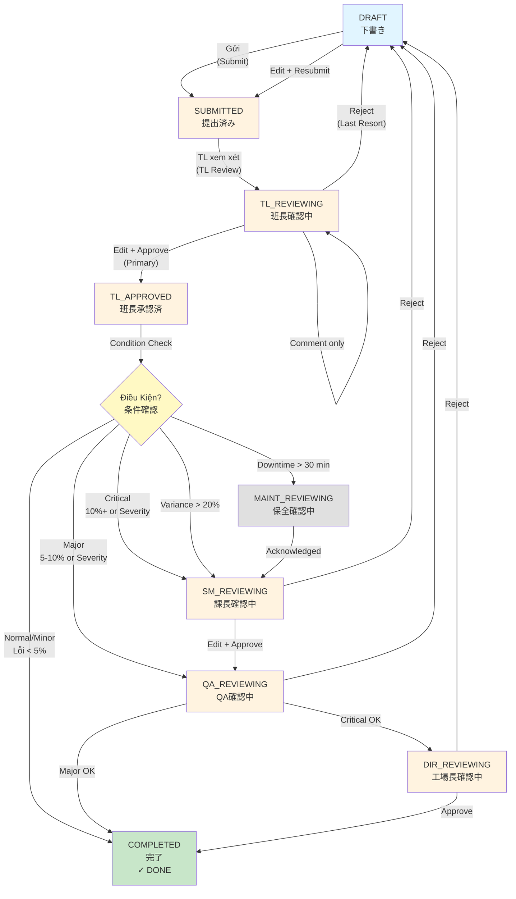

# Tài Liệu Đặc Tả Yêu Cầu Phần Mềm (SRS)
## Hệ Thống Báo Cáo Sản Xuất Hàng Ngày - Nhà Máy Thông Minh 4.0

**Phiên bản**: 1.0
**Ngày**: Tháng 4 năm 2026
**Trạng thái**: Hoàn chỉnh
**Tác giả**: DanaExperts & Y-Nettech
**Khách hàng**: Nhà Máy Sản Xuất Nhật Bản (1000+ máy tổng, 150 máy CNC, 2000+ công nhân tổng - Giai đoạn 1 áp dụng cho CNC: 50 người)

---

## 1. Giới Thiệu

### 1.1 Mục Đích
Tài liệu này định nghĩa các yêu cầu phần mềm chi tiết cho **Hệ Thống Báo Cáo Sản Xuất Hàng Ngày** (Smart Factory 4.0 Production Daily Report System) - một giải pháp quản lý sản xuất tích hợp giữa DanaExperts (ERP/Odoo) và Y-Nettech (IoT/Tự động hóa).

Mục tiêu chính:
- Thay thế quy trình báo cáo trên giấy bằng hệ thống điện tử trên máy tính bảng
- Cung cấp quy trình duyệt và phê duyệt báo cáo có điều kiện kiểm soát
- Hỗ trợ 6 vai trò khác nhau trong nhà máy với quyền hạn cụ thể
- Tích hợp với dữ liệu kế hoạch sản xuất (KHSX) từ ERP
- Tạo nền tảng cho giai đoạn tiếp theo: tích hợp IoT, chế độ ngoại tuyến, quét mã vạch

### 1.2 Phạm Vi

**Giai Đoạn 1 - CNC Department PILOT:**
Giai đoạn 1 tập trung vào CNC Department (部門) làm pilot trước khi mở rộng toàn nhà máy:
- **Phạm vi máy**: 150 máy CNC
- **Phạm vi nhân lực**: 50 người gồm:
  - 40 Nhân viên vận hành (オペレーター)
  - 10 Trưởng nhóm (班長 - cũng là nhân viên vận hành)
  - 1 Trưởng phòng CNC (CNC課長 - Section Manager cho CNC)
  - QA, Maintenance Lead (chia sẻ với toàn nhà máy), Director

**Bao gồm (Giai đoạn 1):**
- Nhập báo cáo sản xuất hàng ngày qua máy tính bảng
- Quy trình duyệt và phê duyệt nhiều cấp
- Bảng điều khiển dựa trên vai trò
- Tải sẵn dữ liệu kế hoạch sản xuất từ Odoo
- Quản lý lỗi sản xuất (loại, mức độ, nguyên nhân, biện pháp khắc phục)
- Hỗ trợ đa ngôn ngữ (Tiếng Nhật / Tiếng Anh)
- Lịch sử audit đầy đủ

**Mở Rộng Toàn Nhà Máy (Giai đoạn 2+):**
Sau khi Giai đoạn 1 thành công, hệ thống sẽ mở rộng để hỗ trợ tất cả phòng ban/dây chuyền trong nhà máy:
- 1000+ máy tổng
- 2000+ công nhân tổng
- Tích hợp cảm biến IoT
- Chế độ làm việc ngoại tuyến (offline mode)
- Chuyển đổi giọng nói thành văn bản
- Quét mã vạch / QR code
- Ứng dụng di động (Phase 2)

**Giới hạn sử dụng (Giai đoạn 1):**
- Chỉ sử dụng trên máy tính bảng được phân phát bởi nhà máy (1 máy tính bảng / 5 công nhân - shared model)
- Quản lý/TL/SM/QA/Director sử dụng máy tính bảng hoặc PC cá nhân (dedicated devices)
- Không cho phép sử dụng điện thoại cá nhân trong nhà máy
- Kết nối WiFi bắt buộc
- Công nhân chỉ đăng nhập vào máy tính bảng ở đầu ca và cuối ca (không liên tục suốt ngày)

### 1.3 Định Nghĩa, Từ Viết Tắt, Thuật Ngữ

| Thuật Ngữ | Tiếng Nhật | Tiếng Anh | Định Nghĩa |
|-----------|-----------|----------|----------|
| Báo cáo sản xuất hàng ngày | 日報 | Daily Production Report | Báo cáo hoạt động sản xuất trong một ca làm việc |
| Kế hoạch sản xuất | 生産計画 (KHSX) | Production Schedule | Dữ liệu kế hoạch sản xuất được lên lịch từ ERP |
| Ca làm việc | シフト | Shift | Thời gian làm việc (Day/Night) |
| Nhân viên vận hành | オペレーター | Operator | Công nhân vận hành máy |
| Trưởng nhóm | 班長 | Team Leader | Giám sát 5-10 nhân viên vận hành |
| Trưởng phòng | 課長 | Section Manager | Quản lý nhiều nhóm, phê duyệt cấp 2 |
| Kiểm soát chất lượng | 品質管理担当 | QA/QC Inspector | Đánh giá chất lượng sản phẩm và lỗi |
| Trưởng bảo trì | 保全リーダー | Maintenance Lead | Xử lý các vấn đề liên quan đến thiết bị |
| Giám đốc nhà máy | 工場長 | Factory Director | Quản lý cấp cao nhất, phê duyệt cấp 3 |
| Loại lỗi | 不具合分類 | Defect Type | Phân loại lỗi sản xuất (D01-D12, D99) |
| Mức độ lỗi | 重大度 | Severity | Minor, Major, Critical |
| Nguyên nhân | 原因分析 | Root Cause | 4M: Man, Machine, Material, Method |
| Biện pháp khắc phục | 対応策 | Countermeasure | Hành động để khắc phục lỗi |
| Cơ sở dữ liệu | 基本データ | Master Data | Dữ liệu tham chiếu: loại lỗi, nguyên nhân, biện pháp |
| Quy trình phê duyệt | ワークフロー | Workflow | Các bước duyệt/phê duyệt báo cáo |
| ERP | ERP | Enterprise Resource Planning | Hệ thống Odoo quản lý sản xuất |
| IoT | IoT | Internet of Things | Cảm biến và thiết bị tự động hóa (Phase 2) |
| SCADA | SCADA | Supervisory Control and Data Acquisition | Hệ thống giám sát Y-Nettech |
| Wi-Fi | Wi-Fi | Wireless Network | Mạng không dây trong nhà máy |
| API | API | Application Programming Interface | Giao diện tích hợp giữa Odoo và ứng dụng |

### 1.4 Tài Liệu Tham Chiếu

- IEEE 830-1998: Software Requirements Specification Standard
- Kế hoạch dự án: PLAN_Demo_Production_Report_App.md
- Tài liệu kiến trúc ERP: Odoo Implementation Guide
- Tài liệu IoT Y-Nettech: SCADA Integration Manual
- Quy trình nhà máy: Factory Operations Manual (Tiếng Nhật)

### 1.5 Tổng Quan Tài Liệu

Tài liệu này được tổ chức thành 5 phần chính:

1. **Giới Thiệu**: Mục đích, phạm vi, định nghĩa
2. **Mô Tả Tổng Quát**: Đặc điểm sản phẩm, chức năng, người dùng, ràng buộc
3. **Yêu Cầu Cụ Thể**: Yêu cầu chức năng, phi chức năng, dữ liệu
4. **Yêu Cầu Giao Diện**: UI, phần cứng, API, giao tiếp
5. **Phụ Lục**: Sơ đồ, ma trận quyền, dữ liệu chính, bảng glossary

---

## 2. Mô Tả Tổng Quát

### 2.1 Quan Điểm Sản Phẩm

**Vị Trí trong Hệ Thống Nhà Máy:**

```
┌─────────────────────────────────────────────────────┐
│          Odoo ERP (DanaExperts)                      │
│   ┌──────────────────────────────────────────────┐  │
│   │  • Kế hoạch sản xuất (KHSX)                  │  │
│   │  • Quản lý máy, sản phẩm, công nhân         │  │
│   │  • Dữ liệu chính (loại lỗi, nguyên nhân)   │  │
│   └──────────────────────────────────────────────┘  │
└──────────────┬──────────────────────────────────────┘
               │ API Integration
               ▼
┌─────────────────────────────────────────────────────┐
│  Hệ Thống Báo Cáo Sản Xuất Hàng Ngày (Web/Tablet)  │
│  ┌──────────────────────────────────────────────┐  │
│  │  • Nhập báo cáo                              │  │
│  │  • Quy trình duyệt/phê duyệt                 │  │
│  │  • Bảng điều khiển                           │  │
│  │  • Hỗ trợ 6 vai trò + i18n                   │  │
│  └──────────────────────────────────────────────┘  │
└──────────────┬──────────────────────────────────────┘
               │ Future Integration
               ▼
┌─────────────────────────────────────────────────────┐
│          Y-Nettech IoT/SCADA (Phase 2)             │
│   ┌──────────────────────────────────────────────┐  │
│   │  • Cảm biến máy                             │  │
│   │  • Dữ liệu thực tế (suất lao động, tên máy) │  │
│   │  • PLC/Tự động hóa                          │  │
│   └──────────────────────────────────────────────┘  │
└─────────────────────────────────────────────────────┘
```

### 2.2 Chức Năng Sản Phẩm

**Chức Năng Cấp Cao:**

1. **Quản Lý Báo Cáo Sản Xuất**
   - Nhân viên vận hành tạo báo cáo hàng ngày trên máy tính bảng
   - Tự động tải dữ liệu kế hoạch sản xuất
   - Nhập số lượng thực tế, giờ lao động, lỗi sản phẩm
   - Lưu nháp, gửi để duyệt

2. **Quy Trình Duyệt & Phê Duyệt**
   - Trưởng nhóm: duyệt, yêu cầu điền nguyên nhân/biện pháp
   - Trưởng phòng: phê duyệt lỗi cấp cao
   - QA/Kiểm soát chất lượng: xác nhận lỗi
   - Giám đốc: phê duyệt lỗi tới hạn (Critical)

3. **Bảng Điều Khiển Dựa Trên Vai Trò**
   - Bảng điều khiển toàn nhà máy (Giám đốc)
   - Bảng điều khiển phòng ban (Trưởng phòng)
   - Danh sách báo cáo cần duyệt (Trưởng nhóm, QA)
   - Báo cáo cá nhân (Nhân viên vận hành)

4. **Quản Lý Dữ Liệu Chính**
   - 13 loại lỗi (D01-D12, D99)
   - 22 nguyên nhân 4M
   - 13 biện pháp khắc phục (A01-A12, A99)
   - Danh sách máy, sản phẩm, ca làm việc

5. **Hệ Thống Thông Báo**
   - Thông báo khi báo cáo gửi, phê duyệt, từ chối
   - Nhắc nhở công việc chưa hoàn thành
   - Cảnh báo chất lượng (lỗi > 10%)

6. **Hỗ Trợ Đa Ngôn Ngữ (i18n)**
   - Giao diện đầy đủ Tiếng Nhật
   - Giao diện đầy đủ Tiếng Anh
   - Bộ chọn ngôn ngữ

### 2.3 Đặc Điểm Người Dùng

**6 Vai Trò Chính (Giai Đoạn 1 - CNC Department):**

| Vai Trò | Tiếng Nhật | Số Lượng (Phase 1) | Mô Tả | Hoạt Động Chính |
|---------|-----------|------|-------|-----------------|
| **Nhân viên vận hành** | オペレーター | 40 | Công nhân vận hành máy CNC | Tạo báo cáo hàng ngày, nhập dữ liệu sản xuất |
| **Trưởng nhóm** | 班長 | 10 (cũng là Operator) | Giám sát 4-5 nhân viên/nhóm, làm việc sản xuất trực tiếp | Duyệt báo cáo nhóm, yêu cầu thêm thông tin, phê duyệt cấp 1 |
| **Trưởng phòng CNC** | CNC課長 | 1 | Quản lý CNC Department (tất cả 10 nhóm) | Phê duyệt lỗi cấp cao, xem bảng điều khiển CNC, quản lý toàn bộ phòng |
| **QA/Kiểm soát chất lượng** | 品質管理担当 | ~2-3 | Chuyên gia chất lượng (dùng chung cho nhà máy) | Duyệt phân loại lỗi, ký xác nhận chất lượng |
| **Trưởng bảo trì** | 保全リーダー | ~2-3 | Chuyên gia bảo trì máy (dùng chung cho nhà máy) | Duyệt vấn đề thiết bị, phản hồi kỹ thuật |
| **Giám đốc nhà máy** | 工場長 | 1 | Lãnh đạo nhà máy | Phê duyệt lỗi tới hạn, xem báo cáo tổng hợp |

**Tổng số người dùng Giai đoạn 1**: ~55 người (50 CNC + QA + Maintenance + Director)

**Đặc Điểm Kỹ Thuật:**
- Người dùng làm việc trên máy tính bảng (kích thước 7-10 inch)
- Kết nối WiFi (không offline)
- Đa số nhân viên vận hành không quen công nghệ
- Cần giao diện đơn giản, nút bấm lớn
- Yêu cầu hỗ trợ tiếng Nhật là ưu tiên

#### 2.3.1 Mô Hình Sử Dụng Thiết Bị (Device Usage Model)

**Thiết Bị Dùng Chung (Shared Tablets) - Công Nhân:**
- **Máy tính bảng được chia sẻ**: 1 máy tính bảng cho 5 công nhân vận hành (オペレーター)
- **Thời điểm sử dụng**:
  - **Đầu ca (7:30-8:00 AM)**: Công nhân đăng nhập để kiểm tra KHSX (生産計画), xem phản hồi từ TL, và xem bất kỳ báo cáo bị từ chối nào từ ca hôm trước
  - **Cuối ca (4:30-5:00 PM)**: Công nhân đăng nhập để tạo báo cáo hàng ngày và gửi dữ liệu sản xuất
  - **Suốt ngày**: Công nhân KHÔNG liên tục sử dụng máy tính bảng (không đăng nhập)
- **Tác động đến hệ thống**:
  - Push notifications không hiệu quả (công nhân không đăng nhập cả ngày)
  - Cần dashboard cảnh báo "On Login" (khi công nhân đăng nhập lần đầu tiên trong ngày)
  - Các vấn đề từ chối/phản hồi từ TL phải hiển thị khi công nhân đăng nhập
  - Chorei (朝礼 - cuộc họp buổi sáng) là cơ chế chính để thông báo vấn đề cho công nhân

**Tablet Dùng Chung - TL (班長):**
- **Dùng chung tablet với Operator**: Trưởng nhóm cũng là người trực tiếp sản xuất ngoài vai trò quản lý
- **Thực tế vận hành**: Tại nhà máy Nhật Bản, các vị trí Operator, TL đều làm công việc sản xuất trực tiếp → ít thời gian thao tác với tool
- **Thời điểm sử dụng** (giống Operator nhưng thêm review):
  - **Đầu ngày (7:30-8:00)**: Check KHSX, review report của nhóm, chuẩn bị chorei
  - **Sau chorei (8:30-9:00)**: Duyệt/chỉnh sửa trực tiếp report sau khi trao đổi
  - **Trước/sau nghỉ trưa (11:30-12:00 / 13:00-13:30)**: Review và approve/reject
  - **Cuối ngày (4:30-5:00)**: Tạo report cá nhân, final review nhóm
- **Tác động đến hệ thống**:
  - Push notifications KHÔNG hiệu quả (dùng tablet chung, không đăng nhập liên tục)
  - Dashboard alerts "On Login" là cơ chế thông báo chính (giống Operator)
  - Cần UI review nhanh: danh sách cần duyệt → duyệt/sửa trực tiếp → xong
- **Số lượng tablet**: 10 tablets dùng chung (1 tablet cho 5 người = 1 TL + 4 Operators)

**Thiết Bị Cá Nhân (Personal Tablets) - SM/CNC Department Head (CNC課長):**
- **Tablet riêng**: Trưởng phòng CNC (CNC課長 - Section Manager) có thiết bị tablet chuyên dụng riêng
- **Lý do cần thiết bị cá nhân**: Quản lý tất cả 10 nhóm trong CNC Department, cần nhận thông tin SỚM từ các TL để ra quyết định cho vấn đề phát sinh (defect Critical, lỗi máy, etc.)
- **Thời điểm sử dụng**:
  - **Suốt ngày**: Đăng nhập liên tục để giám sát tất cả 10 nhóm, duyệt báo cáo cấp cao, phản hồi nhanh
  - **Khi có vấn đề phát sinh**: Nhận notification ngay từ các TL để xử lý kịp thời
- **Tác động đến hệ thống**:
  - Push notifications HIỆU QUẢ (luôn đăng nhập trên thiết bị cá nhân)
  - In-app notifications và browser push notifications được sử dụng tích cực
  - Badge counts trên menu items giúp SM thấy số lượng báo cáo cần duyệt từ 10 nhóm
  - Real-time updates cần thiết cho các vấn đề Critical/Major
  - Dashboard hiển thị status của tất cả 10 nhóm (submission rate, defect rate, approval status)

**Thiết Bị Cá Nhân (Personal Devices) - QA/Maintenance/Director:**
- **Tablet/PC riêng**: QA/QC (品質管理担当), Trưởng bảo trì (保全リーダー), và Giám đốc (工場長) có thiết bị chuyên dụng
- **Lý do cần thiết bị cá nhân**: Các vị trí này cần nhận thông tin SỚM để ra quyết định cho vấn đề phát sinh (defect Critical, sự cố máy, etc.)
- **Thời điểm sử dụng**:
  - **Suốt ngày**: Đăng nhập liên tục để giám sát, duyệt báo cáo, phản hồi nhanh
  - **Khi có vấn đề phát sinh**: Nhận notification ngay để xử lý kịp thời
- **Tác động đến hệ thống**:
  - Push notifications HIỆU QUẢ (họ luôn đăng nhập trên thiết bị cá nhân)
  - In-app notifications và browser push notifications được sử dụng tích cực
  - Badge counts trên menu items giúp họ thấy số lượng công việc chưa hoàn thành
  - Real-time updates cần thiết cho các vấn đề Critical/Major

### 2.4 Ràng Buộc

**Ràng Buộc Kỹ Thuật:**
- Phải tích hợp với Odoo ERP (API REST)
- Ứng dụng web (responsive, tablet-friendly)
- Dữ liệu lưu trữ trong cơ sở dữ liệu Odoo hoặc PostgreSQL
- Lịch sử audit đầy đủ, không thể xóa bản ghi

**Ràng Buộc Thiết Bị (Device Constraints) - Giai Đoạn 1 CNC Department:**

**Shared Tablets (10 units):**
- Công nhân vận hành (40 Operators) và Trưởng nhóm (10 TL) dùng chung tablet: 1 tablet cho 5 người (1 TL + 4 Operators)
  - Chỉ đăng nhập 2-4 lần mỗi ngày: đầu ca, sau chorei, trước/sau nghỉ trưa, cuối ca
  - Không đăng nhập suốt ngày (không session liên tục)
  - Hệ thống phải có cơ chế "auto-logout" sau 30 phút không hoạt động để tránh dữ liệu bị lộ
  - Thông báo push notifications KHÔNG hiệu quả cho nhóm này
  - Dashboard alerts "On Login" là cơ chế thông báo chính
  - Cần UI review nhanh: danh sách cần duyệt → duyệt/sửa trực tiếp → xong

**Personal Tablets (1 unit):**
- Trưởng phòng CNC (CNC課長/SM) sử dụng tablet riêng
  - Đăng nhập liên tục suốt ngày (session dài hạn)
  - Push notifications VÀ in-app notifications hiệu quả
  - Yêu cầu real-time updates và badge counts
  - Dashboard hiển thị toàn bộ tình trạng 10 nhóm

**Personal Devices (PC/Tablet):**
- QA (~2-3 người), Trưởng bảo trì (~2-3 người), Giám đốc (1 người): Sử dụng thiết bị cá nhân (tablet hoặc PC riêng)
  - Cần nhận thông tin sớm để ra quyết định kịp thời
  - Đăng nhập liên tục suốt ngày (session dài hạn)
  - Push notifications VÀ in-app notifications hiệu quả
  - Yêu cầu real-time updates và badge counts

**Ràng Buộc Vận Hành (CNC Department - Giai Đoạn 1):**
- Áp dụng cho: 150 máy CNC, 50 nhân viên CNC (40 Operators + 10 TL)
- Chỉ 1 báo cáo mỗi nhân viên mỗi ngày
- Ngày báo cáo không quá 3 ngày trong quá khứ
- Giờ lao động chính quy (所定労働時間): 7.5 giờ/ca
- Giờ làm thêm (残業時間 - Overtime/OT):
  - OT có thể được lên kế hoạch trước (trong KHSX) hoặc phát sinh ngoài kế hoạch
  - OT tối đa mỗi ngày: 4 giờ (tham chiếu Luật Lao Động Nhật Bản - 労働基準法)
  - Tổng giờ làm việc tối đa/ngày = 7.5h chính quy + 4h OT = 11.5h
  - Tuân thủ giới hạn theo 36協定 (Thỏa thuận Điều 36):
    - OT tối đa: 45 giờ/tháng (thông thường)
    - OT tối đa đặc biệt: 100 giờ/tháng (bao gồm ngày nghỉ), 720 giờ/năm
    - Trung bình OT ≤ 80 giờ/tháng tính trên 2-6 tháng liên tiếp
  - OT ngoài kế hoạch cũng được chấp nhận nhưng cần ghi chú lý do
- Giờ máy có thể vượt quá giờ lao động (hoạt động song song)
- Không có điện thoại cá nhân trong nhà máy

**Ràng Buộc Pháp Lý:**
- Tuân thủ quy định lao động Nhật Bản
- Bảo vệ dữ liệu cá nhân công nhân
- Audit trail cho mục đích tuân thủ

**Ràng Buộc Tài Chính:**
- Phải hoàn thành trong giai đoạn 1 (Phase 1)
- Sử dụng Odoo open-source (chi phí tối thiểu)

### 2.5 Giả Định và Phụ Thuộc

**Giả Định:**
- Odoo ERP đã được triển khai với dữ liệu sản xuất/nhân viên
- Máy tính bảng được phân phát và kết nối WiFi ổn định
- Nhân viên được đào tạo về hệ thống
- Dữ liệu KHSX được cập nhật hàng ngày từ lịch trình sản xuất
- Tất cả máy CNC được đăng ký trong hệ thống với mã duy nhất

**Phụ Thuộc:**
- **Odoo API**: Cung cấp dữ liệu KHSX, nhân viên, máy, sản phẩm
- **Cơ sở dữ liệu Y-Nettech**: Danh sách máy, thông số kỹ thuật (Phase 2)
- **Hệ thống xác thực**: LDAP hoặc Odoo user authentication
- **Wi-Fi nhà máy**: Kết nối ổn định 24/7
- **Máy tính bảng**: Hệ điều hành Android/iOS, trình duyệt hiện đại

### 2.6 Chiến Lược Workflow (Workflow Strategy)

**Tổng Quan:**
Workflow trong hệ thống báo cáo sản xuất được thiết kế dựa trên nguyên lý Gemba (現場主導 - Hiện trường dẫn dắt) và quản lý theo ngoại lệ (Exception-based), giảm thiểu các bước phê duyệt không cần thiết và thúc đẩy giải quyết vấn đề trực tiếp tại hiện trường (chorei) thay vì qua hệ thống.

#### 2.6.1 Năm Nguyên Tắc Thiết Kế Workflow

**1. Gemba-driven + Exception-based Workflow (現場主導・例外ベース)**
- Sản xuất bình thường (không có vấn đề) = số bước phê duyệt tối thiểu (2 bước: Operator → TL → DONE)
- Full approval chain chỉ kích hoạt khi có ngoại lệ: lỗi lớn, downtime dài, phương sai lớn
- Hệ thống ghi nhận kết quả; Chorei (朝礼 - cuộc họp buổi sáng) xử lý vấn đề
- Principle: "Hiện trường quyết định, hệ thống ghi nhận"

**2. Edit-first, Reject-last (編集優先・差戻し最後) - MUST HAVE**
- Hành động mặc định của người duyệt = Chỉnh sửa + Phê duyệt (1-click: TL xem, sửa nếu cần, phê duyệt)
- Reject (từ chối) dành RIÊNG cho: giả dối dữ liệu, thông tin thiếu nghiêm trọng, gian lận
- Mục tiêu: Giảm reject cycles → tăng tốc độ quy trình, tăng sự hợp tác TL-Operator
- Hiểu rõ: TL không phải kiểm tra chặt mà là "bổ sung thông tin" → cơ chế edit trực tiếp

**3. Configurable Workflow (設定可能なワークフロー)**
- Admin nhà máy có thể enable/disable các cấp phê duyệt: SM approval, QA approval, Director approval
- Mỗi nhà máy có độ trưởng thành khác nhau → không thể bắt buộc 1 workflow cho tất cả
- Ngưỡng giá trị có thể cấu hình: % lỗi, % phương sai, thời gian downtime
- Mặc định: condition-based (khuyến cáo)

**4. Minimum Touch UI (最小操作)**
- Tối đa 1-2 click để approve/edit/submit
- Không điều hướng phức tạp
- Operators & TL dùng tablet chia sẻ (thời gian hạn chế) → UI phải nhanh, gọn gàng
- Số click = độ phức tạp; phải tối thiểu hóa

**5. Chorei = Problem Resolution, System = Record (朝礼=問題解決、システム=記録)**
- Hệ thống KHÔNG thay thế thảo luận trực tiếp
- Hệ thống ghi nhận QUYẾTđịnh từ chorei, không phải nơi ra quyết định
- TL & Operator thảo luận trong chorei → sau đó cập nhật hệ thống (TL direct edit)
- Chorei xảy ra TRƯỚC quy trình phê duyệt hệ thống

#### 2.6.2 Quy Tắc Định Tuyến Dựa Trên Điều Kiện (Condition-Based Approval Rules)

| **Tình Trạng / Điều Kiện** | **Workflow Path** | **Bước** | **Ghi Chú** |
|---|---|---|---|
| **Normal (không có lỗi, phương sai < 10%)** | Operator → TL approve → COMPLETED | 2 | Hoàn thành nhanh, không thông báo SM/QA |
| **Minor defect (lỗi < 5%, severity: Minor)** | Operator → TL edit/approve → COMPLETED | 2 | TL edit trực tiếp, không gửi QA |
| **Major defect (lỗi 5-10% hoặc severity: Major)** | Operator → TL → QA → COMPLETED | 3 | QA duyệt phân loại lỗi |
| **Critical defect (lỗi > 10% hoặc severity: Critical)** | Operator → TL → SM → QA → Director → COMPLETED | 5 | Full chain, tất cả cấp phê duyệt |
| **Downtime > 30 min** | Operator → TL → Maintenance → SM → COMPLETED | 4 | Parallel: Maintenance duyệt ngoài main chain |
| **Large variance (actual vs plan > 20%)** | Operator → TL → SM → COMPLETED | 3 | SM duyệt phương sai lớn |

**Ghi Chú Bảng:**
- COMPLETED = kết thúc quy trình, báo cáo chốt
- % lỗi tính = (số lỗi / số lượng thực tế) * 100%
- Severity: Minor < Major < Critical (3 mức độ)
- Downtime = giờ dừng máy liên tục
- Variance = |kế hoạch - thực tế| / kế hoạch * 100%

#### 2.6.3 Cấu Hình Workflow (Configurable Settings)

**Admin Factory có thể điều chỉnh:**

1. **Bật/Tắt Cấp Phê Duyệt:**
   - [ ] SM approval (CNC Department Head) - Default: ON
   - [ ] QA approval - Default: ON
   - [ ] Director approval (Critical only) - Default: ON

2. **Ngưỡng Giá Trị (Thresholds):**
   - Minor defect: % lỗi ≤ ? (Default: 5%)
   - Major defect: % lỗi ≤ ? (Default: 10%)
   - Critical defect: % lỗi > ? (Default: > 10%)
   - Large variance: % variance > ? (Default: > 20%)
   - Downtime threshold: phút (Default: 30 phút)

3. **Default Workflow:**
   - Condition-based (RECOMMENDED)
   - Hoặc: Custom (advanced)

#### 2.6.4 Hành Động Mặc Định Của Người Duyệt

**Reviewer Workflow (For all reviewers: TL, SM, QA, Director):**

1. **Primary Action: Edit + Approve (編集+承認)**
   - Xem báo cáo → nếu cần sửa nguyên nhân/biện pháp → sửa trực tiếp → phê duyệt
   - 1-click action (nút "Approve" = duyệt ngay, nút "Edit & Approve" = edit rồi duyệt)
   - Không cần từ chối ngoại trừ vấn đề nghiêm trọng

2. **Secondary Action: Comment (Bình Luận)**
   - Thêm ghi chú mà không thay đổi trạng thái
   - Dùng khi cần thêm thông tin nhưng không cần reject

3. **Tertiary Action: Reject (Từ Chối)**
   - ONLY FOR: Giả dối dữ liệu, thông tin thiếu nghiêm trọng, fraud
   - Yêu cầu lý do chi tiết (bắt buộc)
   - Hệ thống theo dõi tỷ lệ reject (mục tiêu: < 5% tất cả reviews)

---

## 3. Yêu Cầu Cụ Thể

### 3.1 Yêu Cầu Chức Năng

#### 3.1.1 Xác Thực & Ủy Quyền (FR-AUTH)

**FR-AUTH-001: Đăng Nhập Người Dùng**
- **Mô Tả**: Người dùng đăng nhập bằng tên người dùng và mật khẩu
- **Ưu Tiên**: Must Have
- **Đầu Vào**: Tên người dùng, mật khẩu
- **Đầu Ra**: Token đăng nhập, thông tin người dùng (tên, vai trò, phòng ban)
- **Quy Tắc Kinh Doanh**:
  - Xác thực qua Odoo hoặc LDAP
  - Tối đa 3 lần đăng nhập sai → khóa 15 phút
  - Session timeout: 4 giờ không hoạt động
- **Tiêu Chí Chấp Nhận**:
  - Đăng nhập thành công → điều hướng tới bảng điều khiển
  - Mật khẩu sai → thông báo lỗi rõ ràng
  - Tài khoản bị khóa → thông báo thời gian chờ
  - Log tất cả nỗ lực đăng nhập

**FR-AUTH-002: Quản Lý Phiên (Session Management)**
- **Mô Tả**: Hệ thống quản lý phiên người dùng, timeout, đăng xuất
- **Ưu Tiên**: Must Have
- **Quy Tắc Kinh Doanh**:
  - Timeout tự động sau 4 giờ không hoạt động
  - Nhắc nhở trước 10 phút
  - Lưu nháp trước khi timeout
- **Tiêu Chí Chấp Nhận**:
  - Phiên hết hạn → yêu cầu đăng nhập lại
  - Dữ liệu nháp được bảo toàn

**FR-AUTH-003: Kiểm Soát Truy Cập Dựa Trên Vai Trò (RBAC)**
- **Mô Tả**: Hệ thống cấp quyền dựa trên vai trò (Operator, TL, SM, QA, ML, Director)
- **Ưu Tiên**: Must Have
- **Quy Tắc Kinh Doanh**:
  - 6 vai trò chính được định nghĩa
  - Mỗi vai trò có quyền hạn cụ thể (xem ma trận phần 5.2)
  - Một người dùng có thể có nhiều vai trò
  - Dữ liệu được lọc dựa trên vai trò và phòng ban
- **Tiêu Chí Chấp Nhận**:
  - Operator chỉ xem báo cáo cá nhân
  - Team Leader xem báo cáo nhóm
  - Section Manager xem báo cáo phòng ban
  - Director xem tất cả
  - Nút bấm "Edit" ẩn/hiển thị theo quyền

**FR-AUTH-004: Xác Thực Multi-Factor (Optional - Phase 2)**
- **Mô Tả**: Hỗ trợ xác thực 2 lớp (PIN + RFID)
- **Ưu Tiên**: Could Have
- **Quy Tắc Kinh Doanh**:
  - Tùy chọn bảo mật cao cho các vai trò nhạy cảm
  - PIN 4-6 chữ số
  - RFID card tùy chọn

#### 3.1.2 Quản Lý Báo Cáo Sản Xuất (FR-RPT)

**FR-RPT-001: Tạo Báo Cáo Mới**
- **Mô Tả**: Nhân viên vận hành tạo báo cáo sản xuất hàng ngày mới
- **Ưu Tiên**: Must Have
- **Đầu Vào**: Ngày (mặc định hôm nay, tối đa 3 ngày trước), Ca (Day/Night)
- **Đầu Ra**: Mẫu báo cáo với dữ liệu KHSX tải sẵn
- **Quy Tắc Kinh Doanh**:
  - Tối đa 1 báo cáo mỗi nhân viên mỗi ngày
  - Nếu báo cáo hôm nay ở trạng thái DRAFT/REJECTED → mở để chỉnh sửa
  - Nếu báo cáo hôm nay ở SUBMITTED+ → hiển thị chi tiết (có thể hủy)
  - Tự động tải tất cả KHSX cho ca/dây chuyền của nhân viên
  - Số lượng thực tế mặc định = số lượng kế hoạch
  - Giờ lao động phân bổ tỷ lệ theo số lượng kế hoạch
  - Nhân viên có thể điều chỉnh các giá trị này
- **Tiêu Chí Chấp Nhận**:
  - Báo cáo tạo thành công → trạng thái DRAFT
  - Dữ liệu KHSX hiển thị đầy đủ
  - Số lượng thực tế có thể chỉnh sửa
  - Nhân viên vận hành không thể tạo báo cáo cho người khác

**FR-RPT-002: Nhập Dữ Liệu Sản Xuất**
- **Mô Tả**: Nhân viên vận hành nhập chi tiết sản xuất cho từng sản phẩm
- **Ưu Tiên**: Must Have
- **Đầu Vào**:
  - Lô hàng (từ KHSX)
  - Sản phẩm/Mã (auto-filter theo lô)
  - Số lượng kế hoạch (hiển thị, chỉ đọc)
  - Số lượng thực tế (chỉnh sửa)
  - Giờ lao động (mỗi mục)
  - Giờ máy (CNC runtime)
- **Đầu Ra**: Dữ liệu được lưu trong báo cáo
- **Quy Tắc Kinh Doanh**:
  - Nút +/- để điều chỉnh số lượng
  - Nút +5/-5 để điều chỉnh nhanh
  - Cảnh báo vàng nếu số lượng > 120% kế hoạch
  - Yêu cầu xác nhận để tiếp tục
  - Giờ lao động chính quy (所定労働時間) ≤ 7.5h/ca
  - Giờ làm thêm (残業時間/OT): tối đa 4h/ngày, có thể planned hoặc unplanned
  - Tổng giờ = chính quy + OT, tối đa 11.5h/ngày
  - Giờ máy có thể > tổng giờ lao động (hoạt động song song)
  - Thanh tiến độ giờ lao động (hiển thị chính quy + OT riêng biệt)
  - Badge "Modified" cho các mục đã thay đổi
- **Tiêu Chí Chấp Nhận**:
  - Có thể thay đổi số lượng, giờ lao động, giờ máy
  - Cảnh báo phù hợp được hiển thị
  - Thanh tiến độ cập nhật thời gian thực
  - Dữ liệu được lưu tạm khi chỉnh sửa

**FR-RPT-003: Quản Lý Lỗi Sản Phẩm**
- **Mô Tả**: Nhân viên vận hành nhập chi tiết lỗi sản phẩm
- **Ưu Tiên**: Must Have
- **Đầu Vào**:
  - Loại lỗi (D01-D12, D99)
  - Mức độ (Minor/Major/Critical) - nút toggle
  - Số lượng lỗi
  - Mô tả (tùy chọn cho Operator, bắt buộc cho TL)
  - Nguyên nhân 4M (tùy chọn cho Operator, bắt buộc cho TL)
  - Biện pháp khắc phục (tùy chọn cho Operator, bắt buộc cho TL)
  - Ảnh đính kèm (Phase 2)
- **Đầu Ra**: Bản ghi lỗi liên kết với sản phẩm
- **Quy Tắc Kinh Doanh**:
  - Số lượng lỗi ≤ số lượng thực tế sản phẩm
  - Cảnh báo đỏ nếu lỗi > 10% số lượng thực tế
  - Mô tả bắt buộc nếu lỗi > 5
  - Nguyên nhân/biện pháp sẽ được yêu cầu ở giai đoạn Trưởng nhóm duyệt
- **Tiêu Chí Chấp Nhận**:
  - Có thể thêm/xóa/chỉnh sửa lỗi
  - Loại lỗi có dropdown đầy đủ
  - Mức độ chọn qua nút toggle (rõ ràng)
  - Cảnh báo phù hợp

**FR-RPT-004: Lưu Nháp Báo Cáo**
- **Mô Tả**: Lưu báo cáo dưới dạng nháp (DRAFT) mà không gửi
- **Ưu Tiên**: Must Have
- **Đầu Vào**: Dữ liệu báo cáo (có thể không đầy đủ)
- **Đầu Ra**: Báo cáo trạng thái DRAFT
- **Quy Tắc Kinh Doanh**:
  - Không yêu cầu dữ liệu bắt buộc để lưu nháp
  - Tự động lưu định kỳ (3 phút)
  - Cho phép tiếp tục chỉnh sửa sau
  - Giữ lại dữ liệu nháp ngay cả khi session timeout
- **Tiêu Chí Chấp Nhận**:
  - Nút "Lưu" → lưu nháp thành công
  - Thông báo xác nhận "Báo cáo đã được lưu"
  - Có thể tiếp tục chỉnh sửa ngay sau khi lưu

**FR-RPT-005: Gửi Báo Cáo Để Duyệt**
- **Mô Tả**: Nhân viên vận hành gửi báo cáo hoàn chỉnh cho Trưởng nhóm duyệt
- **Ưu Tiên**: Must Have
- **Đầu Vào**: Báo cáo DRAFT hoàn chỉnh
- **Đầu Ra**: Báo cáo trạng thái SUBMITTED, thông báo cho Trưởng nhóm
- **Quy Tắc Kinh Doanh**:
  - Dữ liệu bắt buộc phải đầy đủ:
    - Ít nhất 1 mục sản phẩm
    - Tổng giờ lao động chính quy ≤ 7.5h (hoặc có lý do nếu < 7.5h)
    - Nếu có OT: ghi rõ giờ OT kế hoạch và giờ OT thực tế
    - OT ngoài kế hoạch: yêu cầu ghi lý do (残業理由)
    - Nếu có lỗi → phải có loại lỗi + mô tả
  - Không thể gửi ngày quá 3 ngày trong quá khứ
  - Yêu cầu xác nhận trước khi gửi
- **Tiêu Chí Chấp Nhận**:
  - Kiểm tra toàn bộ trước khi gửi
  - Hiển thị lỗi nếu dữ liệu không đầy đủ
  - Gửi thành công → trạng thái SUBMITTED
  - Thông báo cho Trưởng nhóm

**FR-RPT-006: Hủy Gửi Báo Cáo**
- **Mô Tả**: Nhân viên vận hành có thể hủy báo cáo SUBMITTED để trở về DRAFT
- **Ưu Tiên**: Should Have
- **Đầu Vào**: Báo cáo SUBMITTED
- **Đầu Ra**: Báo cáo trở về DRAFT, thông báo cho người đã duyệt
- **Quy Tắc Kinh Doanh**:
  - Chỉ có thể hủy báo cáo SUBMITTED (chưa được duyệt)
  - Không thể hủy nếu đã được duyệt (SUBMITTED+)
  - Yêu cầu lý do hủy gửi
  - Lịch sử audit ghi nhận hành động
- **Tiêu Chí Chấp Nhận**:
  - Dialog xác nhận với trường lý do
  - Hủy thành công → trạng thái DRAFT
  - Thông báo cho Trưởng nhóm dạng "Báo cáo bị hủy gửi"

**FR-RPT-007: Chỉnh Sửa Báo Cáo Bị Từ Chối**
- **Mô Tả**: Nhân viên vận hành có thể chỉnh sửa báo cáo REJECTED và gửi lại
- **Ưu Tiên**: Should Have
- **Đầu Vào**: Báo cáo REJECTED với lý do từ chối
- **Đầu Ra**: Báo cáo trở về DRAFT, hiển thị lý do từ chối, có thể gửi lại
- **Quy Tắc Kinh Doanh**:
  - Hiển thị lý do từ chối nổi bật (banner đỏ)
  - Cho phép chỉnh sửa tất cả các trường
  - Lưu lịch sử version báo cáo
- **Tiêu Chí Chấp Nhận**:
  - Banner đỏ với lý do từ chối
  - Có thể chỉnh sửa mọi dữ liệu
  - Gửi lại → chuyển sang bước duyệt tiếp theo

**FR-RPT-008: Xem Chi Tiết Báo Cáo**
- **Mô Tả**: Người dùng xem chi tiết báo cáo với lịch sử, trạng thái, ghi chú
- **Ưu Tiên**: Must Have
- **Đầu Ra**: Giao diện hiển thị:
  - Tiêu đề báo cáo (ngày, ca, nhân viên)
  - Badge trạng thái với màu code
  - Danh sách sản phẩm + số lượng + % đạt được
  - Giờ lao động + thanh tiến độ
  - Giờ máy
  - Danh sách lỗi với chi tiết (loại, mức độ, số lượng, nguyên nhân, biện pháp)
  - Timeline/Audit trail: tất cả hành động + người thực hiện + thời gian
  - Ghi chú từ người duyệt
  - Nút bấm (dựa trên vai trò + trạng thái)
- **Tiêu Chí Chấp Nhận**:
  - Hiển thị tất cả thông tin liên quan
  - Timeline hiển thị theo thứ tự thời gian
  - Màu code rõ ràng
  - Responsive trên tablet

**FR-RPT-009: Liên Kết Báo Cáo Với Số Công Việc (工番)**
- **Mô Tả**: Báo cáo sản xuất được liên kết với số công việc (Job Number) cụ thể từ kế hoạch sản xuất
- **Ưu Tiên**: Must Have
- **Đầu Vào**:
  - Job Number (工番): từ KHSX
  - Customer Name (得意先名): tên khách hàng
  - Work Title (作業件名): tiêu đề công việc
- **Đầu Ra**: Báo cáo hiển thị đầy đủ thông tin công việc
- **Quy Tắc Kinh Doanh**:
  - Mỗi báo cáo phải liên kết với ít nhất 1 job number
  - Job number tự động tải từ KHSX
  - Hiển thị tên khách hàng và tiêu đề công việc trong form
  - Cho phép lọc/tìm kiếm báo cáo theo job number
  - Dữ liệu công việc là read-only từ phía nhân viên vận hành
- **Tiêu Chí Chấp Nhận**:
  - Báo cáo chứa job number, tên khách hàng, tiêu đề công việc
  - Có thể tìm kiếm báo cáo theo job number
  - Tạo báo cáo mới tự động điền job number từ KHSX

**FR-RPT-010: So Sánh Ngày Hôm Qua vs Hôm Nay (前日の作業実績 vs 当日の作業実績)**
- **Mô Tả**: Hiển thị layout so sánh side-by-side giữa kết quả làm việc hôm qua và hôm nay
- **Ưu Tiên**: Must Have
- **Đầu Vào**:
  - Dữ liệu báo cáo hôm qua (nếu có)
  - Dữ liệu báo cáo hôm nay (bản nháp)
- **Đầu Ra**: Layout 2 cột so sánh hiển thị cạnh nhau
- **Quy Tắc Kinh Doanh**:
  - Mỗi cột (hôm qua / hôm nay) chứa đầy đủ các mục:
    - 作業目標 (Work Target): Mục tiêu sản xuất (có thể chỉnh sửa)
    - 結果 (Results): Kết quả thực tế (từ báo cáo)
    - 差異原因/改善すべき点 (Variance/Improvement): Phân tích sự khác biệt
    - 明日の予定 (Tomorrow's Plan): Kế hoạch cho ngày tiếp theo
  - Các mục "hôm qua" là read-only (hiển thị dữ liệu đã hoàn thành)
  - Các mục "hôm nay" có thể chỉnh sửa
  - Tự động tính toán sự khác biệt nếu có dữ liệu hôm qua
  - Giúp nhân viên thực hiện Kaizen (cải tiến liên tục)
- **Tiêu Chí Chấp Nhận**:
  - Layout 2 cột hiển thị rõ ràng trên tablet
  - Dữ liệu hôm qua hiển thị (hoặc tin nhắn "không có báo cáo hôm qua")
  - Có thể nhập/chỉnh sửa mục "hôm nay"
  - Phân tích so sánh hiệu quả

**FR-RPT-011: Nhập Dữ Liệu Kế Hoạch & Kết Quả (作業目標, 結果, 改善点, 明日の予定)**
- **Mô Tả**: Nhân viên vận hành nhập các trường narrative (từ tự do) cho kế hoạch, kết quả, cải tiến
- **Ưu Tiên**: Must Have
- **Đầu Vào**:
  - 作業目標 (Work Target): Kế hoạch công việc hôm nay (free text, tối đa 500 ký tự)
  - 結果 (Results): Kết quả thực tế hôm nay (free text, tối đa 500 ký tự)
  - 差異原因 (Variance Reasons): Lý do sự khác biệt giữa kế hoạch và kết quả (free text, tối đa 1000 ký tự)
  - 改善すべき点 (Improvement Points): Các điểm cần cải tiến (free text, tối đa 1000 ký tự)
  - 明日の予定 (Tomorrow's Plan): Kế hoạch cho ngày mai (free text, tối đa 500 ký tự)
- **Đầu Ra**: Dữ liệu narrative được lưu trong báo cáo
- **Quy Tắc Kinh Doanh**:
  - Các trường này tùy chọn (optional) ở giai đoạn nhân viên vận hành
  - Có thể bắt buộc ở giai đoạn Trưởng nhóm duyệt (nếu có lỗi)
  - Text area có counter ký tự
  - Hỗ trợ ký tự Nhật Bản (UTF-8)
  - Tự động lưu draft định kỳ
- **Tiêu Chí Chấp Nhận**:
  - Có thể nhập text dài cho mỗi trường
  - Text area responsive trên tablet
  - Hiển thị counter ký tự
  - Lưu thành công khi save/submit báo cáo

**FR-RPT-012: Ghi Nhận Giờ Lao Động Theo Loại Công Việc (作業時間 by 作業種別)**
- **Mô Tả**: Nhân viên vận hành ghi nhận giờ lao động phân theo loại công việc (activity type)
- **Ưu Tiên**: Must Have
- **Đầu Vào**:
  - 10 loại công việc (activity types):
    - 打合・段取 (Meeting/Setup)
    - 設計・展開 (Design/Development)
    - 製缶 (Can making/Fabrication)
    - 組立 (Assembly)
    - 試運転 (Test run/Commissioning)
    - 現地作業 (On-site work)
    - 機械加工 (Machining)
    - メンテナンス (Maintenance)
    - バリ取り・酸洗 (Deburring/Pickling)
    - ドキュメント作成 (Documentation)
  - Mỗi activity type: 予定 (Planned), 実績 (Actual), % (Percentage), 進捗% (Progress)
- **Đầu Ra**: Dữ liệu giờ lao động theo activity type
- **Quy Tắc Kinh Doanh**:
  - Tổng giờ lao động tất cả activity types ≤ 7.5h chính quy + OT (tối đa 11.5h/ngày)
  - Hiển thị bảng với columns: Activity Type | Planned (h) | Actual (h) | % | Progress (%)
  - Nút +/- để điều chỉnh giờ thực tế
  - Thanh tiến độ tính tổng từ tất cả activity types, phân biệt chính quy (7.5h) và OT
  - Cảnh báo vàng nếu actual > planned hoặc tổng > 7.5h (chuyển sang OT)
  - Cảnh báo đỏ nếu tổng > 11.5h (vượt giới hạn ngày)
  - Percentage tính tự động: (Actual / Planned) * 100%
- **Tiêu Chí Chấp Nhận**:
  - Bảng activity types hiển thị đầy đủ
  - Có thể chỉnh sửa giờ thực tế
  - Thanh tiến độ cập nhật thời gian thực, phân biệt chính quy vs OT
  - Cảnh báo phù hợp hiển thị
  - OT ngoài kế hoạch yêu cầu ghi lý do

**FR-RPT-013: Đánh Giá Từ Giám Sát (評価 - Star Rating & Comments)**
- **Mô Tả**: Trưởng nhóm hoặc Trưởng phòng cấp một đánh giá cho báo cáo bằng sao và ghi chú
- **Ưu Tiên**: Should Have
- **Đầu Vào**:
  - 評価者 (Evaluator): Tên người đánh giá (auto-fill từ người duyệt)
  - Star Rating (★): 1-5 sao đánh giá chất lượng công việc
  - 評価コメント (Evaluation Comments): Nhân xét/góp ý từ giám sát (free text)
  - 改善指示 (Improvement Instructions): Hướng dẫn cải tiến cụ thể (free text, tùy chọn)
- **Đầu Ra**: Dữ liệu đánh giá lưu trong báo cáo
- **Quy Tắc Kinh Doanh**:
  - Chỉ Trưởng nhóm, Trưởng phòng, QA, Giám đốc mới có quyền đánh giá
  - Star rating hiển thị trực quan (★★★☆☆)
  - Comment có độ dài tối đa 500 ký tự
  - Có thể sửa đánh giá trước khi phê duyệt hoàn tất
  - Đánh giá không xóa được (audit trail)
  - Nhân viên có thể xem đánh giá nhưng không thể chỉnh sửa
- **Tiêu Chí Chấp Nhận**:
  - Hiển thị widget chọn sao (1-5 sao)
  - Text area nhập comment
  - Đánh giá lưu thành công
  - Nhân viên có thể xem đánh giá trong chi tiết báo cáo

**FR-RPT-014: Quản Lý Loại Công Việc (作業種別 - Activity Type Master Data)**
- **Mô Tả**: Admin quản lý danh sách các loại công việc được sử dụng trong báo cáo
- **Ưu Tiên**: Must Have
- **Đầu Vào**:
  - Activity Type Code: Mã loại công việc (VD: ACT01-ACT10)
  - Name_ja: Tên loại công việc tiếng Nhật
  - Name_en: Tên loại công việc tiếng Anh
  - Description: Mô tả chi tiết
  - Active: Tình trạng kích hoạt
- **Đầu Ra**: Danh sách activity types được sử dụng trong tất cả báo cáo
- **Quy Tắc Kinh Doanh**:
  - 10 loại công việc mặc định (Meeting/Setup, Design, Fabrication, Assembly, Test, On-site, Machining, Maintenance, Deburring, Documentation)
  - Admin có thể thêm/sửa/xóa (soft delete)
  - Khi deactivate activity type → báo cáo cũ vẫn giữ nguyên giá trị
  - Danh sách được cache trên tablet, đồng bộ hàng ngày
  - Hỗ trợ đa ngôn ngữ (JP/EN)
- **Tiêu Chí Chấp Nhận**:
  - Có thể xem danh sách 10 activity types mặc định
  - Có thể thêm activity type mới
  - Có thể sửa/deactivate activity type
  - Báo cáo cũ không bị ảnh hưởng khi activity type thay đổi

**FR-RPT-015: Quản Lý Giờ Làm Thêm (残業管理 - Overtime Management)**
- **Mô Tả**: Hệ thống hỗ trợ ghi nhận và quản lý giờ làm thêm (OT), bao gồm OT có kế hoạch và OT ngoài kế hoạch
- **Ưu Tiên**: Must Have
- **Đầu Vào**:
  - Giờ OT kế hoạch (残業予定時間): Tải từ KHSX/kế hoạch ca, có thể = 0 nếu không có OT
  - Giờ OT thực tế (残業実績時間): Nhân viên nhập sau khi hoàn thành OT
  - Lý do OT (残業理由): Bắt buộc nếu OT ngoài kế hoạch
  - Loại OT: Có kế hoạch (計画残業) / Ngoài kế hoạch (計画外残業)
- **Đầu Ra**: Dữ liệu OT liên kết với báo cáo, cảnh báo vi phạm quy định
- **Quy Tắc Kinh Doanh**:
  - OT kế hoạch được tải sẵn từ KHSX (nếu có), nhân viên có thể điều chỉnh
  - OT ngoài kế hoạch: nhân viên có thể thêm OT chưa có trong kế hoạch, nhưng bắt buộc ghi lý do
  - Giới hạn theo Luật Lao Động Nhật Bản (労働基準法) & 36協定:
    - OT tối đa mỗi ngày: 4 giờ → Tổng = 7.5h chính quy + 4h OT = 11.5h/ngày
    - OT tối đa mỗi tháng: 45 giờ (thông thường), 100 giờ (trường hợp đặc biệt)
    - OT tối đa mỗi năm: 360 giờ (thông thường), 720 giờ (trường hợp đặc biệt)
    - Trung bình OT ≤ 80 giờ/tháng tính trên 2-6 tháng liên tiếp
  - Cảnh báo vàng khi OT thực tế > OT kế hoạch
  - Cảnh báo đỏ khi OT > 4h/ngày (vượt giới hạn hàng ngày)
  - Cảnh báo đỏ khi tổng OT tháng gần chạm 45h (hiển thị OT tháng đã tích lũy)
  - Thanh tiến độ hiển thị: [Chính quy 7.5h | OT kế hoạch | OT ngoài KH]
  - OT phải được Trưởng nhóm xác nhận khi duyệt báo cáo
- **Tiêu Chí Chấp Nhận**:
  - Giờ OT kế hoạch tải sẵn từ KHSX (nếu có)
  - Nhân viên có thể thêm OT ngoài kế hoạch + lý do
  - Cảnh báo hiển thị đúng khi vượt giới hạn
  - Thanh tiến độ phân biệt rõ giờ chính quy vs OT
  - Tổng OT tháng hiển thị cho cả Operator và TL
  - Trưởng nhóm xác nhận OT khi duyệt báo cáo

#### 3.1.3 Quy Trình Duyệt & Phê Duyệt (FR-WF)

**FR-WF-001: Quy Trình Duyệt Trưởng Nhóm (Team Leader Review) - EDIT-FIRST PRINCIPLE**
- **Mô Tả**: Trưởng nhóm xem báo cáo, chỉnh sửa trực tiếp nếu cần (nguyên nhân/biện pháp), sau đó phê duyệt. Reject dành cho vấn đề nghiêm trọng chỉ.
- **Ưu Tiên**: Must Have
- **Đầu Vào**: Báo cáo SUBMITTED
- **Đầu Ra**: Báo cáo trạng thái SUBMITTED → TL_APPROVED → (auto-route based on condition) hoặc REJECTED (hiếm)
- **Quy Tắc Kinh Doanh**:
  - **Primary Action (MUST)**: Edit + Approve
    - Nút "Approve" (1-click): TL xem → nếu không cần sửa → nhấn Approve → chuyển tiếp theo
    - Nút "Edit & Approve": TL có thể chỉnh sửa nguyên nhân/biện pháp → thêm ghi chú → phê duyệt
    - Cơ chế edit trực tiếp: TL sửa ngay, không từ chối
    - Lịch sử audit ghi: "TL edited: [fields changed] on [date]"
  - **Secondary Action**: Comment (Bình Luận)
    - Thêm ghi chú mà không thay đổi trạng thái
    - Dùng khi cần hỏi/yêu cầu thêm info nhưng chưa ready duyệt
  - **Tertiary Action (LAST RESORT)**: Reject
    - ONLY for: Giả dối dữ liệu, thông tin thiếu cơ bản, lỗi cơ bản
    - Yêu cầu lý do chi tiết (bắt buộc)
    - Báo cáo quay về DRAFT, Operator phải sửa lại
    - Hệ thống theo dõi reject rate (mục tiêu: < 5%)
  - **Auto-Route After TL_APPROVED** (based on condition):
    - Normal (no issue) or Minor (< 5%, minor severity): COMPLETED (不要 SM/QA notification)
    - Major (5-10% or major severity): → QA_REVIEWING
    - Critical (> 10% or critical severity): → SM_REVIEWING → QA_REVIEWING
    - Downtime > 30 min: → MAINT_REVIEWING (parallel) & SM_REVIEWING
    - Large variance (> 20%): → SM_REVIEWING
- **Tiêu Chí Chấp Nhận**:
  - Nút "Approve", "Edit & Approve", "Comment", "Reject" rõ ràng
  - Edit form hiển thị các trường có thể sửa (Root cause, Countermeasure, Notes)
  - Audit trail ghi nhận: tên TL, fields edited, timestamp
  - Điều kiện xác định cấp tiếp theo (Normal/Minor → COMPLETED, Major → QA, Critical → SM)
  - Reject rate tracked trong dashboard (< 5% target)

**FR-WF-002: Quy Trình Phê Duyệt Trưởng Phòng (Section Manager / CNC課長 Approval)**
- **Mô Tả**: Trưởng phòng CNC phê duyệt báo cáo chỉ khi có ngoại lệ: Critical defect, Large variance, Downtime. Normal/Minor không gửi SM.
- **Phase 1**: CNC Department Head quản lý 10 nhóm (50 người, 150 máy)
- **Ưu Tiên**: Must Have (nếu enable) / Should Have (configurable)
- **Đầu Vào**: Báo cáo TL_APPROVED với điều kiện: Critical defect (> 10%) HOẶC Large variance (> 20%) HOẶC Downtime > 30 min
- **Đầu Ra**: Báo cáo trạng thái SM_REVIEWING → SM_APPROVED → QA_REVIEWING hoặc REJECTED
- **Quy Tắc Kinh Doanh**:
  - **Trigger Condition**: Chỉ xảy ra khi: (1) Critical defect, (2) Large variance, (3) Downtime > 30min
  - Normal/Minor reports: KHÔNG gửi SM (goes directly to COMPLETED after TL)
  - SM xem báo cáo từ tất cả 10 nhóm
  - Same edit-first principle: Chỉnh sửa trực tiếp → Phê duyệt (hoặc Comment, Reject if serious)
  - Có thể chỉnh sửa nguyên nhân/biện pháp, ghi chú
  - Phê duyệt → gửi tới QA_REVIEWING
  - Từ chối → quay lại TL_REVIEWING
  - Real-time notifications chỉ cho SM khi có Critical/Large variance/Downtime
- **Tiêu Chí Chấp Nhận**:
  - Chỉ xem báo cáo với điều kiện trigger (không spam với Normal reports)
  - Nút "Approve", "Edit & Approve", "Comment", "Reject"
  - Chỉnh sửa được nguyên nhân/biện pháp/ghi chú
  - Real-time notification hiệu quả
  - Audit trail ghi nhận hành động SM

**FR-WF-003: Quy Trình Duyệt QA (QA/QC Review)**
- **Mô Tả**: QA duyệt phân loại lỗi, có thể điều chỉnh severity. Normal/Minor không cần QA (goes to COMPLETED after TL). Major/Critical trigger QA.
- **Ưu Tiên**: Must Have (nếu enable) / Should Have (configurable)
- **Đầu Vào**: Báo cáo TL_APPROVED với lỗi (Minor → direct to COMPLETED bỏ qua, Major/Critical → QA_REVIEWING)
- **Đầu Ra**: Báo cáo trạng thái QA_REVIEWING → QA_APPROVED → COMPLETED hoặc DIR_REVIEWING (nếu Critical) hoặc REJECTED
- **Quy Tắc Kinh Doanh**:
  - **Trigger Condition**: Chỉ xảy ra khi báo cáo có lỗi (ANY defect exist)
    - Minor: No QA needed → COMPLETED after TL
    - Major/Critical: QA_REVIEWING (bắt buộc)
  - QA xem tất cả báo cáo nhà máy có lỗi
  - QA có thể reclassify lỗi (thay đổi type, severity) dựa trên kiểm tra thực tế
  - Same edit-first principle: Chỉnh sửa (phân loại lỗi, nguyên nhân, biện pháp) → Phê duyệt
  - Hành động: Approve (edit/no-edit), Comment, Reject (hiếm)
  - Phê duyệt Major → COMPLETED (end of workflow)
  - Phê duyệt Critical → DIR_REVIEWING
  - Từ chối → quay lại TL_REVIEWING
- **Tiêu Chí Chấp Nhận**:
  - Minor reports không gửi QA (COMPLETED after TL)
  - Major/Critical reports gửi QA
  - QA có thể edit: Defect Type, Severity, Root Cause, Countermeasure
  - Nút "Approve", "Edit & Approve", "Comment", "Reject"
  - QA signature/ký xác nhận (audit trail)
  - Điều kiện routing: Major → COMPLETED, Critical → DIR_REVIEWING

**FR-WF-004: Quy Trình Duyệt Giám Đốc (Director Approval)**
- **Mô Tả**: Giám đốc phê duyệt lỗi Critical cấp cao nhất. Chỉ trigger cho Critical defects.
- **Ưu Tiên**: Should Have (configurable: có thể disable)
- **Đầu Vào**: Báo cáo QA_APPROVED với lỗi Critical (> 10%)
- **Đầu Ra**: Báo cáo trạng thái DIR_REVIEWING → DIR_APPROVED → COMPLETED hoặc REJECTED
- **Quy Tắc Kinh Doanh**:
  - **Trigger Condition**: ONLY Critical defects (> 10% or severity = Critical)
  - Giám đốc xem báo cáo Critical từ tất cả phòng ban
  - Same edit-first: Có thể chỉnh sửa (notes, ghi chú cao cấp) → Phê duyệt
  - Hành động: Approve (no-edit hoặc with edit), Comment, Reject (very rare - for falsification)
  - Phê duyệt → COMPLETED
  - Từ chối → quay lại QA_REVIEWING
  - Có thể view tóm tắt chất lượng, hiệu suất toàn nhà máy
- **Tiêu Chí Chấp Nhận**:
  - Chỉ xem báo cáo Critical (không spam)
  - Nút "Approve", "Edit & Approve", "Comment", "Reject"
  - Audit trail đầy đủ với signature
  - Can disable/enable cấp này trong settings

**FR-WF-005: Quy Trình Xử Lý Từ Chối (LAST RESORT - Reject Rate < 5%)**
- **Mô Tả**: Từ chối HIẾM được sử dụng - chỉ cho vấn đề nghiêm trọng (giả dối, thiếu info cơ bản). Mục tiêu < 5% reject rate.
- **Ưu Tiên**: Must Have (nhưng minimize usage)
- **Đầu Vào**: Báo cáo ở bất kỳ giai đoạn duyệt, người duyệt nhấn "Reject"
- **Đầu Ra**: Báo cáo REJECTED → quay lại DRAFT, người tạo chỉnh sửa & gửi lại
- **Quy Tắc Kinh Doanh**:
  - **When to Reject** (3 cases only):
    1. Data falsification / Giả dối dữ liệu
    2. Serious missing information / Thông tin thiếu cơ bản (e.g., không có nguyên nhân khi > 5 lỗi)
    3. Fraud / Gian lận
  - **Do NOT reject for**: Typo, minor missing details (TL should edit), opinion differences
  - Reject → yêu cầu lý do chi tiết (mandatory field)
  - Báo cáo quay về DRAFT, Operator phải sửa
  - Thông báo tới Operator với reject reason
  - Hệ thống theo dõi reject rate: [TL name] = X% rejects (dashboard metric)
  - Nếu reject rate > 5%, flag cảnh báo cho SM/Director
  - Lịch sử audit ghi: reject reason, người reject, timestamp, re-submission
- **Tiêu Chí Chấp Nhận**:
  - Nút "Reject" hiển thị nhưng nhấn vào có warning: "Reject should be last resort. Consider Edit instead."
  - Dialog bắt buộc: "Reject Reason" (text field)
  - Báo cáo quay về DRAFT
  - Operator được thông báo rõ ràng (alert + email)
  - Lý do từ chối hiển thị trong Morning Review section
  - Dashboard shows reject rate per reviewer (< 5% target)

**FR-WF-006: Ghi Chú & Bình Luận trong Duyệt**
- **Mô Tả**: Người duyệt có thể thêm ghi chú/bình luận mà không thay đổi trạng thái (when Edit & Approve is not immediate)
- **Ưu Tiên**: Should Have
- **Đầu Vào**: Báo cáo ở trạng thái duyệt, nội dung bình luận
- **Đầu Ra**: Ghi chú lưu trong báo cáo, hiển thị trong timeline
- **Quy Tắc Kinh Doanh**:
  - Nút "Comment" = thêm ghi chú mà không approve/reject
  - Dùng khi cần hỏi thêm thông tin hoặc có nhận xét nhưng chưa ready quyết định
  - Comment không thay đổi trạng thái báo cáo
  - Nên configure: Comment counter = số bình luận chưa trả lời
- **Tiêu Chí Chấp Nhận**:
  - Nút "Comment" rõ ràng + text area
  - Comment hiển thị với tên người + timestamp
  - Operator được notify khi có comment mới
  - Comment có thể được mention (@operator_name)

**FR-WF-007: Quy Trình Duyệt Trưởng Bảo Trì (Maintenance Lead) - PARALLEL, NON-BLOCKING**
- **Mô Tả**: Trưởng bảo trì duyệt vấn đề thiết bị (downtime, equipment issue) song song, KHÔNG block main workflow
- **Ưu Tiên**: Could Have
- **Đầu Vào**: Báo cáo có Downtime > 30 min hoặc lỗi liên quan thiết bị (Machine defect category)
- **Đầu Ra**: Ghi chú kỹ thuật, xác nhận nhận được, diagnostic notes
- **Quy Tắc Kinh Doanh**:
  - Maintenance Lead xem báo cáo có downtime/equipment issue (parallel to main chain)
  - Có thể thêm ghi chú kỹ thuật (diagnostic, repair plan)
  - Hành động: "Acknowledged", "Will Check", "In Progress", "Resolved"
  - Hành động này KHÔNG block báo cáo hoàn thành (non-blocking)
  - Có thể enable/disable trong settings (configurable)
- **Tiêu Chí Chấp Nhận**:
  - Xem báo cáo downtime/equipment
  - Nút "Acknowledged", "Will Check", "In Progress", "Resolved"
  - Thêm ghi chú kỹ thuật
  - Maintenance notes hiển thị trong report detail (info-only)

**FR-WF-008: Đánh Giá Báo Cáo Của Giám Sát (Supervisor Evaluation - 評価)**
- **Mô Tả**: Trưởng nhóm, Trưởng phòng, QA, hoặc Giám đốc cấp đánh giá sao (star rating) và nhận xét
- **Ưu Tiên**: Should Have
- **Đầu Vào**: Báo cáo được duyệt hoặc đang duyệt
- **Đầu Ra**: Dữ liệu đánh giá ghi trong báo cáo với:
  - Tên người đánh giá (評価者)
  - Star rating (1-5 sao)
  - Nhận xét đánh giá (評価コメント)
  - Hướng dẫn cải tiến (改善指示)
- **Quy Tắc Kinh Doanh**:
  - Chỉ Trưởng nhóm, Trưởng phòng, QA, Giám đốc có quyền đánh giá
  - Star rating là bắt buộc nếu chọn đánh giá
  - Comment là tùy chọn
  - Có thể sửa đánh giá trước khi báo cáo chốt hoàn tất
  - Đánh giá không thể xóa (audit trail ghi nhận)
  - Nhân viên có quyền xem đánh giá nhưng không thể chỉnh sửa
  - Hỗ trợ ký tự Nhật Bản trong comment (UTF-8)
- **Tiêu Chí Chấp Nhận**:
  - Widget chọn sao 1-5 hiển thị rõ ràng
  - Text area nhập comment/hướng dẫn
  - Đánh giá lưu thành công
  - Nhân viên xem được đánh giá trong chi tiết báo cáo
  - Audit trail ghi nhận hành động đánh giá

#### 3.1.3.1 Hỗ Trợ Chorei - Cuộc Họp Buổi Sáng (FR-CHOREI)

**Tổng Quan Chorei (朝礼) - THE HEART OF GEMBA-DRIVEN WORKFLOW:**
Chorei là cuộc họp buổi sáng hàng ngày (7:30-8:00 AM) trong các nhà máy Nhật Bản, nơi:
- TL & Operators tập hợp lại để xem xét kết quả ngày hôm trước
- Thảo luận về lỗi (defects), vấn đề chất lượng, nguyên nhân gốc rễ (face-to-face)
- Quyết định countermeasures và hướng hành động
- Lên kế hoạch cho ngày hôm nay
- **Sau chorei**: Operator & TL cập nhật báo cáo hệ thống (TL chỉnh sửa trực tiếp)

**Nguyên Tắc**: Hệ thống HỖỢ chorei, không THAY THẾ chorei. Quyết định kinh doanh (root cause, countermeasures) được made tại hiện trường, system chỉ GHI NHẬN.

**FR-CHOREI-001: Morning Review Dashboard - Hiển Thị Feedback Từ Chorei Hôm Qua**
- **Mô Tả**: Operator xem kết quả ngày hôm trước, phản hồi từ TL, ghi chú chorei khi đăng nhập buổi sáng (7:30-8:00 AM)
- **Ưu Tiên**: Must Have
- **Đầu Vào**: Operator đăng nhập lúc 7:30-8:00 AM
- **Đầu Ra**: Dashboard section ở ĐẦU (priority #1) hiển thị:
  - **"Morning Review Alerts" banner**:
    - Báo cáo hôm qua trạng thái: COMPLETED vs REJECTED vs PENDING
    - Nếu REJECTED: Lý do từ chối rõ ràng (bắt buộc chỉnh sửa)
    - Nếu COMPLETED: Phản hồi từ TL (bình luận, TL edit notes, evaluation rating nếu có)
    - Ghi chú chorei hôm qua: "Discussed in Chorei - Root cause: [RCA], Countermeasure: [CRM]"
  - Visual indicators: ✓ Green (hoàn thành), ✗ Red (từ chối), ! Orange (cần chú ý)
  - Links: "View Details", "Edit & Resubmit" (nếu rejected)
- **Quy Tắc Kinh Doanh**:
  - Morning Review hiển thị TAUTOMATICALLY, không cần Operator tìm kiếm
  - Báo cáo hôm qua của tất cả Operators (nếu shared tablet)
  - Từ chối → lý do rõ ràng, có thể chỉnh sửa ngay
  - COMPLETED → xem phản hồi TL (có input tốt → confidence tăng)
  - Chorei discussion notes → Operator thấy rõ quyết định được made
- **Tiêu Chí Chấp Nhận**:
  - Morning Review section hiển thị ở TOP khi login
  - Báo cáo hôm qua visible ngay lập tức
  - Reject reason bold & actionable
  - TL feedback (comments, edits, evaluation) rõ ràng
  - Chorei notes ghi rõ: "朝礼で議論済み (2026-04-05) - RCA: [reason], CRM: [action]"

**FR-CHOREI-002: TL Direct Edit - Chỉnh Sửa Trực Tiếp Sau Chorei**
- **Mô Tả**: Sau chorei, TL chỉnh sửa báo cáo trực tiếp (thêm nguyên nhân/biện pháp từ cuộc thảo luận) mà không từ chối. Edits được ghi trong audit trail rõ ràng.
- **Ưu Tiên**: Must Have (cốt lõi edit-first principle)
- **Đầu Vào**: Báo cáo SUBMITTED hoặc đang duyệt
- **Đầu Ra**: Báo cáo với trường root cause/countermeasure/notes updated bởi TL, trạng thái vẫn TL_REVIEWING (chưa approved)
- **Quy Tắc Kinh Doanh**:
  - TL nhấn nút "Edit & Add Notes" hoặc "TL Direct Edit" trên báo cáo
  - Form cho phép edit:
    - Root cause (4M): Single/Multiple select + free text
    - Countermeasure (A01-A12): Single/Multiple select + free text
    - Notes/Comments: Free text với mention (@operator)
    - Chorei mark: "Discussed in Chorei on [date]" (timestamp auto-fill)
  - Save edit → Audit trail ghi:
    - "TL [name] edited: Root cause, Countermeasure, Notes on [timestamp]"
    - Diff view: "Previous: [old value] → New: [new value]"
  - Operator can view TL edits anytime (không bị ẩn)
  - TL chỉnh sửa => không thay đổi trạng thái (vẫn TL_REVIEWING) => TL sau đó phê duyệt
  - **Outcome**: Chỉnh sửa → Phê duyệt (approve) → auto-route theo condition (COMPLETED hoặc next level)
- **Tiêu Chí Chấp Nhận**:
  - Nút "TL Direct Edit" hoặc "Edit & Add Notes" rõ ràng
  - Form cho phép edit root cause, countermeasure, notes
  - Audit trail ghi "Edited by TL [name]" + timestamp + diff fields
  - Operator xem được edits ngay lập tức (no delay)
  - Trạng thái report vẫn TL_REVIEWING sau edit (chưa approve)
  - TL sau đó phê duyệt → auto-route

**FR-CHOREI-003: Mark as Chorei Discussed - Ghi Nhận Thảo Luận**
- **Mô Tả**: Sau khi TL chỉnh sửa trực tiếp (post-chorei), TL/Operator có thể mark báo cáo "Chorei Discussed" → ghi nhận vấn đề được thảo luận face-to-face
- **Ưu Tiên**: Should Have
- **Đầu Vào**: Báo cáo đã được TL edit
- **Đầu Ra**: Flag/badge "朝礼で議論済み" (Chorei Discussed) với date, TL name
- **Quy Tắc Kinh Doanh**:
  - Nút "Mark as Chorei Discussed" hiển thị sau TL edit
  - Click → Timestamp & TL name được ghi tự động
  - Audit trail: "Chorei discussed on 2026-04-05 with TL [name]"
  - Badge color: BLUE (to distinguish from other statuses)
  - Purpose: Ghi nhận quyết định được made tại hiện trường, không phải qua system
- **Tiêu Chí Chấp Nhận**:
  - Nút "Mark as Chorei Discussed" xuất hiện
  - Badge/flag hiển thị rõ ràng trong báo cáo
  - Audit trail ghi: "朝礼で議論済み on [date] with [TL]"

**FR-CHOREI-004: Edit-First Strategy - Giảm Reject Cycles to < 5%**
- **Mô Tả**: Workflow strategy nhấn mạnh EDIT thay vì REJECT. Mục tiêu reject rate < 5%. TL training: "Edit first, reject last."
- **Ưu Tiên**: Must Have (strategy, not feature)
- **Quy Tắc Kinh Doanh**:
  - **UI Hint**: Khi TL click "Reject", popup warning: "Reject nên dành cho vấn đề nghiêm trọng (giả dối, thiếu info cơ bản). Xem xét 'Edit & Approve' thay vì 'Reject'?"
  - Hướng dẫn TL workflow:
    1. Operator gửi báo cáo (SUBMITTED)
    2. TL xem → chỉnh sửa trực tiếp (TL_EDIT) thêm root cause + countermeasure từ chorei
    3. Mark "Chorei Discussed" (ghi nhận decision made tại hiện trường)
    4. Phê duyệt (TL_APPROVED) → auto-route
    5. Reject CHỈ nếu: Dữ liệu giả, thông tin thiếu cơ bản, fraud
  - Dashboard metric: Reject rate per TL (target: < 5%)
    - Nếu TL > 5%: SM/Director được cảnh báo để coach/retrain
  - System discourages reject: Reject button có visual distinction (e.g., red, confirmed dialog)
- **Tiêu Chí Chấp Nhận**:
  - Workflow hướng dẫn rõ "Edit first, Reject last"
  - UI warning khi click Reject
  - Dashboard track reject rate per TL
  - Alert nếu TL reject rate > 5%

#### 3.1.4 Bảng Điều Khiển & Phân Tích (FR-DASH)

**FR-DASH-001: Bảng Điều Khiển Nhân Viên Vận Hành (Operator Dashboard)**
- **Mô Tả**: Nhân viên vận hành xem báo cáo cá nhân, trạng thái duyệt, ghi chú, phản hồi từ TL. Dashboard có section "Morning Review Alerts" ở trên đầu.
- **Ưu Tiên**: Must Have
- **Đầu Ra**: Giao diện hiển thị:
  - **Morning Review Section (Trên đầu - ưu tiên nhất)**:
    - Alert box "Báo cáo bị từ chối" (nếu có) với lý do từ chối rõ ràng
    - Alert box "Phản hồi từ Trưởng nhóm" (nếu có) - thể hiện bình luận, ghi chú
    - Visual indicators: Màu xanh (hoàn thành), Màu đỏ (từ chối), Màu vàng (cần chú ý)
    - Mỗi alert có link "Xem chi tiết" hoặc "Chỉnh sửa"
  - **Báo cáo hôm nay**: Trạng thái (DRAFT/SUBMITTED/REJECTED)
  - **Danh sách báo cáo gần đây**: 7 ngày gần đây
  - **Ghi chú từ Trưởng nhóm**: Bao gồm TL_EDIT notes (những gì TL thêm vào)
  - **Nút hành động**: "Tạo báo cáo", "Xem chi tiết", "Chỉnh sửa"
- **Tiêu Chí Chấp Nhận**:
  - Morning Review alerts hiển thị ở trên đầu khi Operator đăng nhập
  - Báo cáo bị từ chối hiển thị rõ ràng với lý do
  - Phản hồi TL (bình luận, TL_EDIT notes) có thể đọc được
  - Operator có thể điều hướng tới báo cáo để chỉnh sửa
  - Ghi chú từ TL hiển thị rõ ràng

**FR-DASH-002: Bảng Điều Khiển Trưởng Nhóm**
- **Mô Tả**: Trưởng nhóm xem báo cáo nhóm cần duyệt, danh sách tóm tắt
- **Ưu Tiên**: Must Have
- **Đầu Ra**: Giao diện hiển thị:
  - Danh sách báo cáo SUBMITTED cần duyệt
  - Báo cáo lỗi > 10% đánh dấu
  - Báo cáo đã phê duyệt (7 ngày gần đây)
  - Số lượng báo cáo theo trạng thái (stats)
  - Nút "Duyệt", "Chi tiết", "Bình luận"
- **Tiêu Chí Chấp Nhận**:
  - Danh sách cần duyệt có filter/sort
  - Hiển thị tóm tắt lỗi
  - Thống kê stats chính xác

**FR-DASH-003: Bảng Điều Khiển Trưởng Phòng (Section Manager / CNC課長)**
- **Mô Tả**: Trưởng phòng CNC (CNC課長) xem báo cáo CNC Department, thống kê chất lượng, hiệu suất toàn bộ 10 nhóm
- **Áp dụng Phase 1**: CNC Department Head quản lý tất cả 10 nhóm (50 người, 150 máy CNC)
- **Ưu Tiên**: Should Have
- **Đầu Ra**: Giao diện hiển thị:
  - Danh sách báo cáo từ tất cả 10 nhóm cần duyệt
  - Biểu đồ chất lượng CNC (tỷ lệ lỗi theo loại)
  - Biểu đồ hiệu suất (% đạt được theo nhóm)
  - Danh sách lỗi Critical từ 10 nhóm
  - Thống kê tóm tắt: số báo cáo hôm nay, số lỗi, % submit rate từ 10 nhóm
  - Bộ lọc ngày/nhóm (10 nhóm)/máy
- **Tiêu Chí Chấp Nhận**:
  - Hiển thị dữ liệu CNC Department đầy đủ từ tất cả 10 nhóm
  - Biểu đồ cập nhật thời gian thực
  - Bộ lọc hoạt động, có thể xem từng nhóm riêng
  - Badge counts hiển thị số báo cáo chờ duyệt từ từng nhóm

**FR-DASH-004: Bảng Điều Khiển QA/Kiểm Soát Chất Lượng**
- **Mô Tả**: QA xem báo cáo tất cả nhà máy, thống kê chất lượng, lỗi cần xử lý
- **Ưu Tiên**: Must Have
- **Đầu Ra**: Giao diện hiển thị:
  - Danh sách báo cáo cần duyệt (all departments)
  - Biểu đồ chất lượng tổng hợp
  - Top 10 loại lỗi phổ biến
  - Trend lỗi (7 ngày, 30 ngày, 3 tháng, 1 năm)
  - Bộ lọc phòng/ngày/loại lỗi
- **Tiêu Chí Chấp Nhận**:
  - Xem tất cả báo cáo
  - Thống kê chính xác
  - Biểu đồ rõ ràng

**FR-DASH-005: Bảng Điều Khiển Giám Đốc (Director Dashboard)**
- **Mô Tả**: Giám đốc xem tóm tắt nhà máy, KPI chính, lỗi Critical
- **Phase 1**: Dữ liệu từ CNC Department (50 người, 150 máy)
- **Phase 2+**: Mở rộng sang tất cả phòng ban (2000+ người, 1000+ máy)
- **Ưu Tiên**: Should Have
- **Đầu Ra**: Giao diện hiển thị:
  - Thống kê tổng hợp: số báo cáo, lỗi, hiệu suất
  - Trend 30 ngày: tỷ lệ lỗi, % đạt được
  - Top phòng ban (best/worst) - Phase 1: chỉ CNC; Phase 2: tất cả phòng
  - Danh sách lỗi Critical chưa phê duyệt
  - KPI chính (OEE, Defect Rate)
  - Bộ lọc thời gian
- **Tiêu Chí Chấp Nhận**:
  - Thống kê cấp cao
  - Biểu đồ trend rõ ràng
  - KPI hiển thị

**FR-DASH-006: Xuất Báo Cáo (Export)**
- **Mô Tả**: Người dùng có thể xuất dữ liệu thành Excel/PDF
- **Ưu Tiên**: Should Have
- **Đầu Vào**: Bộ lọc (ngày, phòng, loại lỗi)
- **Đầu Ra**: File Excel/PDF
- **Quy Tắc Kinh Doanh**:
  - Chỉ xuất dữ liệu người dùng có quyền xem
  - Bao gồm tất cả chi tiết lỗi
  - Format rõ ràng, dễ đọc
- **Tiêu Chí Chấp Nhận**:
  - Xuất Excel thành công
  - Dữ liệu đầy đủ, chính xác
  - Format chuyên nghiệp

#### 3.1.5 Quản Lý Dữ Liệu Chính (FR-MDM)

**FR-MDM-001: Quản Lý Loại Lỗi**
- **Mô Tả**: Quản trị viên quản lý danh sách 13 loại lỗi CNC
- **Ưu Tiên**: Must Have
- **Đầu Vào**: Loại lỗi (D01-D12, D99), tên, mô tả
- **Đầu Ra**: Dữ liệu lưu trong Odoo
- **Quy Tắc Kinh Doanh**:
  - 13 loại được định nghĩa sẵn, không thêm/xóa
  - Có thể chỉnh sửa tên/mô tả
  - Đồng bộ từ Odoo
- **Tiêu Chí Chấp Nhận**:
  - Danh sách 13 loại lỗi đầy đủ
  - Có thể chỉnh sửa tên

**FR-MDM-002: Quản Lý Nguyên Nhân 4M**
- **Mô Tả**: Quản trị viên quản lý 22 nguyên nhân 4M
- **Ưu Tiên**: Must Have
- **Đầu Vào**:
  - Man (6): Kỹ năng, Chú ý, Sức khỏe, Tâm trạng, v.v.
  - Machine (6): Mài mòn, Độ chính xác, Bảo trì, v.v.
  - Material (4): Chất lượng nguyên liệu, Tính chất, v.v.
  - Method (6): Công nghệ, Thao tác, v.v.
- **Tiêu Chí Chấp Nhận**:
  - 22 nguyên nhân được hiển thị theo 4M
  - Có thể chỉnh sửa, không thêm/xóa

**FR-MDM-003: Quản Lý Biện Pháp Khắc Phục**
- **Mô Tả**: Quản trị viên quản lý 13 biện pháp khắc phục
- **Ưu Tiên**: Must Have
- **Đầu Vào**: Biện pháp (A01-A12, A99), tên, mô tả
- **Tiêu Chí Chấp Nhận**:
  - 13 biện pháp được hiển thị
  - Có thể chỉnh sửa, không thêm/xóa

**FR-MDM-004: Quản Lý Dữ Liệu Máy**
- **Mô Tả**: Quản lý danh sách máy, mã, loại, trạng thái
- **Ưu Tiên**: Must Have
- **Đầu Vào**: Từ Odoo ERP
- **Đầu Ra**: Dropdown danh sách máy
- **Quy Tắc Kinh Doanh**:
  - Đồng bộ từ Odoo
  - Phân loại CNC/Non-CNC
  - Hiển thị mã máy duy nhất
- **Tiêu Chí Chấp Nhận**:
  - Danh sách máy đầy đủ
  - Có thể lọc CNC

**FR-MDM-005: Quản Lý Dữ Liệu Sản Phẩm**
- **Mô Tả**: Quản lý danh sách sản phẩm, mã, loại, đơn vị
- **Ưu Tiên**: Must Have
- **Đầu Vào**: Từ Odoo ERP
- **Đầu Ra**: Dropdown danh sách sản phẩm (auto-filter theo lô)
- **Tiêu Chí Chấp Nhận**:
  - Danh sách sản phẩm đầy đủ
  - Auto-filter theo lô chính xác

**FR-MDM-006: Quản Lý Dữ Liệu Kế Hoạch Sản Xuất (KHSX)**
- **Mô Tả**: Tải và quản lý dữ liệu KHSX từ Odoo hàng ngày
- **Ưu Tiên**: Must Have
- **Đầu Vào**: Lịch trình sản xuất từ Odoo
- **Đầu Ra**: KHSX tải sẵn trong báo cáo
- **Quy Tắc Kinh Doanh**:
  - Đồng bộ tự động hàng ngày (0:00)
  - Bao gồm: Lô, Sản phẩm, Số lượng kế hoạch, Dây chuyền, Ca
  - Hiệu lực cho 7 ngày sắp tới
  - Cache trong ứng dụng để ngoại tuyến (Phase 2)
- **Tiêu Chí Chấp Nhận**:
  - KHSX tải đầy đủ
  - Dữ liệu chính xác
  - Cập nhật hàng ngày

#### 3.1.6 Hệ Thống Thông Báo (FR-NTF)

**FR-NTF-001: Push Notifications (Exception-Based) - Chỉ cho Ngoại Lệ**
- **Mô Tả**: Thông báo real-time CHỈ KHI CÓ NGOẠI LỆ (Critical defect, Large variance, Downtime). Normal reports → NO notification (giảm noise).
- **Ưu Tiên**: Must Have
- **Đầu Vào**: Báo cáo SUBMITTED với điều kiện trigger: Critical defect > 10%, Variance > 20%, Downtime > 30 min
- **Đầu Ra**: Push notification in-app + Browser notification (PWA) + Email (Phase 2)
- **Quy Tắc Kinh Doanh**:
  - **Gửi CHỈ khi có ngoại lệ**:
    - SM/CNC課長: CriticalDefect HOẶC LargeVariance HOẶC Downtime > 30 min
    - QA: Critical defect (không phải Minor/Major)
    - Maintenance Lead: Downtime > 30 min hoặc lỗi Machine category
    - Director: Critical defect ONLY
  - **KHÔNG gửi**:
    - Normal reports (no issue)
    - Minor/Major defects (không critical)
    - Mỗi TL: 50+ báo cáo/ngày, 90% không có ngoại lệ → không spam SM/QA
  - Badge count trên menu tương ứng (chỉ ngoại lệ)
  - **KHÔNG gửi push cho Operator, TL** (họ dùng tablet chung, dùng Dashboard Alerts instead)
- **Tiêu Chí Chấp Nhận**:
  - Push notification gửi CHỈ cho exception cases
  - Normal reports KHÔNG trigger notification (giảm 90% noise)
  - SM/CNC課長/QA/Director chỉ nhận notify khi có vấn đề → focus tốt hơn
  - Badge count chính xác (exception count only)
  - Nhấp notification → điều hướng tới báo cáo

**FR-NTF-002: Dashboard Alerts On Login (Tablet dùng chung - Operator/TL)**
- **Mô Tả**: Hiển thị cảnh báo và vấn đề chờ xử lý khi người dùng tablet dùng chung đăng nhập. Đây là cơ chế thông báo CHÍNH cho Operator, TL vì họ không nhận push notification.
- **Ưu Tiên**: Must Have
- **Đầu Vào**: Người dùng (Operator/TL) đăng nhập
- **Đầu Ra**: Dashboard alerts section ở trên cùng, tùy theo vai trò
- **Quy Tắc Kinh Doanh**:
  - **Operator thấy khi đăng nhập**:
    1. Báo cáo bị từ chối (với lý do từ chối) → nút "Chỉnh sửa"
    2. Phản hồi/ghi chú từ TL (bình luận, TL direct edit)
    3. Thay đổi KHSX so với hôm qua
  - **TL thấy khi đăng nhập**:
    1. Số báo cáo chờ duyệt từ nhóm → nút "Duyệt nhanh"
    2. Báo cáo có defect Major/Critical cần chú ý
    3. Báo cáo đã bị SM/QA reject cần follow-up
    4. Tóm tắt nhóm: bao nhiêu người đã submit, ai chưa
  - Thứ tự ưu tiên: Đỏ (reject/critical) > Vàng (cần duyệt) > Xanh (thông tin)
  - Mỗi mục có nút action trực tiếp (1 tap để xử lý)
- **Tiêu Chí Chấp Nhận**:
  - Dashboard alerts xuất hiện ngay khi đăng nhập
  - Nội dung phù hợp với vai trò (Operator/TL thấy khác nhau)
  - Action buttons cho phép xử lý nhanh không cần navigate nhiều
  - Alerts tự ẩn sau khi đã xử lý

**FR-NTF-003: Thông Báo Từ Chối Báo Cáo (Push + Dashboard)**
- **Mô Tả**: Thông báo cho Operator khi báo cáo bị từ chối
- **Ưu Tiên**: Must Have
- **Đầu Vào**: Báo cáo REJECTED
- **Đầu Ra**:
  - Push notification (nếu Operator đăng nhập)
  - Dashboard alert khi Operator đăng nhập tiếp theo
  - In-app banner trong báo cáo chi tiết
- **Quy Tắc Kinh Doanh**:
  - Nếu Operator đang đăng nhập → Push notification ngay
  - Nếu Operator không đăng nhập → Alert xuất hiện khi họ đăng nhập
  - Lý do từ chối hiển thị rõ ràng
  - Banner highlight màu đỏ "REJECTED" với nút "Chỉnh sửa"
- **Tiêu Chí Chấp Nhận**:
  - Thông báo gửi/hiển thị
  - Lý do từ chối có thể đọc rõ ràng
  - Link chỉnh sửa hoạt động

**FR-NTF-004: Thông Báo Phê Duyệt Báo Cáo (Push - Managers Only)**
- **Mô Tả**: Thông báo cho Operator khi báo cáo được phê duyệt cuối cùng (QA_APPROVED hoặc DIR_APPROVED)
- **Ưu Tiên**: Could Have
- **Đầu Vào**: Báo cáo QA_APPROVED hoặc DIR_APPROVED
- **Đầu Ra**: Push notification + Dashboard alert
- **Quy Tắc Kinh Doanh**:
  - Gửi khi báo cáo hoàn thành (phê duyệt cuối cùng)
  - Thông báo xác nhận thành công
  - Có thể hiển thị tóm tắt điểm số/đánh giá (nếu có)
- **Tiêu Chí Chấp Nhận**:
  - Thông báo gửi
  - Trạng thái "Hoàn thành" hiển thị rõ ràng

**FR-NTF-005: Badge Counts & Real-time Updates (Managers/TL/QA/Director)**
- **Mô Tả**: Hiển thị badge counts trên menu items và updates real-time cho Managers
- **Ưu Tiên**: Should Have
- **Đầu Vào**: Báo cáo trong các trạng thái chờ duyệt
- **Đầu Ra**: Badge counts, notification icons, real-time updates
- **Quy Tắc Kinh Doanh**:
  - Menu "Duyệt Báo Cáo" (Report Review) hiển thị badge với số lượng báo cáo chưa duyệt
  - Dashboard hiển thị số lượng báo cáo theo trạng thái
  - Updates real-time (không cần refresh)
  - Dành cho: Trưởng nhóm, Trưởng phòng, QA, Giám đốc
- **Tiêu Chí Chấp Nhận**:
  - Badge counts cập nhật chính xác
  - Real-time updates làm việc
  - Không cần user refresh thủ công

**FR-NTF-006: Cảnh Báo Chất Lượng (Quality Alerts)**
- **Mô Tả**: Cảnh báo khi lỗi > 10% hoặc lỗi Critical phát sinh
- **Ưu Tiên**: Should Have
- **Đầu Vào**: Báo cáo có lỗi cao
- **Đầu Ra**: Push notification đưa đến QA/Trưởng phòng/Giám đốc
- **Quy Tắc Kinh Doanh**:
  - Trigger khi:
    - Báo cáo có lỗi Critical được gửi
    - Báo cáo có tỷ lệ lỗi > 10% được gửi
  - Gửi tới: QA, Trưởng phòng liên quan, Giám đốc
  - Bao gồm: Máy, Loại lỗi, Mức độ, Link xem chi tiết
- **Tiêu Chí Chấp Nhận**:
  - Cảnh báo gửi kịp thời
  - Màu sắc cảnh báo rõ (màu đỏ)
  - Link xem chi tiết lỗi hoạt động

#### 3.1.7 Hỗ Trợ Đa Ngôn Ngữ (FR-I18N)

**FR-I18N-001: Bộ Chọn Ngôn Ngữ**
- **Mô Tả**: Người dùng chọn ngôn ngữ (Tiếng Nhật / Tiếng Anh)
- **Ưu Tiên**: Must Have
- **Đầu Vào**: Bộ chọn trong menu, tài khoản người dùng
- **Đầu Ra**: Giao diện chuyển ngôn ngữ
- **Quy Tắc Kinh Doanh**:
  - Lưu tùy chọn ngôn ngữ vào tài khoản người dùng
  - Mặc định theo cài đặt hệ thống (JP)
  - Áp dụng ngay lập tức
- **Tiêu Chí Chấp Nhận**:
  - Chọn JP/EN → giao diện thay đổi
  - Lưu tùy chọn

**FR-I18N-002: Dịch Giao Diện (Tiếng Nhật)**
- **Mô Tả**: Tất cả văn bản giao diện dịch sang Tiếng Nhật
- **Ưu Tiên**: Must Have
- **Đầu Ra**: Giao diện đầy đủ Tiếng Nhật
- **Quy Tắc Kinh Doanh**:
  - Sử dụng kỹ thuật i18n (gettext/i18next)
  - Các thành phần chính: nút, menu, dialog, thông báo, báo cáo
  - Dịch chính xác từ ngữ kỹ thuật
- **Tiêu Chí Chấp Nhận**:
  - Tất cả văn bản dịch đúng
  - Không có văn bản "đặt chỗ" (placeholder)
  - Đầu tiên Tiếng Nhật

**FR-I18N-003: Dịch Giao Diện (Tiếng Anh)**
- **Mô Tả**: Tất cả văn bản giao diện có sẵn Tiếng Anh
- **Ưu Tiên**: Must Have
- **Đầu Ra**: Giao diện đầy đủ Tiếng Anh
- **Tiêu Chí Chấp Nhận**:
  - Tất cả văn bản dịch Tiếng Anh
  - Thuật ngữ kỹ thuật sử dụng đúng

**FR-I18N-004: Dịch Dữ Liệu Chính (Master Data)**
- **Mô Tả**: Dữ liệu chính (loại lỗi, nguyên nhân) có tên Tiếng Nhật/Tiếng Anh
- **Ưu Tiên**: Must Have
- **Quy Tắc Kinh Doanh**:
  - Mỗi mục dữ liệu chính có name_ja, name_en
  - Hiển thị theo ngôn ngữ chọn
- **Tiêu Chí Chấp Nhận**:
  - Loại lỗi hiển thị JP/EN
  - Nguyên nhân hiển thị JP/EN
  - Biện pháp hiển thị JP/EN

#### 3.1.8 Báo Cáo Sự Cố / Downtime (Incident/Downtime Report - FR-INC) — TBD

> **Trạng thái: TBD (To Be Determined) — Không nằm trong phạm vi Demo & Phase 1 MVP**

**Ghi Chú Thiết Kế**:
Khi xảy ra sự cố hoặc downtime trong ca làm việc, việc liên lạc và xử lý sẽ được thực hiện **trực tiếp giữa người với người** (điện thoại, gặp mặt trực tiếp) — đây là cách nhanh nhất và phù hợp nhất với thực tế nhà máy. SM (CNC課長), đội Maintenance (保全チーム), và Director (工場長) luôn có thể liên lạc được qua điện thoại hoặc trực tiếp.

**Hướng đi dự kiến (sẽ thiết kế chi tiết trong Phase sau)**:
- Đội Maintenance sẽ ghi nhận incident/downtime report **sau khi xử lý xong** (hoặc trong khi đang xử lý nếu kết thúc ngày làm việc)
- Report sẽ bao gồm: máy bị sự cố, loại sự cố, thời gian downtime, nguyên nhân, biện pháp khắc phục
- Downtime hours sẽ được liên kết (link) vào Daily Report của Operator tương ứng
- Không cần hệ thống push notification real-time cho incident trên app

**Lý Do TBD**:
- Phase 1 tập trung vào Daily Production Report cho bộ phận CNC
- Incident communication đã được xử lý hiệu quả bằng liên lạc trực tiếp
- Sẽ đánh giá lại nhu cầu sau khi Phase 1 hoàn thành và thu thập feedback thực tế

---

### 3.2 Yêu Cầu Phi Chức Năng

#### 3.2.1 Hiệu Suất (NFR-PERF)

**NFR-PERF-001: Thời Gian Tải Trang**
- **Tiêu Chí**: Trang chính tải < 3 giây, dialog tải < 1 giây
- **Ưu Tiên**: Must Have
- **Lý Do**: Máy tính bảng kết nối WiFi có latency cao, cần cải thiện UX

**NFR-PERF-002: Phản Hồi UI**
- **Tiêu Chí**: Nút bấm phản hồi < 200ms, animation mượt mà
- **Ưu Tiên**: Must Have
- **Lý Do**: Giao diện tablet-first, cần UX mượt mà

**NFR-PERF-003: Khả Năng Mở Rộng Dữ Liệu**
- **Tiêu Chí Phase 1 (CNC)**: Hỗ trợ 50+ báo cáo/ngày, 150 máy CNC, 50 công nhân CNC
- **Tiêu Chí Tương Lai (Phase 2+)**: Hỗ trợ 2000+ báo cáo/ngày, 1000+ máy, 2000+ công nhân (mở rộng toàn nhà máy)
- **Ưu Tiên**: Must Have
- **Lý Do**: Giai đoạn 1 là pilot cho CNC Department, sau đó mở rộng toàn nhà máy

**NFR-PERF-004: Tối Ưu Hóa Cơ Sở Dữ Liệu**
- **Tiêu Chí**: Truy vấn < 500ms, batch operation hỗ trợ
- **Ưu Tiên**: Should Have

#### 3.2.2 Khả Năng Sử Dụng (NFR-USE)

**NFR-USE-001: Thiết Kế Tablet-First**
- **Tiêu Chí**:
  - Kích thước nút ≥ 56px (h-14/h-16 Tailwind)
  - Touch targets ≥ 48px
  - Font chính ≥ 16px
  - Độ dày border ≥ 2px
- **Ưu Tiên**: Must Have
- **Lý Do**: Người dùng làm việc trên máy tính bảng 7-10 inch, cần UI lớn, dễ chạm

**NFR-USE-002: Nút +/- Điều Chỉnh Nhanh**
- **Tiêu Chí**: Nút +/- cho số lượng, nút +5/-5 cho điều chỉnh nhanh
- **Ưu Tiên**: Must Have
- **Lý Do**: Cải thiện hiệu suất nhập dữ liệu, giảm lỗi

**NFR-USE-003: Nút Toggle Mức Độ Lỗi**
- **Tiêu Chí**: Minor/Major/Critical chọn qua toggle button, không dropdown
- **Ưu Tiên**: Must Have
- **Lý Do**: Rõ ràng hơn dropdown, phù hợp tablet

**NFR-USE-004: Hỗ Trợ Tiếng Nhật Tối Ưu**
- **Tiêu Chí**: Bô cục, font, đầu vào hiểu ký tự Nhật
- **Ưu Tiên**: Must Have
- **Lý Do**: Người dùng sử dụng Tiếng Nhật chính

**NFR-USE-005: Hướng Dẫn & Trợ Giúp In-App**
- **Tiêu Chí**: Tooltip, help icon, ví dụ cho các trường phức tạp
- **Ưu Tiên**: Should Have

#### 3.2.3 Bảo Mật (NFR-SEC)

**NFR-SEC-001: Xác Thực Người Dùng Mạnh**
- **Tiêu Chí**:
  - Mật khẩu ≥ 8 ký tự, hash bcrypt
  - Hạn chế đăng nhập sai 3x → khóa 15 phút
  - Session token mã hóa, httpOnly cookie
- **Ưu Tiên**: Must Have

**NFR-SEC-002: Kiểm Soát Truy Cập Dựa Trên Vai Trò (RBAC)**
- **Tiêu Chí**:
  - Mỗi API endpoint kiểm tra vai trò
  - Không thể truy cập dữ liệu không có quyền
  - Log tất cả truy cập
- **Ưu Tiên**: Must Have

**NFR-SEC-003: Mã Hóa Dữ Liệu**
- **Tiêu Chí**:
  - HTTPS/TLS 1.2+ cho tất cả liên lạc
  - Dữ liệu nhạy cảm mã hóa trong DB (AES-256)
  - Backup mã hóa
- **Ưu Tiên**: Must Have

**NFR-SEC-004: Lịch Sử Audit**
- **Tiêu Chí**:
  - Ghi lại tất cả thay đổi: người, thời gian, hành động, giá trị cũ/mới
  - Không thể xóa audit log
  - Lưu ≥ 2 năm
- **Ưu Tiên**: Must Have

**NFR-SEC-005: Bảo Vệ Dữ Liệu Cá Nhân**
- **Tiêu Chí**:
  - Tuân thủ quy định bảo vệ dữ liệu Nhật Bản
  - Hạn chế quyền truy cập dữ liệu cá nhân
  - Thông báo người dùng về dữ liệu được thu thập
- **Ưu Tiên**: Must Have

**NFR-SEC-006: Bảo Mật API**
- **Tiêu Chí**:
  - Rate limiting để chống DDoS
  - Input validation, SQL injection prevention
  - CORS policy hạn chế
- **Ưu Tiên**: Must Have

#### 3.2.4 Tính Sẵn Có (NFR-AVL)

**NFR-AVL-001: Uptime**
- **Tiêu Chí**: 99.5% uptime (máy chủ chính), phục hồi lỗi < 1 giờ
- **Ưu Tiên**: Should Have

**NFR-AVL-002: Sao Lưu & Khôi Phục**
- **Tiêu Chí**:
  - Sao lưu hàng ngày (tối thiểu)
  - Khôi phục RTO < 4 giờ
  - Kiểm tra sao lưu định kỳ
- **Ưu Tiên**: Must Have

**NFR-AVL-003: Chế Độ Ngoại Tuyến (Phase 2)**
- **Tiêu Chí**: Hỗ trợ làm việc ngoại tuyến, đồng bộ khi có kết nối
- **Ưu Tiên**: Could Have

#### 3.2.5 Khả Năng Mở Rộng (NFR-SCL)

**NFR-SCL-001: Kiến Trúc Microservices**
- **Tiêu Chí**: Các module (Báo cáo, Duyệt, Dashboard) có thể scale độc lập
- **Ưu Tiên**: Could Have

**NFR-SCL-002: Load Balancing**
- **Tiêu Chí**: Hỗ trợ load balancer (nginx) để phân bổ tải
- **Ưu Tiên**: Should Have

**NFR-SCL-003: Caching Strategy**
- **Tiêu Chí**: Cache KHSX, danh sách máy (Redis/Memcached)
- **Ưu Tiên**: Should Have

---

### 3.3 Yêu Cầu Dữ Liệu

#### 3.3.1 Mô Hình Dữ Liệu

```
┌─────────────────────────────────────────────────────────────┐
│                    PRODUCTION_REPORT                         │
├─────────────────────────────────────────────────────────────┤
│ id (PK)                                                     │
│ operator_id (FK)  → HR.EMPLOYEE                            │
│ job_number (FK)   → PRODUCTION_SCHEDULE (工番)             │
│ customer_name     VARCHAR(255) [from job]                  │
│ work_title        VARCHAR(255) [from job]                  │
│ report_date       DATE (max 3 days back)                   │
│ shift             ENUM(Day, Night)                          │
│ status            ENUM(DRAFT, SUBMITTED, TL_REVIEWING, ...) │
│ created_at        TIMESTAMP                                 │
│ updated_at        TIMESTAMP                                 │
│ submitted_at      TIMESTAMP (NULL if DRAFT)                │
│ regular_hours     DECIMAL(5,2) (≤ 7.5 所定労働時間)       │
│ ot_planned_hours  DECIMAL(5,2) (計画残業 - OT kế hoạch)   │
│ ot_actual_hours   DECIMAL(5,2) (実績残業 - OT thực tế)    │
│ ot_type           ENUM(planned,unplanned,mixed) (loại OT)  │
│ ot_reason         TEXT (残業理由 - lý do OT ngoài KH)      │
│ total_hours       DECIMAL(5,2) (= regular + ot_actual)     │
│ notes             TEXT                                      │
│ --- Narrative Fields (作業目標, 結果, 改善点) ---           │
│ work_target_ja    TEXT (作業目標 - Work Target)            │
│ work_results_ja   TEXT (結果 - Results)                    │
│ variance_reason_ja TEXT (差異原因 - Variance Reasons)      │
│ improvement_points_ja TEXT (改善すべき点 - Improvements)   │
│ tomorrow_plan_ja  TEXT (明日の予定 - Tomorrow's Plan)      │
│ UNIQUE(operator_id, report_date)                           │
└─────────────────────────────────────────────────────────────┘
           │
           ├─ 1:M → REPORT_LINE_ITEMS
           ├─ 1:M → REPORT_DEFECTS
           ├─ 1:M → REPORT_COMMENTS
           ├─ 1:M → REPORT_WORK_HOURS_BY_ACTIVITY
           ├─ 1:M → REPORT_NARRATIVE_COMPARISON
           ├─ 1:M → REPORT_EVALUATION
           └─ 1:M → REPORT_WORKFLOW_HISTORY

┌─────────────────────────────────────────────────────────────┐
│                    REPORT_LINE_ITEMS                         │
├─────────────────────────────────────────────────────────────┤
│ id (PK)                                                     │
│ report_id (FK)    → PRODUCTION_REPORT                       │
│ lot_code          VARCHAR(50) [from KHSX]                  │
│ product_id (FK)   → PRODUCT                                 │
│ planned_qty       DECIMAL(10,2) [from KHSX]                │
│ actual_qty        DECIMAL(10,2) [modified by operator]     │
│ labor_hours       DECIMAL(5,2) [≤ 7.5 total]              │
│ machine_hours     DECIMAL(5,2) [per machine]               │
│ machine_id (FK)   → MACHINE (optional, for tracking)       │
│ is_modified       BOOLEAN [if != planned_qty]              │
│ created_at        TIMESTAMP                                 │
│ updated_at        TIMESTAMP                                 │
└─────────────────────────────────────────────────────────────┘
           │
           └─ 1:M → REPORT_DEFECTS (per product)

┌─────────────────────────────────────────────────────────────┐
│                    REPORT_DEFECTS                            │
├─────────────────────────────────────────────────────────────┤
│ id (PK)                                                     │
│ line_item_id (FK) → REPORT_LINE_ITEMS                       │
│ defect_type_id    → DEFECT_TYPE (D01-D12, D99)             │
│ severity          ENUM(Minor, Major, Critical)              │
│ defect_count      INTEGER (≤ actual_qty)                   │
│ description       TEXT (optional for operator, required TL) │
│ root_cause_id (FK)→ ROOT_CAUSE (4M categories)             │
│ countermeasure_id (FK)→ COUNTERMEASURE (optional op, req TL)│
│ photo_url         VARCHAR (Phase 2)                         │
│ created_at        TIMESTAMP                                 │
│ updated_at        TIMESTAMP                                 │
└─────────────────────────────────────────────────────────────┘

┌─────────────────────────────────────────────────────────────┐
│                  REPORT_WORKFLOW_HISTORY                     │
├─────────────────────────────────────────────────────────────┤
│ id (PK)                                                     │
│ report_id (FK)    → PRODUCTION_REPORT                       │
│ from_status       ENUM (previous state)                     │
│ to_status         ENUM (current state)                      │
│ action            VARCHAR(50) (Approve, Reject, Comment)    │
│ actor_id (FK)     → HR.EMPLOYEE (who took action)          │
│ reason            TEXT (for rejection)                      │
│ comment           TEXT (for comments)                       │
│ created_at        TIMESTAMP                                 │
└─────────────────────────────────────────────────────────────┘

┌─────────────────────────────────────────────────────────────┐
│            REPORT_WORK_HOURS_BY_ACTIVITY                    │
├─────────────────────────────────────────────────────────────┤
│ id (PK)                                                     │
│ report_id (FK)    → PRODUCTION_REPORT                       │
│ activity_type_id (FK) → ACTIVITY_TYPE                       │
│ planned_hours     DECIMAL(5,2) (予定 - Planned)            │
│ actual_hours      DECIMAL(5,2) (実績 - Actual)             │
│ progress_percent  DECIMAL(5,2) (進捗% - Progress %)        │
│ created_at        TIMESTAMP                                 │
│ updated_at        TIMESTAMP                                 │
└─────────────────────────────────────────────────────────────┘

┌─────────────────────────────────────────────────────────────┐
│         REPORT_NARRATIVE_COMPARISON                          │
├─────────────────────────────────────────────────────────────┤
│ id (PK)                                                     │
│ report_id (FK)    → PRODUCTION_REPORT                       │
│ previous_date     DATE (yesterday's report date)            │
│ previous_report_id (FK) → PRODUCTION_REPORT (yesterday)     │
│ work_target       TEXT (作業目標 - today's plan)            │
│ work_results      TEXT (結果 - today's results)             │
│ variance_reason   TEXT (差異原因 - variance reasons)        │
│ improvement_points TEXT (改善すべき点 - improvements)      │
│ tomorrow_plan     TEXT (明日の予定 - next day plan)        │
│ created_at        TIMESTAMP                                 │
│ updated_at        TIMESTAMP                                 │
└─────────────────────────────────────────────────────────────┘

┌─────────────────────────────────────────────────────────────┐
│              REPORT_EVALUATION                               │
├─────────────────────────────────────────────────────────────┤
│ id (PK)                                                     │
│ report_id (FK)    → PRODUCTION_REPORT                       │
│ evaluator_id (FK) → HR.EMPLOYEE (評価者)                    │
│ star_rating       INTEGER (1-5 stars)                       │
│ evaluation_comment TEXT (評価コメント)                       │
│ improvement_instructions TEXT (改善指示)                    │
│ created_at        TIMESTAMP                                 │
│ updated_at        TIMESTAMP                                 │
└─────────────────────────────────────────────────────────────┘

┌─────────────────────────────────────────────────────────────┐
│                 ACTIVITY_TYPE                                │
├─────────────────────────────────────────────────────────────┤
│ id (PK)                                                     │
│ code              VARCHAR(10) (ACT01-ACT10)                 │
│ name_ja           VARCHAR(255) (Japanese name)              │
│ name_en           VARCHAR(255) (English name)               │
│ description_ja    TEXT (Japanese description)               │
│ description_en    TEXT (English description)                │
│ display_order     INTEGER (sort order)                      │
│ active            BOOLEAN (default TRUE)                    │
│ created_at        TIMESTAMP                                 │
│ updated_at        TIMESTAMP                                 │
└─────────────────────────────────────────────────────────────┘

┌─────────────────────────────────────────────────────────────┐
│                    DEFECT_TYPE                               │
├─────────────────────────────────────────────────────────────┤
│ id (PK)                                                     │
│ code              VARCHAR(10) (D01-D12, D99)               │
│ name_ja           VARCHAR(255) (Japanese)                   │
│ name_en           VARCHAR(255) (English)                    │
│ description_ja    TEXT                                      │
│ description_en    TEXT                                      │
│ active            BOOLEAN (default TRUE)                    │
└─────────────────────────────────────────────────────────────┘

┌─────────────────────────────────────────────────────────────┐
│                    ROOT_CAUSE (4M)                           │
├─────────────────────────────────────────────────────────────┤
│ id (PK)                                                     │
│ category          ENUM(Man, Machine, Material, Method)      │
│ code              VARCHAR(10)                               │
│ name_ja           VARCHAR(255)                              │
│ name_en           VARCHAR(255)                              │
│ description_ja    TEXT                                      │
│ description_en    TEXT                                      │
└─────────────────────────────────────────────────────────────┘

┌─────────────────────────────────────────────────────────────┐
│                  COUNTERMEASURE                              │
├─────────────────────────────────────────────────────────────┤
│ id (PK)                                                     │
│ code              VARCHAR(10) (A01-A12, A99)               │
│ name_ja           VARCHAR(255)                              │
│ name_en           VARCHAR(255)                              │
│ description_ja    TEXT                                      │
│ description_en    TEXT                                      │
└─────────────────────────────────────────────────────────────┘

┌─────────────────────────────────────────────────────────────┐
│             PRODUCTION_SCHEDULE (KHSX - from Odoo)          │
├─────────────────────────────────────────────────────────────┤
│ id (PK)                                                     │
│ lot_code          VARCHAR(50)                               │
│ product_id (FK)   → PRODUCT                                 │
│ planned_qty       DECIMAL(10,2)                             │
│ production_line   VARCHAR(50)                               │
│ shift             ENUM(Day, Night)                          │
│ production_date   DATE                                      │
│ scheduled_at      TIMESTAMP (from Odoo)                     │
│ synced_at         TIMESTAMP                                 │
└─────────────────────────────────────────────────────────────┘
```

#### 3.3.2 Dữ Liệu Chính (Master Data)

**Loại Lỗi (13 loại):**
- D01: 寸法不足 (Kích thước không đủ)
- D02: 寸法超過 (Kích thước vượt quá)
- D03: 表面粗さ (Độ nhám bề mặt)
- D04: 材質不良 (Chất liệu lỗi)
- D05: 色違い (Màu sắc không khớp)
- D06: 形状異常 (Hình dáng bất thường)
- D07: 破損 (Hỏng hóc)
- D08: キズ (Vết xước)
- D09: 変形 (Biến dạng)
- D10: 接着不良 (Dính kém)
- D11: 組立ミス (Lỗi lắp ráp)
- D12: 機能不足 (Chức năng không đủ)
- D99: その他 (Khác)

**Nguyên Nhân 4M (22 mục):**
- Man (6): Kỹ năng thấp, Chú ý không tập trung, Sức khỏe kém, Tâm trạng xấu, Đào tạo không đủ, Kinh nghiệm thiếu
- Machine (6): Mài mòn/hao mòn, Độ chính xác giảm, Bảo trì không đúng, Cách cài đặt sai, Mức độ chặt lỏng sai, Nhiệt độ bất thường
- Material (4): Chất lượng nguyên liệu kém, Tính chất thay đổi, Kích thước lô sai, Kho bảo quản sai
- Method (6): Qui trình sai, Tốc độ quay sai, Độ sâu cắt sai, Lưu lượng nước mát sai, Thực hiện ứng dụng sai, Cài đặt máy sai

**Biện Pháp Khắc Phục (13 mục):**
- A01: Retrain nhân viên
- A02: Hiệu chỉnh máy
- A03: Thay thế dụng cụ cắt
- A04: Điều chỉnh tốc độ
- A05: Kiểm tra nguyên liệu
- A06: Kiểm tra lô hàng
- A07: Tinh chỉnh qui trình
- A08: Báo cáo sự cố
- A09: Sửa chữa máy
- A10: Kiểm soát nhiệt độ
- A11: Cải thiện qui trình
- A12: Kiểm tra lại toàn bộ
- A99: Khác

**Loại Công Việc (10 loại - 作業種別):**
- ACT01: 打合・段取 (Meeting/Setup - Họp và chuẩn bị)
- ACT02: 設計・展開 (Design/Development - Thiết kế và phát triển)
- ACT03: 製缶 (Can making/Fabrication - Chế tạo hộp/Gia công cơ bản)
- ACT04: 組立 (Assembly - Lắp ráp)
- ACT05: 試運転 (Test run/Commissioning - Thử chạy/Chạy thử nghiệm)
- ACT06: 現地作業 (On-site work - Công việc tại xưởng)
- ACT07: 機械加工 (Machining - Gia công máy CNC)
- ACT08: メンテナンス (Maintenance - Bảo trì)
- ACT09: バリ取り・酸洗 (Deburring/Pickling - Loại bỏ lỗi/Pickl)
- ACT10: ドキュメント作成 (Documentation - Tạo tài liệu)

#### 3.3.3 Quy Tắc Kiểm Tra Dữ Liệu

| Quy Tắc | Trường | Điều Kiện | Hành Động |
|---------|--------|----------|----------|
| **Ngày báo cáo** | report_date | Max 3 ngày trước | Lỗi "Ngày báo cáo quá cũ" |
| **Số lượng thực tế** | actual_qty | > 120% planned_qty | Cảnh báo vàng, xác nhận |
| **Lỗi % cao** | defect_count/actual_qty | > 10% | Cảnh báo đỏ, yêu cầu mô tả |
| **Lỗi > Số lượng** | defect_count | > actual_qty | Lỗi chặn |
| **Giờ chính quy** | regular_hours | > 7.5h | Cảnh báo, không cho vượt 7.5h |
| **Giờ chính quy < 7.5h** | regular_hours | < 7.5h | Yêu cầu lý do |
| **OT hàng ngày** | ot_actual_hours | > 4h | Cảnh báo đỏ "Vượt giới hạn OT/ngày" |
| **OT ngoài kế hoạch** | ot_type = unplanned | ot_reason = NULL | Lỗi chặn "Yêu cầu lý do OT" |
| **OT vượt kế hoạch** | ot_actual_hours | > ot_planned_hours | Cảnh báo vàng |
| **Tổng giờ/ngày** | total_hours | > 11.5h | Lỗi chặn "Vượt giới hạn giờ/ngày" |
| **OT tháng tích lũy** | SUM(ot tháng) | > 40h | Cảnh báo vàng "Gần giới hạn 45h/tháng" |
| **Dữ liệu mục sản phẩm** | line_items | = 0 | Lỗi chặn "Ít nhất 1 mục" |
| **Mô tả lỗi** | defect.description | Lỗi > 5, TL duyệt | Bắt buộc |
| **Nguyên nhân/Biện pháp** | root_cause, countermeasure | TL duyệt | Bắt buộc |
| **Báo cáo trùng** | (operator, report_date) | UNIQUE | Lỗi "Báo cáo hôm nay tồn tại" |

---

## 4. Yêu Cầu Giao Diện

### 4.1 Giao Diện Người Dùng (UI)

**Nguyên tắc thiết kế:**
- Tablet-first: Màn hình 7-10 inch, hướng Portrait/Landscape
- Nút bấm lớn: ≥ 56px (h-14/h-16 Tailwind)
- Touch targets: ≥ 48px
- Font chính: ≥ 16px
- Màu rõ ràng: Xanh (Phê duyệt), Đỏ (Từ chối/Lỗi), Vàng (Cảnh báo)
- Hỗ trợ tiếng Nhật tối ưu

**Giao Diện Chính:**

1. **Trang Đăng Nhập**
   - Logo nhà máy
   - Trường tên người dùng
   - Trường mật khẩu
   - Nút "Đăng nhập" (h-16)
   - Bộ chọn ngôn ngữ (JP/EN)
   - Link "Quên mật khẩu"

2. **Bảng Điều Khiển Nhân Viên Vận Hành (Operator Dashboard)**
   - Chào hỏi: "Xin chào [Tên]"
   - Status báo cáo hôm nay (DRAFT/SUBMITTED/REJECTED)
   - Nút "Tạo báo cáo mới" (h-16, xanh)
   - Danh sách báo cáo gần đây (7 ngày)
   - Ghi chú từ Trưởng nhóm (nếu có)
   - Menu: Báo cáo, Cài đặt, Đăng xuất

3. **Form Tạo/Chỉnh Sửa Báo Cáo**
   - **Header:**
     - Ngày: DatePicker (mặc định hôm nay, max 3 ngày trước)
     - Ca: Toggle Day/Night (h-12)
     - Nhân viên: auto-fill (read-only)
     - Job Number (工番): Auto-fill từ KHSX (read-only)
     - Customer Name (得意先名): Hiển thị tên khách hàng (read-only)
     - Work Title (作業件名): Hiển thị tiêu đề công việc (read-only)

   - **Phần So Sánh Hôm Qua vs Hôm Nay (前日 vs 当日 Comparison):**
     - Layout 2 cột side-by-side (nếu có báo cáo hôm qua)
     - **Cột "Hôm Qua" (Previous Day):**
       - 作業目標 (Work Target): Read-only (từ báo cáo hôm qua)
       - 結果 (Results): Read-only (kết quả hôm qua)
       - 差異原因 (Variance): Read-only (phân tích hôm qua)
       - 改善すべき点 (Improvements): Read-only
     - **Cột "Hôm Nay" (Current Day):**
       - 作業目標 (Work Target): Text area, chỉnh sửa (tối đa 500 ký tự)
       - 結果 (Results): Text area, chỉnh sửa (tối đa 500 ký tự)
       - 差異原因 (Variance Reasons): Text area, chỉnh sửa (tối đa 1000 ký tự)
       - 改善すべき点 (Improvement Points): Text area, chỉnh sửa (tối đa 1000 ký tự)
       - 明日の予定 (Tomorrow's Plan): Text area, chỉnh sửa (tối đa 500 ký tự)
     - Nếu không có báo cáo hôm qua: "Không có báo cáo hôm qua"

   - **Mục Sản Phẩm (Line Items):**
     - Nút "+ Thêm mục" (h-14)
     - Bảng/List:
       - Lô: Dropdown (từ KHSX)
       - Sản phẩm: Dropdown auto-filter
       - Số lượng kế hoạch: Read-only
       - Số lượng thực tế: +/- buttons, +5/-5 buttons
       - Giờ lao động: +/- buttons
       - Giờ máy: +/- buttons
       - Badge "Modified" (nếu thay đổi)
       - Nút "Xóa"
     - Thanh tiến độ giờ lao động (chính quy 0/7.5h + OT 0/4h)
     - Nếu có OT kế hoạch: hiển thị riêng phần OT kế hoạch vs OT thực tế
     - Lý do OT (残業理由): Text area, bắt buộc nếu OT ngoài kế hoạch

   - **Giờ Lao Động Theo Loại Công Việc (作業時間 by 作業種別):**
     - Bảng 10 hàng (10 activity types):
       - Columns: Activity Type | 予定 (Planned h) | 実績 (Actual h) | % | 進捗% (Progress %)
       - Mỗi activity type: nút +/- để điều chỉnh giờ thực tế
       - Thanh tiến độ tổng, phân biệt chính quy (7.5h) và OT (max 4h)
       - Cảnh báo vàng nếu actual > planned hoặc tổng > 7.5h
       - Cảnh báo đỏ nếu tổng > 11.5h
       - Percentage tính tự động: (Actual / Planned) * 100%

   - **Giờ Làm Thêm (残業 - Overtime):**
     - OT kế hoạch (計画残業): Hiển thị từ KHSX, có thể chỉnh sửa
     - OT thực tế (実績残業): Nhân viên nhập
     - Loại OT: Toggle [Có kế hoạch / Ngoài kế hoạch]
     - Lý do OT (残業理由): Text area, bắt buộc nếu ngoài kế hoạch
     - Hiển thị OT tháng tích lũy: "OT tháng này: XX/45h"

   - **Lỗi (Defects):**
     - Nút "+ Thêm lỗi" (h-14)
     - Bảng:
       - Loại lỗi: Dropdown (D01-D99)
       - Mức độ: Toggle buttons (Minor/Major/Critical)
       - Số lượng: +/- buttons
       - Mô tả: Text area (tùy chọn)
       - Nút "Xóa"

   - **Đánh Giá Từ Giám Sát (Supervisor Evaluation - Optional, hiển thị nếu có dữ liệu):**
     - Người đánh giá: [Tên] (read-only)
     - Star rating: ★★★☆☆ (read-only nếu đã đánh giá)
     - Nhận xét: Text (read-only nếu đã đánh giá)
     - Hướng dẫn cải tiến: Text (read-only nếu đã đánh giá)

   - **Footer:**
     - Ghi chú: Text area "Nhân viên ghi chú"
     - Nút "Lưu nháp" (h-14, xám)
     - Nút "Gửi để duyệt" (h-14, xanh)
     - Nút "Hủy" (h-14)

4. **Trang Chi Tiết Báo Cáo**
   - Badge trạng thái (màu code)
   - Tiêu đề + Ngày/Ca/Nhân viên
   - Job Number (工番) + Customer Name + Work Title
   - **Phần Narrative (Kế hoạch & Kết quả):**
     - 作業目標 (Work Target): Hiển thị text
     - 結果 (Results): Hiển thị text
     - 差異原因 (Variance Reasons): Hiển thị text
     - 改善すべき点 (Improvement Points): Hiển thị text
     - 明日の予定 (Tomorrow's Plan): Hiển thị text
   - Danh sách sản phẩm + % đạt được
   - Thanh tiến độ giờ lao động
   - **Giờ Lao Động Theo Loại Công Việc (Work Hours by Activity Type):**
     - Bảng hiển thị 10 activity types với giờ planned/actual/progress
   - Danh sách lỗi với chi tiết
   - **Đánh Giá Từ Giám Sát (Supervisor Evaluation):**
     - Người đánh giá: [Tên]
     - Star rating: ★★★★★ (hiển thị visual)
     - Nhận xét: Text
     - Hướng dẫn cải tiến: Text
   - Timeline (Audit trail) - sự kiện thời gian tuyến tính
   - Ghi chú người duyệt
   - Nút hành động (dựa trên vai trò + trạng thái)

5. **Bảng Điều Khiển Trưởng Nhóm (Team Leader)**
   - Danh sách báo cáo SUBMITTED cần duyệt
   - Hiển thị: Nhân viên, Máy, Lỗi > 10% (đánh dấu), Thời gian gửi
   - Nút "Duyệt", "Chi tiết"
   - Thống kê: Số báo cáo/ngày, % lỗi

6. **Bảng Điều Khiển Trưởng Phòng (Section Manager)**
   - Danh sách báo cáo cần duyệt (Major/Critical)
   - Biểu đồ chất lượng: Tỷ lệ lỗi theo loại (pie chart)
   - Biểu đồ hiệu suất: % đạt được theo nhóm (bar chart)
   - Danh sách lỗi Critical
   - Bộ lọc: Ngày, Nhóm, Máy

7. **Bảng Điều Khiển QA**
   - Danh sách báo cáo cần duyệt (all factory)
   - Biểu đồ chất lượng tổng hợp
   - Top 10 loại lỗi phổ biến (bar chart)
   - Trend lỗi 7/30 ngày (line chart)
   - Bộ lọc: Phòng, Ngày, Loại lỗi

8. **Bảng Điều Khiển Giám Đốc (Director)**
   - Thống kê tổng hợp: Số báo cáo, Lỗi, Hiệu suất
   - Trend 30 ngày: Tỷ lệ lỗi (line chart)
   - Top phòng ban (best/worst performance)
   - Danh sách lỗi Critical chưa phê duyệt
   - KPI: OEE, Defect Rate
   - Bộ lọc thời gian

### 4.2 Giao Diện Phần Cứng (Hardware Interfaces)

**Thiết Bị Hỗ Trợ:**
- Máy tính bảng: iPad (iOS), Samsung Galaxy Tab (Android)
- Kích thước: 7-10 inch
- Kết nối: Wi-Fi (802.11 a/b/g/n/ac)
- Trình duyệt: Safari (iOS), Chrome (Android)

**Yêu Cầu:**
- Ram ≥ 2GB
- Pin ≥ 8 giờ hoạt động
- Khả năng chịu độ ẩm/nhiệt (nhà máy)

### 4.3 Giao Diện Phần Mềm (Software Interfaces)

**Tích Hợp Odoo ERP:**
- API REST: `https://odoo-server/api/v1`
- Endpoint chính:
  - `GET /production-schedule` - Lấy KHSX
  - `GET /employees` - Danh sách nhân viên
  - `GET /machines` - Danh sách máy
  - `GET /products` - Danh sách sản phẩm
  - `POST /production-reports` - Gửi báo cáo
  - `GET /production-reports/{id}` - Chi tiết báo cáo
  - `PUT /production-reports/{id}/status` - Cập nhật trạng thái

**Xác Thực:**
- OAuth 2.0 hoặc Bearer Token
- Header: `Authorization: Bearer {token}`

**Format Dữ Liệu:**
- JSON
- Timestamp: ISO 8601 (UTC)

### 4.4 Giao Diện Giao Tiếp (Communication Interfaces)

**Thông Báo:**
- In-app notification (center notification)
- Email (Phase 2)
- SMS (Phase 2)
- Format: JSON WebSocket hoặc Polling (5 phút)

**Đồng Bộ Hóa:**
- KHSX đồng bộ hàng ngày (0:00 UTC+9)
- Master data đồng bộ định kỳ (6 giờ)

---

## 5. Phụ Lục

### 5.1 Sơ Đồ Quy Trình Làm Việc (Workflow State Diagram) - SIMPLIFIED GEMBA-DRIVEN

**Key Changes:**
- Single COMPLETED state (not separate QA_APPROVED / DIR_APPROVED)
- Condition-based routing after TL_APPROVED
- REJECTED state rarely used (< 5% target)
- Primary action = EDIT + APPROVE (not reject)
- Maintenance parallel track (non-blocking)



**Workflow Logic Explanation:**

1. **DRAFT → SUBMITTED**: Operator gửi báo cáo hoàn chỉnh
2. **SUBMITTED → TL_REVIEWING**: TL xem xét báo cáo
3. **TL Action** (3 options):
   - **APPROVE** (primary): TL có thể edit + approve 1-click → Auto-route based on condition
   - **COMMENT**: Thêm ghi chú, không thay đổi status
   - **REJECT** (last resort < 5%): Chỉ cho vấn đề nghiêm trọng → quay về DRAFT
4. **Condition Check** (after TL_APPROVED):
   - Normal/Minor (< 5%) → **COMPLETED** (không cần QA/SM/Director)
   - Major (5-10%) → QA_REVIEWING
   - Critical (> 10%) → SM_REVIEWING (then QA, then Director)
   - Downtime > 30 min → MAINT_REVIEWING (parallel, then SM)
   - Variance > 20% → SM_REVIEWING
5. **Reviewer Actions** (QA, SM, Director):
   - EDIT + APPROVE (primary)
   - COMMENT
   - REJECT (hiếm)
6. **COMPLETED**: Báo cáo hoàn thành, quá trình kết thúc ✓

**State Colors:**
- Blue (DRAFT): Nhập liệu
- Orange (SUBMITTED-TL_APPROVED): Duyệt
- Yellow (Condition Check): Logic routing
- Green (COMPLETED): Hoàn thành
- Gray (MAINT_REVIEWING): Parallel track

### 5.2 Ma Trận Quyền Hạn (Permission Matrix)

| Hành Động / Vai Trò | Operator | TL | SM | QA | ML | Director |
|-------------------|----------|----|----|----|----|----------|
| **Tạo báo cáo** | ✓ | ✓ | ✗ | ✗ | ✗ | ✗ |
| **Chỉnh sửa báo cáo (DRAFT)** | ✓ (riêng) | ✓ (nhóm) | ✗ | ✗ | ✗ | ✗ |
| **Chỉnh sửa báo cáo (REJECTED)** | ✓ (riêng) | ✗ | ✗ | ✗ | ✗ | ✗ |
| **Gửi báo cáo** | ✓ | ✓ | ✗ | ✗ | ✗ | ✗ |
| **Hủy gửi báo cáo** | ✓ | ✓ | ✗ | ✗ | ✗ | ✗ |
| **Xem báo cáo cá nhân** | ✓ | ✗ | ✗ | ✗ | ✗ | ✗ |
| **Xem báo cáo nhóm** | ✗ | ✓ | ✗ | ✗ | ✗ | ✗ |
| **Xem báo cáo phòng ban** | ✗ | ✗ | ✓ | ✗ | ✗ | ✗ |
| **Xem báo cáo nhà máy** | ✗ | ✗ | ✗ | ✓ | ✓ (thiết bị) | ✓ |
| **Duyệt TL (SUBMITTED)** | ✗ | ✓ | ✗ | ✗ | ✗ | ✗ |
| **Duyệt SM (Major/Critical)** | ✗ | ✗ | ✓ | ✗ | ✗ | ✗ |
| **Duyệt QA (chất lượng)** | ✗ | ✗ | ✗ | ✓ | ✗ | ✗ |
| **Duyệt Director (Critical)** | ✗ | ✗ | ✗ | ✗ | ✗ | ✓ |
| **Chỉnh sửa nguyên nhân/biện pháp** | ✗ | ✓ | ✓ | ✓ | ✗ | ✗ |
| **Chỉnh sửa phân loại lỗi** | ✗ | ✗ | ✗ | ✓ | ✗ | ✗ |
| **Từ chối báo cáo** | ✗ | ✓ | ✓ | ✓ | ✗ | ✓ |
| **Thêm bình luận** | ✗ | ✓ | ✓ | ✓ | ✓ | ✓ |
| **Xem audit trail** | ✗ | ✓ | ✓ | ✓ | ✓ | ✓ |
| **Xuất báo cáo (Excel/PDF)** | ✗ | ✗ | ✓ | ✓ | ✓ | ✓ |
| **Xem bảng điều khiển (Dashboard)** | ✓ | ✓ | ✓ | ✓ | ✓ | ✓ |
| **Quản lý dữ liệu chính** | ✗ | ✗ | ✗ | ✗ | ✗ | ✗ (Admin) |

**Ghi chú:**
- Operator (オペレーター): Nhân viên vận hành
- TL (班長): Trưởng nhóm
- SM (課長): Trưởng phòng
- QA (品質管理担当): Kiểm soát chất lượng
- ML (保全リーダー): Trưởng bảo trì
- Director (工場長): Giám đốc nhà máy

### 5.3 Bảng Dữ Liệu Chính (Master Data Tables)

#### 5.3.1 Loại Lỗi (13)

| Mã | Tiếng Nhật | Tiếng Anh | Mô Tả |
|----|-----------|----------|-------|
| D01 | 寸法不足 | Undersized | Kích thước sản phẩm nhỏ hơn yêu cầu |
| D02 | 寸法超過 | Oversized | Kích thước sản phẩm lớn hơn yêu cầu |
| D03 | 表面粗さ | Surface Roughness | Bề mặt không trơn |
| D04 | 材質不良 | Material Defect | Chất liệu không đúng tiêu chuẩn |
| D05 | 色違い | Color Mismatch | Màu sắc khác với yêu cầu |
| D06 | 形状異常 | Shape Abnormality | Hình dáng không đúng |
| D07 | 破損 | Breakage | Sản phẩm bị vỡ/hỏng |
| D08 | キズ | Scratch | Vết xước/trầy xước |
| D09 | 変形 | Deformation | Sản phẩm bị biến dạng |
| D10 | 接着不良 | Poor Adhesion | Kết dính không tốt |
| D11 | 組立ミス | Assembly Error | Lỗi trong lắp ráp |
| D12 | 機能不足 | Function Deficiency | Chức năng không đủ |
| D99 | その他 | Other | Lỗi khác |

#### 5.3.2 Nguyên Nhân 4M (22)

**Man (6):**
| Mã | JP | EN | Mô Tả |
|----|----|-------|-------|
| M01 | 技術不足 | Low Skill | Nhân viên thiếu kỹ năng |
| M02 | 集中力不足 | Lack of Attention | Không tập trung |
| M03 | 疲労 | Fatigue | Nhân viên mệt mỏi |
| M04 | 心理状態 | Mental State | Tâm trạng không tốt |
| M05 | 教育不足 | Insufficient Training | Đào tạo không đủ |
| M06 | 経験不足 | Lack of Experience | Kinh nghiệm không đủ |

**Machine (6):**
| Mã | JP | EN | Mô Tả |
|----|----|-------|-------|
| MC01 | 摩耗 | Wear | Máy bị mài mòn |
| MC02 | 精度低下 | Accuracy | Độ chính xác giảm |
| MC03 | 保守不良 | Maintenance | Bảo trì không đúng |
| MC04 | セッティングミス | Setup Error | Cài đặt sai |
| MC05 | 緩み | Looseness | Lỏng/không chặt |
| MC06 | 温度異常 | Temperature | Nhiệt độ bất thường |

**Material (4):**
| Mã | JP | EN | Mô Tả |
|----|----|-------|-------|
| MT01 | 品質不良 | Quality | Chất lượng nguyên liệu kém |
| MT02 | 特性変化 | Characteristics | Tính chất thay đổi |
| MT03 | 寸法不良 | Size | Kích thước lô sai |
| MT04 | 保管不良 | Storage | Kho bảo quản sai cách |

**Method (6):**
| Mã | JP | EN | Mô Tả |
|----|----|-------|-------|
| MH01 | 工程不良 | Process | Qui trình sai |
| MH02 | 回転速度 | Speed | Tốc độ quay sai |
| MH03 | 切込み深さ | Depth | Độ sâu cắt sai |
| MH04 | 冷却不良 | Cooling | Lưu lượng nước mát sai |
| MH05 | 適用ミス | Application | Thực hiện ứng dụng sai |
| MH06 | 設定ミス | Setting | Cài đặt máy sai |

#### 5.3.3 Biện Pháp Khắc Phục (13)

| Mã | JP | EN | Mô Tả |
|----|----|----|-------|
| A01 | 再教育 | Retraining | Đào tạo lại nhân viên |
| A02 | 機械調整 | Machine Adjustment | Hiệu chỉnh máy |
| A03 | 工具交換 | Tool Replacement | Thay thế dụng cụ cắt |
| A04 | 速度調整 | Speed Adjustment | Điều chỉnh tốc độ |
| A05 | 材料検査 | Material Inspection | Kiểm tra nguyên liệu |
| A06 | ロット検査 | Lot Inspection | Kiểm tra lô hàng |
| A07 | 工程改善 | Process Improvement | Tinh chỉnh qui trình |
| A08 | 機械整備 | Equipment Maintenance | Báo cáo sự cố, sửa chữa |
| A09 | 修理 | Repair | Sửa chữa máy |
| A10 | 温度制御 | Temperature Control | Kiểm soát nhiệt độ |
| A11 | 標準化 | Standardization | Cải thiện qui trình |
| A12 | 再検査 | Re-inspection | Kiểm tra lại toàn bộ |
| A99 | その他 | Other | Biện pháp khác |

### 5.4 Glossary (VN / JP / EN)

| Tiếng Việt | 日本語 | English | Định Nghĩa |
|-----------|--------|---------|----------|
| Báo cáo | 日報 | Daily Report | Báo cáo sản xuất hàng ngày |
| Kế hoạch sản xuất | 生産計画 | Production Schedule | Lịch trình sản xuất được lên kế hoạch |
| Ca làm việc | シフト | Shift | Day (ngày) hoặc Night (đêm) |
| Nhân viên vận hành | オペレーター | Operator | Công nhân vận hành máy sản xuất |
| Trưởng nhóm | 班長 | Team Leader | Giám sát 5-10 nhân viên vận hành |
| Trưởng phòng | 課長 | Section Manager | Quản lý một hoặc nhiều nhóm |
| Kiểm soát chất lượng | 品質管理担当 | QA/QC Inspector | Kiểm tra chất lượng sản phẩm |
| Trưởng bảo trì | 保全リーダー | Maintenance Lead | Chuyên gia bảo trì máy móc |
| Giám đốc nhà máy | 工場長 | Factory Director | Lãnh đạo cấp cao nhất |
| Loại lỗi | 不具合分類 | Defect Type | Phân loại lỗi sản xuất |
| Mức độ lỗi | 重大度 | Severity | Minor (Nhỏ), Major (Trung bình), Critical (Tới hạn) |
| Nguyên nhân | 原因分析 | Root Cause | 4M: Man, Machine, Material, Method |
| Biện pháp khắc phục | 対応策 | Countermeasure | Hành động để khắc phục lỗi |
| Dữ liệu chính | 基本データ | Master Data | Dữ liệu tham chiếu không thay đổi |
| Quy trình duyệt | ワークフロー | Workflow | Quy trình phê duyệt báo cáo |
| Lịch sử kiểm toán | 監査証跡 | Audit Trail | Ghi nhận tất cả thay đổi |
| DRAFT | 下書き | Draft | Báo cáo đang nhập liệu |
| SUBMITTED | 提出済み | Submitted | Báo cáo đã gửi chờ duyệt |
| TL_REVIEWING | 班長確認中 | TL Reviewing | Trưởng nhóm đang xem xét |
| TL_APPROVED | 班長承認済 | TL Approved | Trưởng nhóm đã phê duyệt |
| SM_REVIEWING | 課長確認中 | SM Reviewing | Trưởng phòng đang xem xét |
| SM_APPROVED | 課長承認済 | SM Approved | Trưởng phòng đã phê duyệt |
| QA_REVIEWING | QA確認中 | QA Reviewing | QA đang xem xét |
| QA_APPROVED | QA承認済 | QA Approved | QA đã phê duyệt (hoàn thành) |
| DIR_REVIEWING | 工場長確認中 | Dir Reviewing | Giám đốc đang xem xét |
| DIR_APPROVED | 工場長承認済 | Dir Approved | Giám đốc đã phê duyệt (hoàn thành) |
| REJECTED | 差戻し | Rejected | Báo cáo bị từ chối, quay lại chỉnh sửa |
| Giờ chính quy | 所定労働時間 | Regular Hours | Giờ làm việc chính quy của nhân viên (≤ 7.5h/ca) |
| Giờ làm thêm | 残業時間 | Overtime (OT) | Giờ làm thêm ngoài giờ chính quy (tối đa 4h/ngày, 45h/tháng) |
| OT kế hoạch | 計画残業 | Planned OT | Giờ OT được lên kế hoạch trước trong KHSX |
| OT ngoài kế hoạch | 計画外残業 | Unplanned OT | Giờ OT phát sinh ngoài kế hoạch, cần ghi lý do |
| Lý do OT | 残業理由 | OT Reason | Lý do làm thêm giờ (bắt buộc cho OT ngoài KH) |
| 36協定 | 36協定 | Article 36 Agreement | Thỏa thuận lao động về giờ làm thêm theo Điều 36 |
| Giờ máy | マシンタイム | Machine Hours | Giờ hoạt động của máy (có thể > tổng giờ lao động) |
| Lô hàng | ロット番号 | Lot Number | Mã lô sản xuất từ KHSX |
| KHSX | 生産計画 | Production Schedule | Kế hoạch sản xuất hàng ngày |
| ERP | ERP | Enterprise Resource Planning | Hệ thống Odoo |
| IoT | IoT | Internet of Things | Cảm biến & tự động hóa |
| SCADA | SCADA | Supervisory Control | Hệ thống giám sát Y-Nettech |
| API | API | Application Programming Interface | Giao diện tích hợp |
| Chorei | 朝礼 | Morning Standup | Cuộc họp buổi sáng để xem xét kết quả hôm qua và lên kế hoạch hôm nay |
| Máy tính bảng dùng chung | 共有タブレット | Shared Tablet | 1 máy tính bảng chia sẻ giữa 5 người (Operator, TL, SM cùng dùng chung) |
| Thiết bị cá nhân | 専用端末 | Personal Device | Tablet/PC riêng cho QA, Maintenance Lead, Director (cần nhận thông tin sớm) |
| Dashboard cảnh báo | ダッシュボードアラート | Dashboard Alert | Cảnh báo hiển thị khi Operator đăng nhập (On Login) |
| Chỉnh sửa trực tiếp TL | 班長が直接編集 | TL Direct Edit | TL chỉnh sửa báo cáo trực tiếp (thêm nguyên nhân, biện pháp) mà không từ chối |
| TL_EDITED | 班長が編集済み | TL Edited | Trưởng nhóm đã chỉnh sửa trực tiếp báo cáo |
| Đã thảo luận Chorei | 朝礼で議論済み | Chorei Discussed | Vấn đề đã được thảo luận face-to-face trong cuộc họp chorei |
| Morning Review | 朝の確認 | Morning Review | Xem xét kết quả hôm qua và phản hồi khi đầu ca (7:30-8:00 AM) |

---

## Phụ Lục Bổ Sung: Tiêu Chí Chấp Nhận Tổng Hợp

### Tiêu Chí UAT (User Acceptance Testing)

**Scenario 1: Operator Tạo và Gửi Báo Cáo (Bao gồm Job Number, Narrative & Activity Hours)**
- [ ] Operator đăng nhập → hiển thị bảng điều khiển cá nhân
- [ ] Nút "Tạo báo cáo mới" → hiển thị form với KHSX tải sẵn
- [ ] Form tự động điền: Job Number (工番), Customer Name, Work Title → đúng thông tin
- [ ] **So sánh Hôm Qua vs Hôm Nay**: Hiển thị layout 2 cột (nếu có báo cáo hôm qua)
  - [ ] Cột hôm qua: hiển thị read-only (Work Target, Results, Variance, Improvements)
  - [ ] Cột hôm nay: nhập được các trường (Work Target, Results, Variance, Improvements, Tomorrow Plan)
- [ ] **Giờ Lao Động Theo Loại Công Việc (作業時間 by 作業種別)**:
  - [ ] Bảng 10 activity types hiển thị đầy đủ (Meeting, Design, Fabrication, Assembly, etc.)
  - [ ] Điều chỉnh giờ thực tế (Actual hours) bằng nút +/-
  - [ ] Thanh tiến độ tính tổng cập nhật thời gian thực
  - [ ] Cảnh báo đỏ khi tổng > 7.5h
- [ ] Điều chỉnh số lượng thực tế (nút +/-) → cập nhật thành công
- [ ] Nhập lỗi, chọn mức độ (toggle) → lưu thành công
- [ ] Kiểm tra giờ chính quy > 7.5h → hiển thị cảnh báo
- [ ] Nhập OT ngoài kế hoạch → yêu cầu lý do (残業理由)
- [ ] Kiểm tra OT > 4h/ngày → cảnh báo đỏ vượt giới hạn
- [ ] Hiển thị OT tháng tích lũy → "OT tháng này: XX/45h"
- [ ] Gửi báo cáo hoàn chỉnh → trạng thái SUBMITTED, thông báo tới TL
- [ ] Nút "Hủy gửi" → quay về DRAFT, thông báo TL

**Scenario 2: Team Leader Duyệt Báo Cáo (Bao gồm Evaluation)**
- [ ] TL đăng nhập → xem danh sách báo cáo cần duyệt
- [ ] Mở báo cáo → chỉnh sửa nguyên nhân/biện pháp
- [ ] **Đánh Giá Báo Cáo (Supervisor Evaluation)**:
  - [ ] TL cấp Star Rating (1-5 sao) → widget chọn sao hiển thị rõ ràng
  - [ ] TL nhập Nhận Xét (Evaluation Comments) → lưu thành công
  - [ ] TL nhập Hướng Dẫn Cải Tiến (Improvement Instructions) → lưu thành công
  - [ ] Đánh giá hiển thị trong chi tiết báo cáo
- [ ] Phê duyệt (Minor) → gửi tới QA, thông báo gửi
- [ ] Phê duyệt (Major/Critical) → gửi tới SM, thông báo gửi
- [ ] Từ chối → quay về Operator (REJECTED), hiển thị lý do

**Scenario 3: Xem Chi Tiết Báo Cáo (Bao gồm Narrative & Evaluation)**
- [ ] Operator xem chi tiết báo cáo đã gửi → hiển thị Job Number, Customer Name, Work Title
- [ ] **Xem Narrative Fields (Kế Hoạch & Kết Quả)**:
  - [ ] 作業目標 (Work Target): hiển thị text
  - [ ] 結果 (Results): hiển thị text
  - [ ] 差異原因 (Variance Reasons): hiển thị text
  - [ ] 改善すべき点 (Improvements): hiển thị text
  - [ ] 明日の予定 (Tomorrow Plan): hiển thị text
- [ ] **Xem Giờ Lao Động Theo Loại Công Việc**: Bảng hiển thị 10 activity types đầy đủ
- [ ] **Xem Đánh Giá Từ Giám Sát** (nếu TL đã đánh giá):
  - [ ] Người đánh giá: [Tên TL]
  - [ ] Star Rating: ★★★★★ hiển thị rõ ràng
  - [ ] Nhận xét: hiển thị text
  - [ ] Hướng dẫn cải tiến: hiển thị text

**Scenario 4: QA Duyệt Chất Lượng**
- [ ] QA đăng nhập → xem tất cả báo cáo, biểu đồ chất lượng
- [ ] Chỉnh sửa phân loại lỗi → lưu thành công
- [ ] Phê duyệt (Minor/Major) → hoàn thành
- [ ] Phê duyệt (Critical) → gửi tới Director

**Scenario 5: Quản Lý Dữ Liệu Chính (Bao gồm Activity Types)**
- [ ] Admin truy cập quản lý dữ liệu:
  - [ ] Danh sách 13 loại lỗi, 22 nguyên nhân, 13 biện pháp
  - [ ] Danh sách 10 loại công việc (Activity Types) đầy đủ
- [ ] Chỉnh sửa tên activity type → cập nhật trong tất cả báo cáo
- [ ] Thêm activity type mới (tùy chọn) → danh sách cập nhật
- [ ] Deactivate activity type → báo cáo cũ vẫn giữ dữ liệu
- [ ] KHSX đồng bộ hàng ngày → dữ liệu mới
- [ ] Master data đồng bộ định kỳ (6 giờ)

**Scenario 6: Hỗ Trợ Đa Ngôn Ngữ**
- [ ] Bộ chọn ngôn ngữ (JP/EN) → giao diện chuyển ngay lập tức
- [ ] Tất cả văn bản hiển thị đúng → không có text placeholder
- [ ] Narrative fields: Hỗ trợ ký tự Nhật Bản (UTF-8)
- [ ] Activity Types: Hiển thị đúng tên JP/EN

**Scenario 7: So Sánh Liên Tiếp (Kaizen - Cải Tiến Liên Tục)**
- [ ] Operator tạo báo cáo hôm nay (sau khi có báo cáo hôm qua)
- [ ] Form hiển thị layout 2 cột comparison
- [ ] Operator nhập Work Target hôm nay, đối chiếu với hôm qua
- [ ] Operator phân tích Variance (sự khác biệt)
- [ ] Operator ghi chú Improvement Points
- [ ] Operator kế hoạch Tomorrow's Plan dựa trên hôm qua
- [ ] TL nhìn thấy phần so sánh để đánh giá sự cải tiến

**Scenario 8: Tablet UI**
- [ ] Trên máy tính bảng (7-10 inch) → giao diện rõ ràng, không bị cắt
- [ ] Nút bấm (h-14/h-16) → có thể chạm chính xác
- [ ] Hướng Portrait/Landscape → giao diện responsive
- [ ] Layout 2 cột (so sánh) → hiển thị cả 2 cột hoặc scroll ngang

**Scenario 9: Mô Hình Máy Tính Bảng Dùng Chung (Shared Tablet Model)**
- [ ] Operator 1 đăng nhập → hiển thị thông tin Operator 1
- [ ] Operator 1 thoát ra (logout) → màn hình trở về login
- [ ] Operator 2 đăng nhập → hiển thị thông tin Operator 2 (không cơ sở dữ liệu Operator 1)
- [ ] Auto-logout sau 30 phút không hoạt động → hiển thị thông báo "Phiên hết hạn" và đăng xuất tự động
- [ ] Ghi chú để TL nhớ rằng máy tính bảng được chia sẻ → cần logout sau mỗi lần sử dụng

**Scenario 10: Morning Review Dashboard (Operator - Chorei Support)**
- [ ] Operator đăng nhập lúc 7:30-8:00 AM → hiển thị "Morning Review" section ở trên đầu
- [ ] Morning Review section hiển thị:
  - [ ] Báo cáo hôm qua (nếu có) với trạng thái cuối cùng
  - [ ] Danh sách báo cáo bị từ chối (nếu có) với lý do từ chối rõ ràng
  - [ ] Phản hồi từ TL (bình luận, ghi chú, TL_EDIT notes) rõ ràng
  - [ ] Visual indicators: Màu xanh (hoàn thành), Màu đỏ (từ chối), Màu vàng (cần chú ý)
  - [ ] Link "Xem Chi Tiết" hoặc "Chỉnh Sửa" để hành động
- [ ] Operator có thể click vào alert → điều hướng tới báo cáo để chỉnh sửa

**Scenario 11: Team Leader Direct Edit (TL Chỉnh Sửa Trực Tiếp)**
- [ ] TL xem báo cáo của Operator ở trạng thái TL_REVIEWING
- [ ] TL nhấp nút "Edit TL Direct" (hoặc tương tự) → mở form chỉnh sửa
- [ ] TL chỉnh sửa:
  - [ ] Root Cause (nguyên nhân) - thêm nguyên nhân từ 4M
  - [ ] Countermeasure (biện pháp khắc phục)
  - [ ] Notes (ghi chú) để Operator hiểu cần làm gì
- [ ] Lưu → báo cáo vẫn ở trạng thái TL_REVIEWING (KHÔNG từ chối)
- [ ] Lịch sử audit trail ghi: "TL [Name] edited this report on [date/time]" + nội dung chỉnh sửa
- [ ] Operator xem báo cáo → thấy những gì TL thêm vào (hiển thị "Added by TL: ...")
- [ ] TL sau đó phê duyệt (TL_APPROVED) → báo cáo đi tới cấp tiếp theo
- [ ] So sánh Reject flow: Không cần reject → edit → operator gửi lại → duyệt lại (giảm cycle time)

**Scenario 12: Chorei Discussion Log (Ghi Nhận Thảo Luận Chorei)**
- [ ] Sau khi TL chỉnh sửa trực tiếp trong cuộc họp chorei, có nút "Mark as Chorei Discussed" (tùy chọn)
- [ ] Nhấp → lịch sử ghi: "Chorei discussed on [date] with TL [Name]"
- [ ] Report detail view hiển thị: "Discussed in Chorei on [date]" để ghi nhận rằng vấn đề đã được thảo luận
- [ ] Giúp theo dõi quy trình chorei chuẩn - không phải cứ từ chối

**Scenario 12b: Condition-Based Auto-Routing (Gemba-Driven Workflow)**
- [ ] **Normal Case**: Operator gửi báo cáo không có lỗi, phương sai < 10%
  - [ ] TL xem → phê duyệt (1-click Approve hoặc Edit & Approve)
  - [ ] Auto-route: COMPLETED (không gửi QA, không gửi SM, không thông báo SM/QA)
  - [ ] Workflow chỉ 2 bước: Operator → TL → COMPLETED
- [ ] **Minor Defect Case**: Operator gửi báo cáo có lỗi < 5%, severity Minor
  - [ ] TL xem → Edit & Approve (thêm nguyên nhân/biện pháp nếu cần)
  - [ ] Auto-route: COMPLETED (không gửi QA)
  - [ ] Workflow chỉ 2 bước
- [ ] **Major Defect Case**: Operator gửi báo cáo lỗi 5-10% hoặc severity Major
  - [ ] TL xem → Edit & Approve
  - [ ] Auto-route: QA_REVIEWING (thông báo QA)
  - [ ] Workflow 3 bước: Operator → TL → QA → COMPLETED
- [ ] **Critical Case**: Operator gửi báo cáo lỗi > 10% hoặc severity Critical
  - [ ] TL xem → Edit & Approve
  - [ ] Auto-route: SM_REVIEWING (thông báo SM, không thông báo QA yet)
  - [ ] SM duyệt → QA_REVIEWING
  - [ ] QA duyệt → DIR_REVIEWING (thông báo Director)
  - [ ] Director duyệt → COMPLETED
  - [ ] Workflow 5 bước
- [ ] Notification strategy: Normal → 0 notifications. Minor → 0. Major → QA notify. Critical → SM, QA, Director notify (exception-based)

**Scenario 12c: Edit-First, Reject-Last (MUST HAVE Principle)**
- [ ] TL xem báo cáo có lỗi nhỏ (missing description)
  - [ ] Nút "Reject" hiển thị warning: "Reject should be last resort. Consider 'Edit & Approve' instead."
  - [ ] TL click "Edit & Approve" → sửa description + phê duyệt (NOT reject)
  - [ ] Audit trail: "TL edited: Description [old] → [new]"
  - [ ] Operator không bị reject, báo cáo tiếp tục xử lý
  - [ ] Workflow mượt mà, không có reject cycle
- [ ] Dashboard metric: "TL [name] Reject Rate: 2%" (target < 5%)
  - [ ] Nếu > 5%: Warning trong SM dashboard "TL [name] reject rate high, consider coaching"

**Scenario 12d: Configurable Workflow Settings (Admin)**
- [ ] Admin truy cập "Workflow Settings"
- [ ] Admin enable/disable approvals:
  - [ ] [x] SM approval (enabled)
  - [ ] [x] QA approval (enabled)
  - [ ] [x] Director approval (enabled)
- [ ] Admin cấu hình ngưỡng:
  - [ ] Minor defect: % lỗi ≤ 5% (default, adjustable)
  - [ ] Major defect: % lỗi ≤ 10% (default, adjustable)
  - [ ] Critical defect: % lỗi > 10% (default, adjustable)
  - [ ] Large variance: % variance > 20% (default, adjustable)
  - [ ] Downtime threshold: 30 min (default, adjustable)
- [ ] Save settings → Workflow auto-adapts based on new thresholds
- [ ] Admin disable Director approval → Critical defects go to COMPLETED after QA (không send Director)

**Scenario 13: Push Notifications for Managers (Exception-Based ONLY)**
- [ ] **Normal Case**: Operator gửi báo cáo không có lỗi
  - [ ] SM/QA/Director: NO notification (giảm 70% noise)
  - [ ] Báo cáo auto-completes sau TL
- [ ] **Exception Case**: Operator gửi báo cáo Critical defect
  - [ ] SM: Push notification (Critical defect detected)
  - [ ] QA: Push notification khi báo cáo gửi tới QA_REVIEWING
  - [ ] Director: Push notification khi báo cáo gửi tới DIR_REVIEWING
- [ ] TL đăng nhập tablet chung → Dashboard alert hiển thị: "3 báo cáo chờ duyệt từ nhóm" (không phải push, chỉ dashboard)
- [ ] Badge count: Chỉ count exception cases (Major/Critical/Downtime), không count Normal reports
- [ ] Result: Managers focus tốt, không bị spam bởi 100+ Normal reports/ngày

**Scenario 14: Tablet Dùng Chung + Notification Behavior**
- [ ] Operator/TL/SM dùng chung tablet → KHÔNG nhận push notification
- [ ] TL đăng nhập tablet chung → Dashboard alert: "3 báo cáo chờ duyệt, 1 defect Critical"
- [ ] SM đăng nhập tablet chung → Dashboard alert: "2 báo cáo Major chờ duyệt"
- [ ] QA đăng nhập thiết bị cá nhân → Push notification real-time khi có báo cáo cần QA review
- [ ] Director đăng nhập PC cá nhân → Push notification khi có defect Critical
- [ ] Ghi chú: Tablet chung (Operator/TL/SM) → Dashboard alerts. Thiết bị cá nhân (QA/Maintenance/Director) → Push notifications

---

**Tài Liệu này được phê duyệt bởi:**

- DanaExperts (ERP/Odoo): [Tên người đại diện]
- Y-Nettech (IoT/Automation): [Tên người đại diện]
- Nhà Máy Sản Xuất (Client): [Tên Giám đốc]

**Lịch sử Sửa Đổi:**

| Phiên Bản | Ngày | Người Sửa | Ghi Chú |
|-----------|------|-----------|---------|
| 1.0 | 2026-04-05 | DanaExperts | Bản gốc, SRS hoàn chỉnh |
| 1.1 | 2026-04-05 | DanaExperts | Bổ sung: narrative fields, activity hours, evaluation, job number |
| 1.2 | 2026-04-05 | DanaExperts | Sửa tiếng Hàn→Nhật, bổ sung quản lý OT (残業管理), tuân thủ 労働基準法 & 36協定 |
| 1.3 | 2026-04-05 | DanaExperts | Thêm 6 features mới: Job Number tracking, Previous Day Comparison (前日 vs 当日), Narrative Fields, Work Hours by Activity Type, Supervisor Evaluation, Activity Type Master Data |
| 1.4 | 2026-04-05 | DanaExperts | **Major Update - Chorei & Device Sharing Model**: Bổ sung mô hình máy tính bảng dùng chung vs cá nhân, hỗ trợ quy trình chorei (朝礼), redesign notification strategy (Dashboard alerts On Login cho Operator, Push notifications cho Managers), TL Direct Edit capability, giảm reject cycles, thêm morning review dashboard, cập nhật 14 UAT scenarios |
| **2.0** | **2026-04-05** | **DanaExperts** | **MAJOR WORKFLOW REDESIGN - Gemba-Driven + Exception-Based**: <br/>✓ Thêm section 2.6 "Chiến Lược Workflow" với 5 core principles: (1) Gemba-driven + Exception-based, (2) Edit-first/Reject-last, (3) Configurable workflow, (4) Minimum touch UI, (5) Chorei = problem resolution <br/>✓ Rewrite FR-WF-001..005: Primary action = Edit+Approve, Secondary = Comment, Tertiary = Reject (LAST RESORT) <br/>✓ Condition-based routing table: Normal/Minor (2 steps) → COMPLETED, Major (3 steps) → QA, Critical (5 steps) → SM→QA→Director <br/>✓ Simplified workflow state diagram: Single COMPLETED state, auto-route after TL_APPROVED based on condition, REJECTED < 5% target <br/>✓ FR-WF-007: Maintenance parallel track (non-blocking) <br/>✓ Redesign Chorei section (FR-CHOREI): Nhấn mạnh "Chorei = Decision Making at Gemba", TL Direct Edit post-chorei, Mark Chorei Discussed, Edit-First strategy with <5% reject target <br/>✓ Update notifications (FR-NTF-001): Exception-based ONLY (Normal → 0 notifications, Critical → notify SM/QA/Director), reduce 90% notification noise <br/>✓ Add 4 new UAT scenarios (12b, 12c, 12d, redesigned 13): Condition-based routing, Edit-First principle, Configurable settings, Exception-based notifications <br/>✓ Update master table 2.6.2: Condition-based Approval Rules <br/>✓ Delete over-engineered states (TL_EDITED, SM_APPROVED, QA_APPROVED separate endings) → single COMPLETED <br/>Result: Faster workflow (2-5 steps vs 8+ before), higher Operator satisfaction (less rejects), lower notification noise, aligned with Gemba philosophy |

---

*Tài liệu này là bí mật của công ty. Không được phép sao chép hoặc phân phối mà không có sự cho phép bằng văn bản t